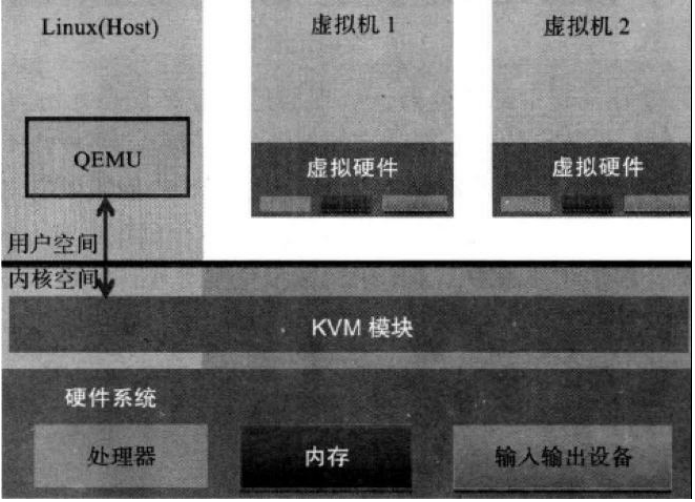
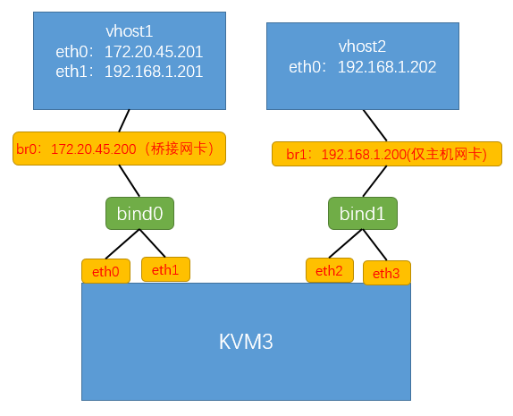
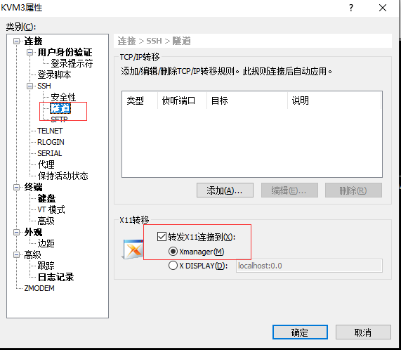
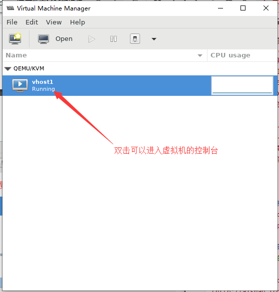

# 虚拟化技术之KVM
KVM是一个开元的系统虚拟化模块，在linux2.6.20之后集成在linux的各个发行版中，它使用Linux自身的调度器进行管理，所以相对于Xen，其核心源码很少，KVm目前已成为主流的虚拟化技术之一
	KVM的虚拟化服务器需要硬件支持(如Intel VT技术或者AMD V技术)，是基于硬件的完全虚拟化
[](http://aishad.top/wordpress/wp-content/uploads/2019/06/kvm.png)

- Guest
	客户机系统，包括CPU（vCPU）、内存、驱动（Console、网卡、I/O 设备驱动等），被KVM置于一种受限制的CPU模式下运行。

- KVM
	运行在内核空间，提供 CPU 和内存的虚级化，以及客户机的 I/O拦截，Guest的部分I/O被KVM拦截后，交给 QEMU处理。

- QEMU
	修改过的被KVM虚机使用的QEMU代码，运行在用户空间，提供硬件I/O虚拟化，通过IOCTL/dev/kvm设备和KVM交互，但是，KVM本身不执行任何硬件模拟，需要用户空间程序通过 /dev/kvm 接口设置一个客户机虚拟服务器的地址空间，向它提供模拟I/O，并将它的视频显示映射回宿主的显示屏。目前这个应用程序是QEMU

## KVM环境准备
KVM需要宿主机CPU必须智慧城虚拟化功能，因此如果在vmware workstation 上使用虚拟机做宿主机，那么必须要在虚拟机配置界面的处理器选项中开启虚拟化功能

> 要实现的KVM环境

[](http://aishad.top/wordpress/wp-content/uploads/2019/06/jiagou.png)

1. 创建宿主机的网卡绑定和桥接网卡

>前提：
>1.必须的软件包:bridge-utils
>2.停用NetworkManager服务器，使用network服务
```bash
[ root@localhost ~]# cat /etc/sysconfig/network-scripts/ifcfg-bond0
BOOTPROTO=static
NAME=bond0
DEVICE=bond0
ONBOOT=yes
BONDING_MASTER=yes
BONDING_OPTS="mode=1 miimon=100" #指定绑定类型为1及链路状态监测间隔时间
BRIDGE=br0 #桥接到br0

[ root@localhost ~]# cat /etc/sysconfig/network-scripts/ifcfg-eth0
BOOTPROTO=static
NAME=eth0
DEVICE=eth0
ONBOOT=yes
NM_CONTROLLED=no
MASTER=bond0
USERCTL=no
SLAVE=yes

[ root@localhost ~]# cat /etc/sysconfig/network-scripts/ifcfg-eth1
BOOTPROTO=static
NAME=eth1
DEVICE=eth1
ONBOOT=yes
NM_CONTROLLED=no
MASTER=bond0
USERCTL=no
SLAVE=yes

## 桥接网卡
[ root@localhost ~]# cat /etc/sysconfig/network-scripts/ifcfg-br0
TYPE=Bridge
BOOTPROTO=static
NAME=br0
DEVICE=br0
ONBOOT=yes
IPADDR=172.20.45.200
NETMASK=255.255.0.0
GATEWAY=172.20.0.1
DNS=223.5.5.5
[ root@localhost ~]# cat /etc/sysconfig/network-scripts/ifcfg-br1
TYPE=Bridge
BOOTPROTO=static
NAME=br1
DEVICE=br1
ONBOOT=yes
IPADDR=192.168.1.200
NETMASK=255.255.0.0

## 重启网络
```

2. 确认CPU指令集：
	X86/x86_64-Intel、AMD
	ARM-手机、pad、机顶盒，https://baike.baidu.com/item/ARM/5907?fr=aladdin
	Power-IBM
```bash
[root@s1 ~]# grep -E "vmx|svm" /proc/cpuinfo | wc -l
```

3. 安装KVM工具包
```bahs
	 yum install qemu-kvm qemu-kvm-tools libvirt virt-manager virt-install
```

4. 启动kvm服务并设置开机自启
```bash
	systemctl start libvirtd
	systemctl enable libvirtd
```

> 服务启动后会自动创建NAT网卡

5. 创建虚拟机要使用的硬盘文件
```bash
[ root@localhost ~]# qemu-img create -f qcow2 /var/lib/libvirt/images/vhost1.qcow2 10G
Formatting '/var/lib/libvirt/images/vhost1.qcow2', fmt=qcow2 size=10737418240 encryption=off cluster_size=65536 lazy_refcounts=off 
[ root@localhost ~]# ll /var/lib/libvirt/images/
total 196
-rw-r--r--. 1 root root 197120 Jun 17 17:20 vhost1.qcow2
```

6. 上传安装虚拟机使用的ISO文件
```bash
[ root@localhost ~]# ll /usr/local/src/
total 940032
-rw-r--r--. 1 root root 962592768 Jun 17 17:45 CentOS-7-x86_64-Minimal-1810.iso
```

7. 创建虚拟机
```bash
[ root@localhost ~]# virt-install --virt-type kvm --name vhost1 --memory 1024 --vcpus 2 --cdrom=/usr/local/src/CentOS-7-x86_64-Minimal-1810.iso --disk path=/var/lib/libvirt/images/vhost1.qcow2  --network network=default --graphics vnc,listen=0.0.0.0 --noautoconsole
```

8. 通过VNC客户端连接客户端并安装虚拟机：
[](http://aishad.top/wordpress/wp-content/uploads/2019/06/vnc1.png)

9. 通过kvm虚拟机管理工具virt-manager进行安装管理虚拟机

> 前提：使用xshell的会话要配置了xmanage

[](http://aishad.top/wordpress/wp-content/uploads/2019/06/xs1.png)

[](http://aishad.top/wordpress/wp-content/uploads/2019/06/vm2.png)

## KVM的创建于管理命令请查看：[管理命令的使用](http://aishad.top/wordpress/?p=340 "管理命令的使用")

## KVM磁盘相关的请查看：[KVM的磁盘类型及转换](http://aishad.top/wordpress/?p=339 "KVM的磁盘类型及转换")