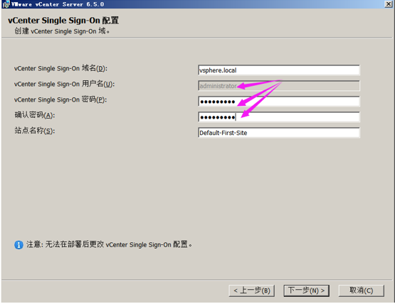
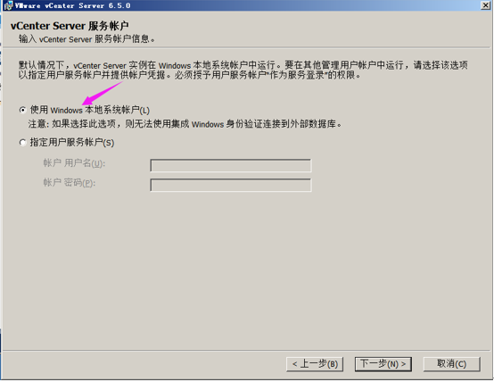

# VMware Esxi简介
	ESXi专为运行虚拟机、最大限度降低配置要求和简化部署而设计。它可以独立安装和运行在裸机上的系统，因此与其他我们以往见过的VMware Workstation 软件不同的是它不再依存于宿主操作系统之上。在ESXi安装好以后，我们可以通过vSphere Client 远程连接控制，在ESXi 服务器上创建多个VM（虚拟机），在为这些虚拟机安装好Linux /Windows Server 系统使之成为能提供各种网络应用服务的虚拟服务器，ESXi 也是从内核级支持硬件虚拟化，运行于其中的虚拟服务器在性能与稳定性上不亚于普通的硬件服务器，而且更易于管理维护。

- VMware Esxi体系结构：

	首先通过虚拟化内核进行虚拟化管理。同时，每台虚拟机下面都安装了VMM（虚拟机监视器），来进行虚拟机状态的监视，管理虚拟机的资源使用。管理方面，可以通过vSphere Client，也可以通过cCenter Server。同时也提供相应的API，也可以通过vCLi和CIM进行管理。

# VMware Esxi的安装
	所需软件包：VMware-VMvisor-Installer-6.5.0-4564106.x86_64.iso

1. 启动安装程序，根据提示下一步继续安装

2. 创建exsi服务器的管理密码，用户名为root

3. 安装完成后重启，进行配置

- 按F2输入密码后进入配置界面

- 配置ip地址为静态地址

- 开启shell功能和远程ssh连接

- 开启ssh密码连接的功能:可以通过xshell远程连接管理
> ctrl+alt+F1切换到命令行，更改/etc/ssh/sshd_config配置文件
> PasswordAuthent yes
> 并重启服务：service.sh restart

4. 使用vmware workstation管理

5. 使用浏览器管理
	在浏览器输入Esxi的ip地址

### 在Esxi创建虚拟机

1. 先上传安装虚拟机需要的iso文件

2. 创建虚拟机

## 通过VSphere 客户端或者浏览器进行多个Esxi管理
> 使用这种方式进行管理，需要在Windows server 2008 R2或以上版本上安装VSphere server，然后才能在客户单使用VSphere或者网页进行管理，但是在VSphere5.5以后，只能使用浏览器进行管理

- 需要的软件包：VMware-VIM-all-6.5.0-4602587.iso解压后安装

> 注意：在安装的时候会创建系统名称，可以使用域名或ip地址，如果是域名的话，需要DNS可以解析，此处的系统名称在创建后是无法更改的

- 创建vCenter的密码

- 使用本地账号认证和本地数据库

- 配置端口

> 后面的直接配置好安装目录就安装就可以，安装完成后启动 VSphere web client

### 管理vmware vsphere

1. 通过浏览器访问：IP地址或者之前设置的系统名称，需要本地DNS能解析到设置的域名

2. 登录账户和密码
	win server 的账号密码：administrator@vsphere.local + administrator的密码

3. 可以通过创建数据中心将多个esxi加入到VMware sphere进行管理