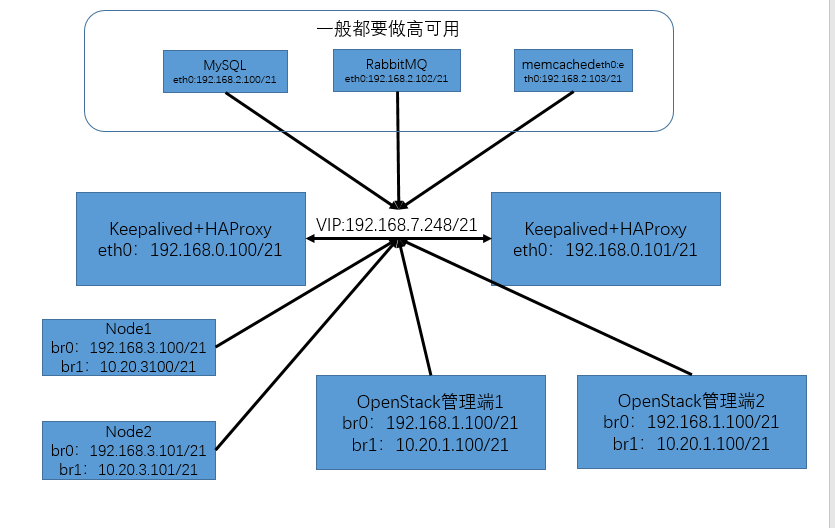
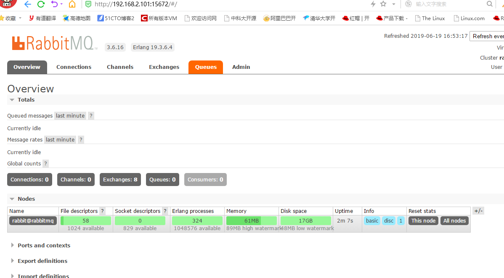
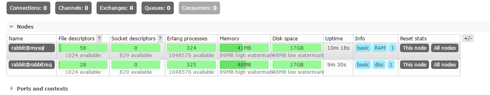

# OpenStack基础环境准备
[](http://aishad.top/wordpress/wp-content/uploads/2019/06/opens1111.png)

- 管理端2个：OpenStack管理端，用来管理计算节点 

- mysql：用来存储管理端创建的数据

- rabbitmq：消息队列服务，用来做消息的传送

- memcached：seccion保存

- HAProxy+Keepalived：实现后端服务的转发

- node节点：OpenStack计算节点

> 虚拟机配置：新建虚拟机，最小化安装 centos 7.2.1511 操作系统，目前不要安装其他版本的系统，系统磁盘 100G，每个虚拟机 4 个网卡，其中前两个网卡为 NAT 模式，后两个网卡为仅主机模式，CPU 两个核心或以上，必须勾选开启虚拟化功能，否则后期 openstack 无法启动云主机，内存 3G，越大越好。

## 工作过程
当在管理端创建虚拟机的时候，管理端会将任务写入到rabbitmq中，各个计算节点都会监听消息队列，当发现有药创建虚拟机的操作，那么会由计算节点将消息消费，其实中间还会有筛选器，由筛选器选择在哪个计算节点创建虚拟机

# OpenStack环境的搭建

## 配置HAProxy+KeepAlived

- KeepAlived
```bash
root@lb1:~# cat /etc/keepalived/keepalived.conf 
! Configuration File for keepalived

global_defs {
   notification_email {
     acassen
   }
   notification_email_from Alexandre.Cassen@firewall.loc
   smtp_server 192.168.200.1
   smtp_connect_timeout 30
   router_id LVS_DEVEL
}

vrrp_instance VI_1 {
    state MASTER
    interface eth0
    garp_master_delay 10
    smtp_alert
    virtual_router_id 51
    priority 80
    advert_int 1
    authentication {
        auth_type PASS
        auth_pass 1111
    }
    virtual_ipaddress {
        192.168.7.248 dev eth0 label eth0:0
    }
}
```

- HAProxy 
```bash
root@lb1:~# cat /etc/haproxy/haproxy.cfg 
global
maxconn 100000
#chroot /usr/local/haproxy
#stats socket /var/lib/haproxy/haproxy.sock mode 600 level admin
uid 99
gid 99
daemon
nbproc 4
cpu-map 1 0
cpu-map 2 1
cpu-map 3 2
cpu-map 4 3
#pidfile /usr/local/haproxy/run/haproxy.pid
log 127.0.0.1 local3 info

defaults
option http-keep-alive
option  forwardfor
maxconn 100000
mode http
timeout connect 300000ms
timeout client  300000ms
timeout server  300000ms

listen stats
 mode http
 bind 0.0.0.0:9999
 stats enable
 log global
 stats uri     /haproxy-status
 stats auth    haadmin:q1w2e3r4ys

listen  web_port
 bind 192.168.7.248:80
 mode http
 log global
 server web1  www.aishad.top:80  check inter 3000 fall 2 rise 5
```

> 注意：keepalived+haproxy要开启的内核参数
> net.ipv4.ip_nonlocal_bind = 1
> net.ipv4.ip_forward = 1

## 配置OpenStackh管理端和各个node节点的网卡绑定和桥接

> 注意：首先关闭NetworkManager、firewalld、selinux服务，安装需要的软件包bridge-utils

NAT网卡eht0与eth2绑定为bond0，并桥接到br0
仅主机网卡eth1与eth3绑定为bong1，并桥接到br1

```bash
[ root@openstack1 network-scripts]# cat ifcfg-eth0
BOOTPROTO=static
NAME=eth0
DEVICE=eth0
ONBOOT=yes
NM_CONTROLLED=no
MASTER=bond0
USERCTL=no
SLAVE=yes

[ root@openstack1 network-scripts]# cat ifcfg-eth2
BOOTPROTO=static
NAME=eth2
DEVICE=eth2
ONBOOT=yes
NM_CONTROLLED=no
MASTER=bond0
USERCTL=no
SLAVE=yes

[ root@openstack1 network-scripts]# cat ifcfg-bond0
BOOTPROTO=static
NAME=bond0
DEVICE=bond0
ONBOOT=yes
BONDING_MASTER=yes
BONDING_OPTS="mode=1 miimon=100"
BRIDGE=br0

[ root@openstack1 network-scripts]# cat ifcfg-br0
TYPE=Bridge
BOOTPROTO=static
NAME=br0
DEVICE=br0
ONBOOT=yes
IPADDR=192.168.1.100
NETMASK=255.255.248.0
GATEWAY=192.168.0.254
```
### 各个节点与时间服务器同步时间
```bash
[ root@openstack1 ~]# cp /usr/share/zoneinfo/Asia/Shanghai /etc/localtime
[ root@openstack1 ~]# ntpdate 172.20.0.1 && hwclock -w
#创建计划任务：
[ root@openstack1 ~]# echo "*/30 * * * * /usr/sbin/ntpdate 172.20.0.1 && /usr/sbin/hwclock -w" >> /var/spool/cron/root
```

# 安装 openstack 基础组件准备
	本次选择 ocata 版本安装，因为最新版的 pike 版本还没有完全作为正式版本提供

### 各服务器安装 ocata 的 yum 源

> 当使用RDO包时，我们推荐禁用EPEL，原因是EPEL中的更新破坏向后兼容性。或者使用``yum-versionlock``插件指定包版本号。

```bash
#所有节点

#启用OpenStack库
[ root@openstack1 ~]#  rm -rf /etc/yum.repos.d/*
[ root@openstack1 ~]# wget -O /etc/yum.repos.d/CentOS-Base.repo http://mirrors.aliyun.com/repo/Centos-7.repo
[ root@openstack1 ~]# yum install –y centos-release-openstack-ocata.noarch
#在RHEL上，下载和安装RDO仓库RPM来启用OpenStack仓库,不建议安装，因为rdo会执行openstack最新版
[ root@openstack1 ~]# yum install -y https://rdoproject.org/repos/rdo-release.rpm
```

### 各服务器安装 openstack 客户端
```bash
#只安装 openstack 控制节点和计算节点
[ root@openstack1 ~]#  yum install -y python-openstackclient
```

### 各服务器安装 openstack SElinux 管理包
```bash
#如果 agent 开启了 selinux 会自动进行 selinux 权限的相关设置：
[root@linux-host1 ~]# yum install -y openstack-selinux
```

## 安装数据库服务
可以单独安装至其他服务器，openstack 的各组件都要使用数据库保存数据，除了 nova 使用API 与其他组件进行调用之外：

### 在控制端安装mysql客户端以及连接MySQL的包：
```bash
#用于控制端连接数据库
[ root@openstack1 ~]# yum install -y mariadb python2-PyMySQL
```

#### 安装MariaDB（mysql服务器也配置了ocata的yum源）
```bash
#配置了ocata的yum源,安装的mariadb是10版本的
[ root@mysql ~]$ yum -y install mariadb-server
```

#### 配置数据库
```bash
[ root@mysql ~]$  vim /etc/my.cnf.d/openstack.cnf
[mysqld]
bind-address = 0.0.0.0  #指定监听地址
default-storage-engine = innodb  #默认引擎
innodb_file_per_table = on  #开启每个表都有独立表空间
max_connections = 4096 #最大连接数
collation-server = utf8_general_ci  #不区分大小写排序
character-set-server = utf8  #设置编码

[root@linux-host4 ~]# cat /etc/my.cnf
[mysqld]
socket=/var/lib/mysql/mysql.sock
user=mysql
symbolic-links=0
datadir=/data/mysql
innodb_file_per_table=1
#skip-grant-tables
relay-log = /data/mysql
server-id=10
log-error= /data/mysql-log/mysql_error.txt
log-bin=/data/mysql-binlog/master-log
#general_log=ON
#general_log_file=/data/general_mysql.log
long_query_time=5
slow_query_log=1
slow_query_log_file= /data/mysql-log/slow_mysql.txt
max_connections=1000
bind-address=192.168.10.204
[client]
port=3306
socket=/var/lib/mysql/mysql.sock
[mysqld_safe]
log-error=/data/mysql-log/mysqld-safe.log
pid-file=/var/lib/mysql/mysql.sock

# 创建数据目录并授权
[root@linux-host4 ~]# mkdir -pv /data/{mysql,mysql-log,mysql-binlog}
mkdir: created directory ‘/data’
mkdir: created directory ‘/data/mysql’
mkdir: created directory ‘/data/mysql-log’
mkdir: created directory ‘/data/mysql-binlog’
[root@linux-host4 ~]# chown mysql.mysql /data/ -

[ root@mysql ~]# systemctl restart mariadb
[ root@mysql ~]# systemctl enable mariadb

#安全初始化
[ root@mysql ~]# mysql_secure_installation
```

## 安装部署rabbitMQ高可用
高可用：192.168.2.101、192.168.2.100
可以单独安装至其他服务器：各组件通过消息发送与接收是实现组件之间的通信
5672：消费者访问的 端口
15672：web管理端口
25672：集群状态通信端口

```bahs
[ root@radditmq ~]#  yum install rabbitmq-server

#rabbitmq之间通过主机名进行访问，设置解析
[ root@radditmq ~]# cat /etc/hosts
192.168.2.100 mysql
192.168.2.101 rabbitmq

[ root@radditmq ~]# systemctl enable rabbitmq-server.service 
[ root@radditmq ~]# systemctl start rabbitmq-server.service

# 验证rabbitMQ监听了5672端口
```
### 打开 rabbitMQ 的 web 插件
```bash
[ root@rabbitmq ~]$ rabbitmq-plugins enable rabbitmq_management
# 开启15672端口
```

### 访问 rabbitMQ 的 web 界面
	默认用户名密码都是 guest，可以更改，web 访问端口为 15672：
[](http://aishad.top/wordpress/wp-content/uploads/2019/06/rabbitmq.png)

### 配置rabbitMQ的高可用
Rabbitmq的集群是依赖于erlang的集群来工作的，所以必须先构建起erlang的集群环境。而Erlang的集群中各节点是通过一个magic cookie来实现的，这个cookie存放在 /var/lib/rabbitmq/.erlang.cookie 中，文件是400的权限。所以必须保证各节点cookie保持一致，否则节点之间就无法通信
```bash
[ root@mysql ~]$ scp /var/lib/rabbitmq/.erlang.cookie  192.168.2.101:/var/lib/rabbitmq/.erlang.cookie
##重启所有rabbitMQ节点使cookie文件生效
```
查看各个节点的状态
```bash
[ root@rabbitmq ~]$ rabbitmqctl  cluster_status
Cluster status of node rabbit@rabbitmq
[{nodes,[{disc,[rabbit@rabbitmq]}]},
 {running_nodes,[rabbit@rabbitmq]},
 {cluster_name,<<"rabbit@rabbitmq">>},
 {partitions,[]},
 {alarms,[{rabbit@rabbitmq,[]}]}]
```

### 

```bash
[root@rabbitmq-server1 ~]# rabbitmqctl  stop_app #停止应用程序
[root@rabbitmq-server1 ~]# rabbitmqctl   reset #清空元数据
＃将mysql添加到集群当中，并成为内存节点，不加--ram默认是磁盘节点
[ root@mysql ~]$ rabbitmqctl  join_cluster rabbit@rabbitmq --ram

[ root@mysql ~]$ rabbitmqctl  start_app #开启应用程序

# 查看集群状态
[ root@rabbitmq ~]$ rabbitmqctl  cluster_status
Cluster status of node rabbit@rabbitmq
[{nodes,[{disc,[rabbit@rabbitmq]},{ram,[rabbit@mysql]}]},
 {running_nodes,[rabbit@rabbitmq]},
 {cluster_name,<<"rabbit@rabbitmq">>},
 {partitions,[]},
 {alarms,[{rabbit@rabbitmq,[]}]}]

#改为镜像模式，在任意一台rabbitMQ节点执行即可
[ root@mysql ~]$  rabbitmqctl set_policy  ha-all "#"  '{"ha-mode":"all"}' 
#  "#"为任意0个或多个即为所有，也可以使用"^test"匹配开头，还可以使用其他正则匹配

```
添加集群后
[](http://aishad.top/wordpress/wp-content/uploads/2019/06/rabbitmq2.png)

### 添加 rabbitMQ 客户端用户并设置密码
```bash
# 添加账号
[ root@rabbitmq ~]$ rabbitmqctl add_user openstack admin123

# 赋权
[ root@rabbitmq ~]$ rabbitmqctl set_permissions openstack ".*" ".*" ".*"
```

## 安装 memcached
用于缓存 openstack 各服务的身份认证令牌信息
高可用：192.168.2.101、192.168.2.102

```bash
[ root@memcached ~]$ yum  install memcached -y
#openstack 控制节点安装 python 模块，用来实现连接memcached
[ root@memcached ~]$ yum install python-memcached –y
#配置
[ root@memcached ~]$ cat /etc/sysconfig/memcached
PORT="11211"
USER="memcached"
MAXCONN="4096"
CACHESIZE="128" #生产环境内存要调大
OPTIONS="-l 0.0.0.0,::1"

#设为开机启动
[ root@memcached ~]$ systemctl enable memcached
[ root@memcached ~]$ systemctl start memcached
```

### 实现memcached的高可用
详细的配置过程建博客：[memcached的安装与使用](http://aishad.top/wordpress/?p=287 "memcached的安装与使用")

### 将rabbitMQ、mysql和memcached配置在负载均衡

```bash
root@lb1:~# cat /etc/haproxy/haproxy.cfg
listen  openstack_mysql
 bind 192.168.7.248:3306
 mode tcp
 log global
 server 192.168.2.100  192.168.2.100:3306  check inter 3000 fall 2 rise 5

listen  openstack_rabbit
 bind 192.168.7.248:5672
 mode tcp
 log global
 server 192.168.2.101  192.168.2.101:5672  check inter 3000 fall 2 rise 5

listen  openstack_memcached
 bind 192.168.7.248:11211
 mode tcp
 log global
 server 192.168.2.102  192.168.2.102:11211  check inter 3000 fall 2 rise 5
```
## 请继续查看下一篇博客：[keystone 服务的搭建](http://aishad.top/wordpress/?p=362 "keystone 服务的搭建")