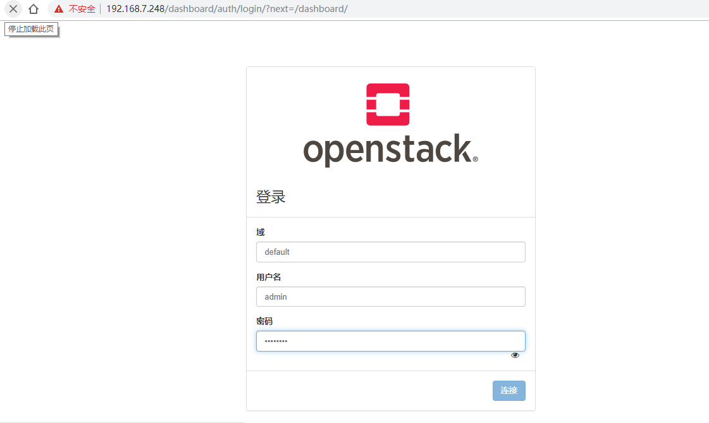

# Horizon
horizon 是 openstack 的管理其他组件的图形显示和操作界面，通过 API 和其他服务进行通讯，如镜像服务、计算服务和网络服务等结合使用，horizon 基于 python django 开发，通过Apache 的 wsgi 模块进行 web 访问通信，Horizon 只需要更改配置文件连接到 keyston 即可

## 控制端安装 horizon
```bash
[ root@openstack1 ~]# yum install openstack-dashboard
```

## 编辑/etc/openstack-dashboard/local_settings配置文件
```bash
[ root@openstack1 ~]# vim /etc/openstack-dashboard/local_settings 
#允许那些主机访问，*表示所有
28:ALLOWED_HOSTS = ['*',]
#配置API版本
54:OPENSTACK_API_VERSIONS = {
56:    "identity": 3,
57:    "image": 2,
58:    "volume": 2,
#启用对域的支持
65:OPENSTACK_KEYSTONE_MULTIDOMAIN_SUPPORT = True
#配置Default为通过仪表板创建的用户的默认域
73:OPENSTACK_KEYSTONE_DEFAULT_DOMAIN = 'Default'
#配置memcached会话存储服务
128 SESSION_ENGINE = 'django.contrib.sessions.backends.cache'
129:CACHES = {
130:    'default': {
131:        'BACKEND': 'django.core.cache.backends.memcached.MemcachedCache',
132:        'LOCATION': '192.168.7.248:11211',
133:    },
134:}
#配置仪表盘监听的地址，一般为监听本机的ip
159:OPENSTACK_HOST = "192.168.7.248"
#启用第3版认证API
161:OPENSTACK_KEYSTONE_URL = "http://%s:5000/v3" % OPENSTACK_HOST
#通过仪表盘创建的用户默认角色配置为 user
162:OPENSTACK_KEYSTONE_DEFAULT_ROLE = "user"
#如果您选择网络参数1(桥接网络)，禁用支持3层网络服务
282:OPENSTACK_NEUTRON_NETWORK = {
283:    'enable_router': False,
284:    'enable_quotas': False,
285:    'enable_ipv6': False,
286:    'enable_distributed_router': False,
287:    'enable_ha_router': False,
288:    'enable_lb': False,
289:    'enable_firewall': False,
290:    'enable_vpn': False;
291:    'enable_fip_topology_check': False,
# 配置时区
417:TIME_ZONE = "Asia/Shanghai"
```

## 重启web服务器
```bash
systemctl restart httpd.service 
```

### 访问测试
[](http://aishad.top/wordpress/wp-content/uploads/2019/06/openstack_login.png)

## 继续查看下一篇博客：[启动一个实例](http://aishad.top/wordpress/?p=381 "启动一个实例")