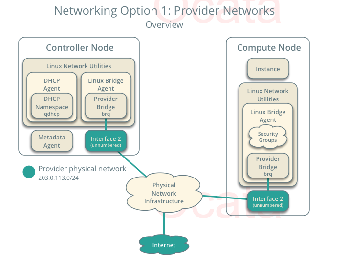
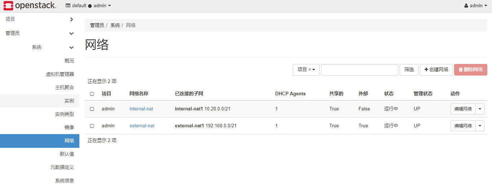
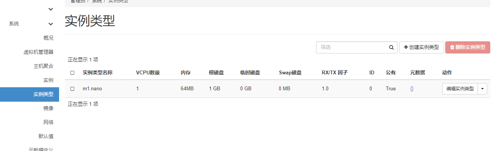
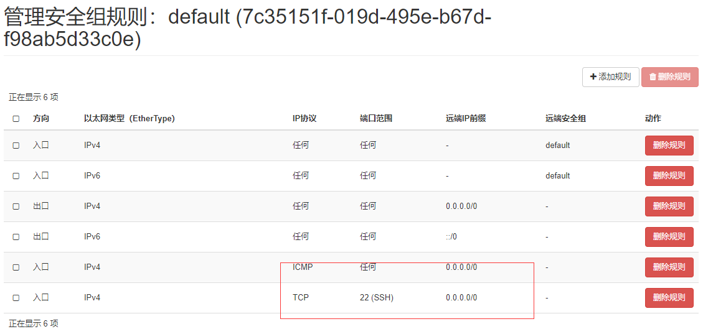
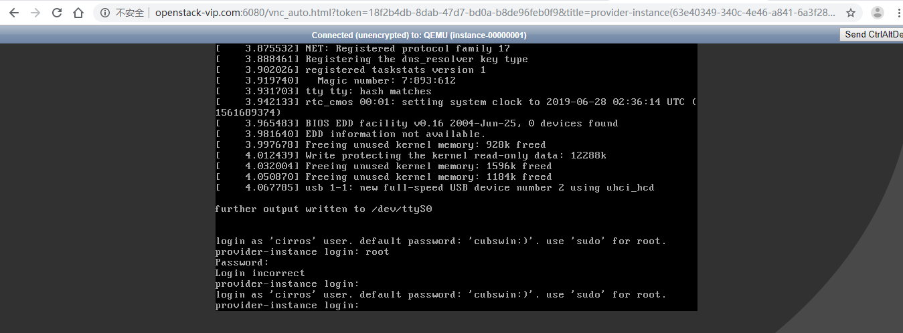

启动虚拟机之前需要先做一些前期准备，比如网络和IP地址分配、虚拟机；类型创建等

# 网络规划及ip划分

## 创建提供者网络(桥接)
[](http://aishad.top/wordpress/wp-content/uploads/2019/06/tigongzhe.png)
桥接网络IP划分，要求虚拟机与物理机必须在同一个相同子网的网络内

### 创建提供者网络
目前有两块网卡：
br0为外网网卡：在openstack定义为external
br1为内网网卡：在openstack定义为internal

1. 在控制节点上创建网络，也可以在web界面创建
```bash
#创建外部网络
[ root@openstack1 ~]# openstack network create  --share --external --provider-physical-network external --provider-network-type flat external-nat

#创建内部网络
[ root@openstack1 ~]# openstack network create  --share --internal   --provider-physical-network internal   --provider-network-type flat internal-nat

# --share：在项目之间共享
# --external：外部网络
#--internal：内部网络
# --provider-physical-network external：配置文件名称，这个名称要和ml2_conf.ini文件和linuxbridge_agent.ini文件中定义的名相同
# --provider-network-type flat external-nat：自定义网络名称
```
2. 定义网络名称并绑定接口
```bash
# 定义网络名称
[ root@openstack1 ~]# vim /etc/neutron/plugins/ml2/ml2_conf.ini 
[ml2_type_flat]
flat_networks = external,internal
#将网络名称绑定到指点的接口
[ root@openstack1 ~]# vim /etc/neutron/plugins/ml2/linuxbridge_agent.ini
[linux_bridge]
physical_interface_mappings = external:br0,internal:br1
```

3. 创建子网用于分配具体的ip地址
```bash
#创建外部网络的子网
[ root@openstack1 ~]# openstack subnet create --network external-nat --allocation-pool start=192.168.5.100,end=192.168.6.254 --dns-nameserver 223.5.5.5 --gateway 192.168.0.254 --subnet-range 192.168.0.0/21 external-nat1


#创建外部网络的子网
[ root@openstack1 ~]# openstack subnet create --network internal-nat --allocation-pool start=10.20.5.100,end=10.20.6.254  --gateway 10.20.0.1 --subnet-range 10.20.0.0/21 internal-nat1


# --network external-nat:上一步定义的网络名称
#--allocation-pool start=192.168.5.100,end=192.168.6.254:开始地址和结束地址
#--subnet-range 192.168.0.0/21 external-nat1：指定分配地址的网段和子网名称
```

4. 验证网络和子网
```bash
[ root@openstack1 ~]# openstack network list
+--------------------------------------+--------------+--------------------------------------+
| ID                                   | Name         | Subnets                              |
+--------------------------------------+--------------+--------------------------------------+
| 86d438cd-c250-4980-bb6d-3aab926a5ae2 | internal-nat | 473d6a39-40d4-4e11-a914-3cc2b10cfcf2 |
| f4a662b1-d5a6-410f-8d9a-729e3117d62f | external-nat | 662b08c3-c3fd-45e1-a98f-08acdbb8f7db |
+--------------------------------------+--------------+--------------------------------------+
[ root@openstack1 ~]# openstack subnet list
+--------------------------------------+---------------+--------------------------------------+----------------+
| ID                                   | Name          | Network                              | Subnet         |
+--------------------------------------+---------------+--------------------------------------+----------------+
| 473d6a39-40d4-4e11-a914-3cc2b10cfcf2 | internal-nat1 | 86d438cd-c250-4980-bb6d-3aab926a5ae2 | 10.20.0.0/21   |
| 662b08c3-c3fd-45e1-a98f-08acdbb8f7db | external-nat1 | f4a662b1-d5a6-410f-8d9a-729e3117d62f | 192.168.0.0/21 |
+--------------------------------------+---------------+--------------------------------------+----------------+
```
[](http://aishad.top/wordpress/wp-content/uploads/2019/06/web.png)

# 创建虚拟机类型
虚拟机类型用来定义虚拟机的基础配置，默认的最小规格的主机需要512 MB内存。对于环境中计算节点内存不足4 GB的，我们推荐创建只需要64 MB的m1.nano规格的主机。若单纯为了测试的目的，请使用m1.nano规格的主机来加载CirrOS镜像。
```bash
[ root@openstack1 ~]# openstack flavor create --id 0 --vcpus 1 --ram 64 --disk 1 m1.nano
+----------------------------+---------+
| Field                      | Value   |
+----------------------------+---------+
| OS-FLV-DISABLED:disabled   | False   |
| OS-FLV-EXT-DATA:ephemeral  | 0       |
| disk                       | 1       |
| id                         | 0       |
| name                       | m1.nano |
| os-flavor-access:is_public | True    |
| properties                 |         |
| ram                        | 64      |
| rxtx_factor                | 1.0     |
| swap                       |         |
| vcpus                      | 1       |
+----------------------------+---------+

#--id：指定id，可以自动生成
#--vcpus：cpu个数
#--ram：内存大小，默认是M
#--disk：硬盘存储大小，默认是G
#m1.nano：实例类型的名称
```

## 验证类型
```bash
[ root@openstack1 ~]# openstack flavor list
+----+---------+-----+------+-----------+-------+-----------+
| ID | Name    | RAM | Disk | Ephemeral | VCPUs | Is Public |
+----+---------+-----+------+-----------+-------+-----------+
| 0  | m1.nano |  64 |    1 |         0 |     1 | True      |
+----+---------+-----+------+-----------+-------+-----------+
```
[](http://aishad.top/wordpress/wp-content/uploads/2019/06/m1.png)

# 生成密钥对实现免秘登录:使用demo用户
```bash
#生成密钥对并添加公钥
[ root@openstack1 ~]# ssh-keygen -q -N ""
[ root@openstack1 ~]# openstack keypair create --public-key ~/.ssh/id_rsa.pub mykey
+-------------+-------------------------------------------------+
| Field       | Value                                           |
+-------------+-------------------------------------------------+
| fingerprint | fd:b8:4f:c8:9d:b9:63:04:d2:7f:33:8f:50:ac:fa:90 |
| name        | mykey                                           |
| user_id     | e86ce7b180e24ca883d17236347c35bf                |
+-------------+-------------------------------------------------+
#可以跳过执行 ssh-keygen 命令而使用已存在的公钥

#验证公钥的添加
[ root@openstack1 ~]# openstack keypair list
+-------+-------------------------------------------------+
| Name  | Fingerprint                                     |
+-------+-------------------------------------------------+
| mykey | fd:b8:4f:c8:9d:b9:63:04:d2:7f:33:8f:50:ac:fa:90 |
+-------+-------------------------------------------------+
```

# 增加安全组
默认情况下，default安全组适用于所有实例并且包括拒绝远程访问实例的防火墙规则。对诸如CirrOS这样的Linux镜像，我们推荐至少允许ICMP (ping) 和安全shell(SSH)规则

添加规则到 指定安全组
```bash
#查看存在的安全组
[ root@openstack1 ~]# openstack security group list
#允许ICMP（ping）
[ root@openstack1 ~]# openstack security group rule create --proto icmp 7c35151f-019d-495e-b67d-f98ab5d33c0e
+-------------------+--------------------------------------+
| Field             | Value                                |
+-------------------+--------------------------------------+
| created_at        | 2019-06-24T03:44:48Z                 |
| description       |                                      |
| direction         | ingress                              |
| ether_type        | IPv4                                 |
| id                | a1e09e1a-b5aa-4595-abf7-9c8f81537163 |
| name              | None                                 |
| port_range_max    | None                                 |
| port_range_min    | None                                 |
| project_id        | 0476bec7404e498185d6d9886f719b2b     |
| protocol          | icmp                                 |
| remote_group_id   | None                                 |
| remote_ip_prefix  | 0.0.0.0/0                            |
| revision_number   | 1                                    |
| security_group_id | 7c35151f-019d-495e-b67d-f98ab5d33c0e |
| updated_at        | 2019-06-24T03:44:48Z                 |
+-------------------+--------------------------------------+
#允许安全 shell (SSH) 的访问
[ root@openstack1 ~]# openstack security group rule create --proto tcp --dst-port 22 7c35151f-019d-495e-b67d-f98ab5d33c0e
+-------------------+--------------------------------------+
| Field             | Value                                |
+-------------------+--------------------------------------+
| created_at        | 2019-06-24T03:45:17Z                 |
| description       |                                      |
| direction         | ingress                              |
| ether_type        | IPv4                                 |
| id                | 0bf4cd7b-fcf7-4c56-b4c1-1f0fb17b2c39 |
| name              | None                                 |
| port_range_max    | 22                                   |
| port_range_min    | 22                                   |
| project_id        | 0476bec7404e498185d6d9886f719b2b     |
| protocol          | tcp                                  |
| remote_group_id   | None                                 |
| remote_ip_prefix  | 0.0.0.0/0                            |
| revision_number   | 1                                    |
| security_group_id | 7c35151f-019d-495e-b67d-f98ab5d33c0e |
| updated_at        | 2019-06-24T03:45:17Z                 |
+-------------------+--------------------------------------+

# 查看安全组规则
[ root@openstack1 ~]# openstack security group rule list
```
[](http://aishad.top/wordpress/wp-content/uploads/2019/06/anquanz.png)

# 创建虚拟机并启动:使用demo用户

1. 创建镜像
```bash
#openstack server create --flavor 虚拟机类型 --image 镜像名称   --nic net-id=network-ID  --security-group 安全组名   --key-name key名称  虚拟机名称
#如果你的环境只有一个网络，你可以省去–nic 选项因为OpenStack会自动选择这个唯一可用的网络

[ root@openstack1 ~]# openstack server create --flavor m1.nano --image cirros-0.3.5   --nic net-id=f4a662b1-d5a6-410f-8d9a-729e3117d62f  --security-group default   --key-name mykey  test-vm
+-------------------------------------+-----------------------------------------------------+
| Field                               | Value                                               |
+-------------------------------------+-----------------------------------------------------+
| OS-DCF:diskConfig                   | MANUAL                                              |
| OS-EXT-AZ:availability_zone         |                                                     |
| OS-EXT-SRV-ATTR:host                | None                                                |
| OS-EXT-SRV-ATTR:hypervisor_hostname | None                                                |
| OS-EXT-SRV-ATTR:instance_name       |                                                     |
| OS-EXT-STS:power_state              | NOSTATE                                             |
| OS-EXT-STS:task_state               | scheduling                                          |
| OS-EXT-STS:vm_state                 | building                                            |
| OS-SRV-USG:launched_at              | None                                                |
| OS-SRV-USG:terminated_at            | None                                                |
| accessIPv4                          |                                                     |
| accessIPv6                          |                                                     |
| addresses                           |                                                     |
| adminPass                           | Tqi6aBnvUtFS                                        |
| config_drive                        |                                                     |
| created                             | 2019-06-24T03:54:17Z                                |
| flavor                              | m1.nano (0)                                         |
| hostId                              |                                                     |
| id                                  | 537ff0f4-e2f9-40e3-8ab1-abcd39f19d03                |
| image                               | cirros-0.3.5 (1e58f3fb-8cfb-4406-894c-3c83a111f0b2) |
| key_name                            | mykey                                               |
| name                                | test-vm                                             |
| progress                            | 0                                                   |
| project_id                          | 0476bec7404e498185d6d9886f719b2b                    |
| properties                          |                                                     |
| security_groups                     | name='default'                                      |
| status                              | BUILD                                               |
| updated                             | 2019-06-24T03:54:18Z                                |
| user_id                             | e86ce7b180e24ca883d17236347c35bf                    |
| volumes_attached                    |                                                     |
+-------------------------------------+-----------------------------------------------------+
```

2. 检查实例的状态
```bash
[root@openstack-master ~]# openstack server list
+----------------------------+-------------------+--------+----------+------------+
| ID                         | Name              | Status | Networks | Image Name |
+----------------------------+-------------------+--------+----------+------------+
| 63e40349-340c-             | provider-instance | BUILD  |          | cirros     |
| 4e46-a841-6a3f2814ba6e     |                   |        |          |            |
+----------------------------+-------------------+--------+----------+------------+
[root@openstack-master ~]# openstack server list
+----------------------+-------------------+--------+----------------------+------------+
| ID                   | Name              | Status | Networks             | Image Name |
+----------------------+-------------------+--------+----------------------+------------+
| 63e40349-340c-4e46-a | provider-instance | ACTIVE | external-            | cirros     |
| 841-6a3f2814ba6e     |                   |        | nat=172.20.45.68     |            |
+----------------------+-------------------+--------+----------------------+------------+
```
#### 使用虚拟控制台访问实例

1. 获取实例的虚拟网络计算（VNC）会话URL并从web浏览器访问它
```bash
[root@openstack-master ~]# openstack console url show provider-instance 
+-------+----------------------------------------------------------------------------------+
| Field | Value                                                                            |
+-------+----------------------------------------------------------------------------------+
| type  | novnc                                                                            |
| url   | http://openstack-vip.com:6080/vnc_auto.html?token=9e0ba211-bf6d-4b9e-            |
|       | 9ec8-a2257904d834                                                                |
+-------+----------------------------------------------------------------------------------+
```

2. 使用浏览器访问虚拟机URL
[](http://aishad.top/wordpress/wp-content/uploads/2019/06/kongzhitai.png)


##### 创建实例的以上步骤都可以通过web界面实现