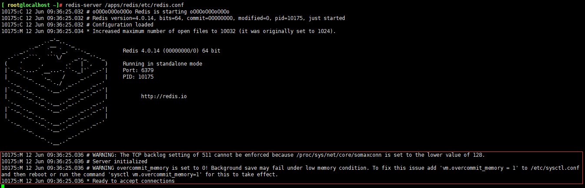
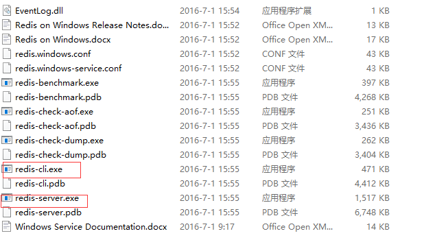
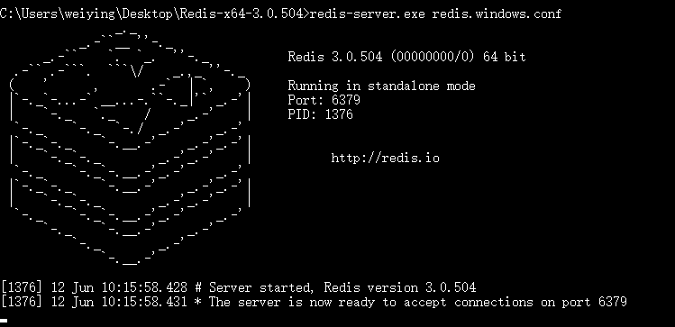

# Redis的部署与简单使用
	Redis和Memcached是非关系型数据库也称为NoSQL数据库，MySQL、Mariadb、SQL Server、PostgreSQL、Oracle 数据库属于关系型数据(RDBMS, Relational Database Management System)
## Redis
	redis是一个开源的、遵循BSD协议的、基于内存的而且目前比较流行的键值数据库(key-value database)，是一个非关系型数据库，redis 提供将内存通过网络远程共享的一种服务，提供类似功能的还有memcache，但相比 memcache，redis 还提供了易扩展、高性能、具备数据持久性等功能。

## redis和memcached的对比：

1. 支持数据的持久化：可以将内存中的数据保持在磁盘中，重启 redis 服务或者服务器之后可以从备份文件中恢复数据到内存继续使用。

2. 支持更多的数据类型：支持字符串、hash(哈希数据)、列表、集合、有序集合

3. 支持数据的备份：可以实现类似与数据的master-slave模式的数据备份，另外也支持使用快照+AOF

4. 支持更大的valve数据：memcached单个 key value 最大只支持 1MB，而 redis 最大支持 512MB。

5. Redis 是单线程，而 memcache 是多线程，所以单机情况下没有 memcache 并发高，但 redis 支持分布式集群以实现更高的并发，单 Redis 实例可以实现数万并发。

6. 支持集群横向扩展：基于redis cluster 的横向扩展，可以实现分布式集群，大幅度提升性能和数据安全性

7. 都是基于C语言开发

### Redis典型应用场景

1. session共享：常见于web集群中的Tomcat或者PHP中多web服务器session共享

2. 消息队列：ELK的日志缓存、部分业务的订阅发布系统

3. 计数器：访问排行榜、商品浏览数等和次数相关的数值统计场景

4. 缓存：数据查询、电商网站商品信息、新闻内容

5. 微博、微信社交场合：共同好友、点赞评论等


## Redis的安装

1. yum安装Redis：
	在CentOS系统上需要安装epel源

-  yum -y install redis（版本3.2.12）

2. 编译安装Redis
	下载当前最新 release 版本 redis 源码包：http://download.redis.io/releases/

- 下载redis
	wget http://download.redis.io/releases/redis-4.0.14.tar.gz -O /usr/local/src/redis-4.0.14.tar.gz

- 解压并编译安装：
	yum install -y vim lrzsz tree screen psmisc lsof tcpdump wget ntpdate gcc gcc-c++ glibc glibc-devel pcre pcre-devel openssl openssl-devel systemd-devel net-tools iotop bc zip unzip zlib-devel bash-completion nfs-utils automake libxml2 libxml2-devel libxslt libxslt-devel perl perl-ExtUtils-Embed jemalloc
	make PREFIX=/apps/redis install

- 准备配置文件
	mkdir /apps/redis/etc
	cp redis.conf /apps/redis/etc
	cp /apps/redis/bin/* /usr/sbin/

### 启动redis

1. 前台启动
	redis-server /apps/redis/etc/redis.conf

> 启动后会有一些警告信息

[](http://aishad.top/wordpress/wp-content/uploads/2019/06/redis_waring.png)

#### 解决警告信息

- tcp—backlog
	backlog 参数控制的是三次握手的时候 server 端收到 client ack 确认号之后的队列值。
```bash
	vim /etc/sysctl.conf
		net.core.somaxconn = 512 # 要求最小为511
	sysctl -p
```

- vm.overcommit_memory：内存参数
	0、表示内核将检查是否有足够的可用内存供应用进程使用；如果有足够的可用内存，内存申请允许；否则，内存申请失败，并把错误返回给应用进程。
	1、表示内核允许分配所有的物理内存，而不管当前的内存状态如何。
	2、表示内核允许分配超过所有物理内存和交换空间总和的内存
```bash
	vim /etc/sysctl.conf
		vm.overcommit_memory = 1
	sysctl -p
```
- transparent hugepage：
	开启大页内存动态分配，需要关闭让 redis 负责内存管理。默认大页内存是2M cat /proc/meninfo 
```bash
	echo never > /sys/kernel/mm/transparent_hugepage/enabled
	vim /etc/rc.local
		echo never > /sys/kernel/mm/transparent_hugepage/enabled
	chmod +x /etc/rc.local
```


#### Redis服务脚本
```bash
cat /usr/lib/systemd/system/redis.service
	[Unit]
	Description=Redis persistent key-value database
	After=network.target
	After=network-online.target
	Wants=network-online.target
	[Service]
	ExecStart=/apps/redis/bin/redis-server /apps/redis/etc/redis.conf --supervised systemd
	ExecReload=/bin/kill -s HUP $MAINPID
	ExecStop=/bin/kill -s QUIT $MAINPID
	Type=notify
	User=redis   #启动服务的用户
	Group=redis  #启动服务的组
	RuntimeDirectory=redis
	RuntimeDirectoryMode=0755
	[Install]
	WantedBy=multi-user.target
```

- 创建redis用户和数据目录：
	groupadd -g 2000 redis && useradd -u 2000 -g 2000 redis -s /sbin/nologin
	mkdir -pv /apps/redis/{etc,logs,data,run}
	chown -R redis:redis /apps/redis/

- 启动和停止服务
	systemctl start redis.service
	systemctl stop redis.service


### Windows 安装redis
	Windows 版 Redis 下载地址：https://github.com/MicrosoftArchive/redis/releases
	
	强烈不推荐在生产环境使用 Windows 系统运行 Redis 服务。

- 解压后的目录：
[](http://aishad.top/wordpress/wp-content/uploads/2019/06/win_redis1.png)

- ：编辑配置文件并执行 redis-server.exe: 
	C:\Users\weiying> cd Desktop\Redis-x64-3.0.504
	C:\Users\weiying\Desktop\Redis-x64-3.0.504> redis-server.exe redis.windows.conf
[](http://aishad.top/wordpress/wp-content/uploads/2019/06/start_redis.png)

### 连接到redis

1. 本机非密码连接
	 redis-cli

2. 跨主机非密码连接：
	redis-cli -h HOSTNAME/IP -p PORT

3. 跨主机密码连接：
	redis-cli -h HOSTNAME/IP -p PORT -a PASSWORD

4. python 连接方式： 
```python
#!/bin/env python

import redis
import time
pool = redis.ConnectionPool(host="172.20.45.131",
port=6379,password="")
r = redis.Redis(connection_pool=pool)
for i in range(100):
 r.set("k%d" % i,"v%d" % i)
 time.sleep(1)
 data=r.get("k%d" % i)
 print(data)
```

## redis的命令

1. config：命令用于查看当前 redis 配置、以及不重启更改 redis 配置等

- 更改最大内存
	127.0.0.1:6379> CONFIG set maxmemory 8589934592
	OK
	127.0.0.1:6379> CONFIG get maxmemory
	1) "maxmemory"
	2) "8589934592"

- 设置连接密码
	127.0.0.1:6379> CONFIG SET requirepass 123456

- 获取当前配置：
	127.0.0.1:6379> CONFIG GET *

2. info：显示当前节点 redis 运行状态信息

3. SELECT：切换数据库

4. keys：查看当前库下的所有 key

5. DBSIZE：返回当前库下的所有 key 数量

6. BGSAVE：手动在后台执行 RDB 持久化操作

7. FLUSHDB：强制清空当前库中的所有 key

8. FLUSHALL：强制清空当前 redis 服务器所有数据库中的所有 key，即删除所有数据