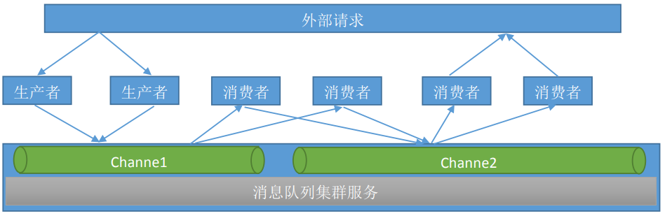
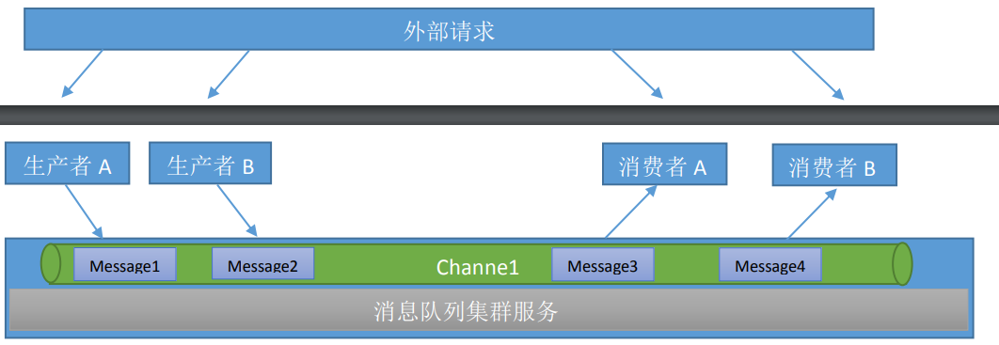
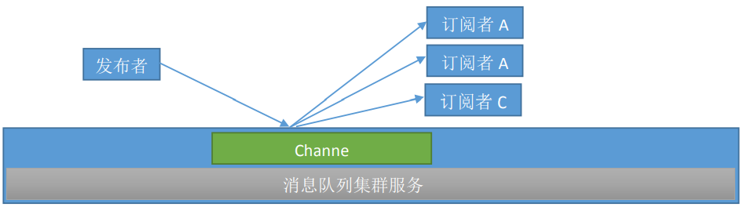

# Redis的消息队列
	消息队列主要分为两种，分别是生产者消费者模式和发布者订阅者模式，这两种模式 Redis 都支持

## 生产者消费者模式
	在生产者消费者(Producer/Consumer)模式下，上层应用接收到的外部请求后开始处理其当前步骤的操作，在执行完成后将已经完成的操作发送至指定的频道(channel)当中，并由其下层的应用监听该频道并继续下一步的操作，如果其处理完成后没有下一步的操作就直接返回数据给外部请求，如果还有下一步的操作就再将任务发布到另外一个频道，由另外一个消费者继续监听和处理。（微服务的典型特征，一个服务只负责处理一类请求）

- 模式介绍：
	生产者消费者模式下，多个消费者同时监听一个队里，但是一个消息只能被最先抢到消息的消费者消费，即消息任务是一次性读取和处理，此模式在分布式业务架构中非常常用，比较常用的软件还有RabbitMQ、Kafka、RocketMQ、ActiveMQ 等

	生产者：接收用户请求
	消费者：处理用户请求

> 生产者接收到用户请求后，将用户请求发送到指定的频道中，消费者监听指定的频道，当收到请求后进行处理，处理完毕后如果没有了下层服务，那么久返回处理后的数据给外部请求，如果还有下层服务，那么消费者就是将请求再次发送到别的频道，由其他的消费者处理

- 队列介绍：
	队列当中的 消息由不同的生产者写入也会有不同的消费者取出进行消费处理，但是一个消息一定是只能被取出一次也就是被消费一次。

### 生产者消费者模式的实现

1. 生产者发布消息
	127.0.0.1:6379> LPUSH channel1 msg1 #从管道的左侧写入
	(integer) 1
	127.0.0.1:6379> LPUSH channel1 msg2
	(integer) 2
	127.0.0.1:6379> LPUSH channel1 msg3
	(integer) 3
	127.0.0.1:6379> LPUSH channel1 msg4
	(integer) 4
	127.0.0.1:6379> LPUSH channel1 msg5
	(integer) 5

2. 查看队列所有消息
	127.0.0.1:6379> LRANGE channel1 0 -1
	1) "msg5"
	2) "msg4"
	3) "msg3"
	4) "msg2"
	5) "msg1"

3. 消费者消费消息
	127.0.0.1:6379> RPOP channel1 #从管道的右侧消费
	"msg1"
	127.0.0.1:6379> RPOP channel1
	"msg2"
	127.0.0.1:6379> RPOP channel1
	"msg3"
	127.0.0.1:6379> RPOP channel1
	"msg4"
	127.0.0.1:6379> RPOP channel1
	"msg5"
	127.0.0.1:6379> RPOP channel1
	(nil)

4. 再次验证消息队列
	127.0.0.1:6379> LRANGE channel1 0 -1
	(empty list or set) #队列中的消息已经被已全部消费完毕

## 发布者订阅者模式
	在发布者订阅者模式下，发布者将消息发布到指定的 channel 里面，凡是监听该 channel 的消费者都会收到同样的一份消息，这种模式类似于是收音机模式，即凡是收听某个频道的听众都会收到主持人发布的相同的消息内容。

> 此模式常用语群聊天、群通知、群公告等场景。

	 Subscriber：订阅者
	 Publisher：发布者
	 Channel：频道

### 发布者订阅者模式的实现

1. 订阅者监听频道
	127.0.0.1:6379> SUBSCRIBE channel1 #订阅者订阅指定的频道
	Reading messages... (press Ctrl-C to quit)
	1) "subscribe"
	2) "channel1"
	3) (integer) 1

2. 发布者发布消息
	127.0.0.1:6379> PUBLISH channel1 test1 #发布者发布消息
	(integer) 2
	127.0.0.1:6379> PUBLISH channel1 test2
	(integer) 2

3. 订阅多个频道：
	订阅指定的多个频道
	127.0.0.1:6379> SUBSCRIBE channel1 channel2

4. 订阅所有频道：
	127.0.0.1:6379> PSUBSCRIBE *

5. 订阅匹配的频道：
	127.0.0.1:6379> PSUBSCRIBE chann* #匹配订阅多个频道