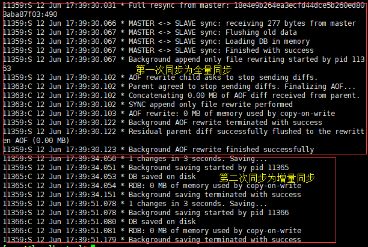
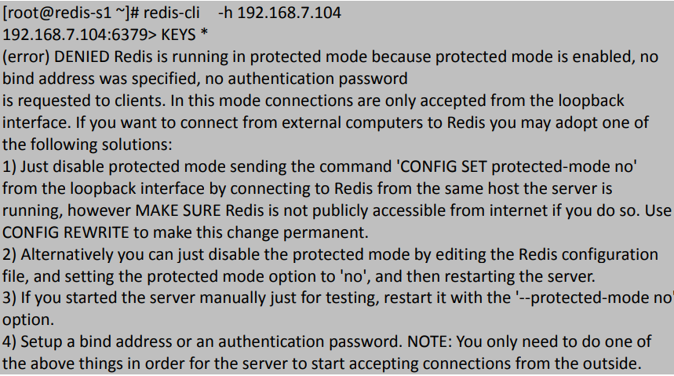

# Redis高可用主从同步
	虽然 Redis 可以实现单机的数据持久化，但无论是 RDB 也好或者 AOF 也好，都解决不了单点宕机问题，即一旦 redis 服务器本身出现系统故障、硬件故障等问题后，就会直接造成数据的丢失，因此需要使用另外的技术来解决单点问题。

## redis的主从复制
	主备模式，可以实现 Redis 数据的跨主机备份

> 程序端连接到高可用负载的 VIP，然后连接到负载服务器设置的 Redis 后端 real server，此模式不需要在程序里面配置 Redis 服务器的真实 IP 地址，当后期 Redis 服务器 IP 地址发生变更只需要更改 redis相应的后端 real server 即可，可避免更改程序中的 IP 地址设置。
> [](http://aishad.top/wordpress/wp-content/uploads/2019/06/redis1.png)

1. slave节点主要配置

> Redis Slave 也要开启持久化并设置和 master 同样的连接密码，因为后期 slave 会有提升为 master 的可能,其他的Slave 端切换 master 节点后会删除所有数据，在新的master节点重新同步数据。

	一旦某个 Slave 成为一个 master 的 slave，Redis Slave 服务会清空当前 redis 服务器上的所有数据并将master 的数据导入到自己的内存，但是断开同步关系后不会删除当前已经同步过的数据。

- 命令行配置当前为master的节点为slvae，并指向 master 服务器的 IP+PORT+Password
	127.0.0.1:6379> SLAVEOF 172.20.45.131 6379
	OK
	127.0.0.1:6379> CONFIG SET masterauth admin123
	OK
127.0.0.1:6379> info Replication  // 查看主从关系状态

2. 保存配置到redis.conf
	281 slaveof 172.20.45.131 6379

 	288 masterauth admin123 #master 如果密码需要设置

### 主从复制过程
	Redis 支持主从复制分为全量同步和增量同步，首次同步是全量同步，主从同步可以让从服务器从主服务器备份数据，而且从服务器还可与有从服务器，即另外一台 redis 服务器可以从一台从服务器进行数据同步，redis 的主从同步是非阻塞的，其收到从服务器的 sync(2.8 版本之前是 PSYNC)命令会fork 一个子进程在后台执行 bgsave 命令，并将新写入的数据写入到一个缓冲区里面，bgsave 执行完成之后并生成的将 RDB 文件发送给客户端，客户端将收到后的 RDB 文件载入自己的内存，然后主 redis将缓冲区的内容在全部发送给从 redis，之后的同步从服务器会发送一个 offset 的位置(等同于 MySQL的 binlog 的位置)给主服务器，主服务器检查后位置没有错误将此位置之后的数据包括写在缓冲区的积压数据发送给 redis 从服务器，从服务器将主服务器发送的挤压数据写入内存，这样一次完整的数据同步，再之后再同步的时候从服务器只要发送当前的 offset 位 置给主服务器，然后主服务器根据响应的位置将之后的数据发送给从服务器保存到其内存即可。

> Redis 全量复制一般发生在 Slave 初始化阶段，这时 Slave 需要将 Master 上的所有数据都复制一份。具
> 体步骤如下：
> 1）从服务器连接主服务器，发送 SYNC 命令；
> 2）主服务器接收到 SYNC 命名后，开始执行 BGSAVE 命令生成 RDB 快照文件并使用缓冲区记录此后执行的所有写命令；
> 3）主服务器 BGSAVE 执行完后，向所有从服务器发送快照文件，并在发送期间继续记录被执行的写命令；
> 4）从服务器收到快照文件后丢弃所有旧数据，载入收到的快照；
> 5）主服务器快照发送完毕后开始向从服务器发送缓冲区中的写命令；
> 6）从服务器完成对快照的载入，开始接收命令请求，并执行来自主服务器缓冲区的写命令；
> 7）后期同步会先发送自己 slave_repl_offset 位置，只同步新增加的数据，不再全量同步。

[](http://aishad.top/wordpress/wp-content/uploads/2019/06/slave.png)

- 同步日志：
[](http://aishad.top/wordpress/wp-content/uploads/2019/06/slave2.png)

## 主从同步优化
	Redis 在 2.8 版本之前没有提供增量部分复制的功能，当网络闪断或者 slave Redis 重启之后会导致主从之间的全量同步，即从 2.8 版本开始增加了部分复制的功能。

- repl-diskless-sync yes
	yes 为支持 disk，master 将 RDB 文件先保存到磁盘在发送给 slave，no 为 maste直接将 RDB 文件发送给 slave，默认即为使用 no，Master RDB 文件不需要与磁盘交互。

- repl-diskless-sync-delay 5
	Master 准备好 RDB 文件后等等待传输时间

- repl-ping-slave-period 10
	slave 端向 server 端发送 ping 的时间区间设置，默认为 10 秒

- repl-timeout 60 
	设置超时时间

- repl-disable-tcp-nodelay no
	是否启用 TCP_NODELAY，如设置成 yes，则 redis 会合并小的 TCP 包从而节省带宽，但会增加同步延迟（40ms），造成 master 与 slave 数据不一致，假如设置成 no，则 redis master会立即发送同步数据，没有延迟，前者关注性能，后者关注一致性

- repl-backlog-size 1mb
	master 的写入数据缓冲区，用于记录自上一次同步后到下一次同步过程中间的写入命令，计算公式：b repl-backlog-size = 允许从节点最大中断时长 * 主实例 offset 每秒写入量，比如 master 每秒最大写入 64mb，最大允许 60 秒，那么就要设置为 64mb*60 秒=3840mb(3.8G)

- repl-backlog-ttl 3600
	如果一段时间后没有 slave 连接到 master，则 backlog size 的内存将会被释放。如果值为 0 则表示永远不释放这部份内存。

- slave-priority 100 
	slave 端的优先级设置，值是一个整数，数字越小表示优先级越高。当 master 故障时将会按照优先级来选择 slave 端进行恢复，如果值设置为 0，则表示该 slave 永远不会被选择。

- min-slaves-to-write 0

- min-slaves-max-lag 10
	设置当一个 master 端的可用 slave 少于 N 个，延迟时间大于 M 秒时，不接收写操作。

### slave切换master

> SLAVEOF no one：不会是任何一个节点的从节点

### slave节点还能再有slave

- 在有 slave 的”master”查看状态：
```bash
	# Replication
	role:slave
	master_host:192.168.7.102
	master_port:6379
	master_link_status:up
	master_last_io_seconds_ago:9 #最近一次与 master 通信已经过去多少秒。
	master_sync_in_progress:0 #是否正在与 master 通信。
	slave_repl_offset:5334 #当前同步的偏移量。
	slave_priority:100 #slave 优先级，master 故障后值越小越优先同步。
	slave_read_only:1
	connected_slaves:1
	slave0:ip=192.168.7.104,port=6379,state=online,offset=5334,lag=1
	master_replid:0f0318c25a022add7fd51d4438c470cf608631f9
	master_replid2:0000000000000000000000000000000000000000
	master_repl_offset:5334
	second_repl_offset:-1
	repl_backlog_active:1
	repl_backlog_size:1048576
	repl_backlog_first_byte_offset:1
	repl_backlog_histlen:5334
```
## 主从同步常见问题

1. master密码不对
	即配置的 master 密码不对，导致验证不通过而无法建立主从同步关系。
[](http://aishad.top/wordpress/wp-content/uploads/2019/06/err3.png)

2. Redis 版本不一致：
	不同的 redis 版本之间存在兼容性问题，因此各 master 和 slave 之间必须保持版本一致。
[](http://aishad.top/wordpress/wp-content/uploads/2019/06/err1.png)

3. 无法远程连接：
	在开启了安全模式情况下，没有设置 bind 地址和密码
[](http://aishad.top/wordpress/wp-content/uploads/2019/06/err2.png)