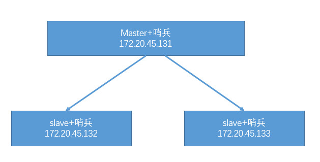
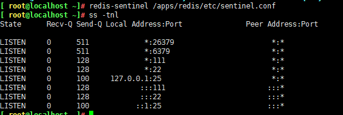
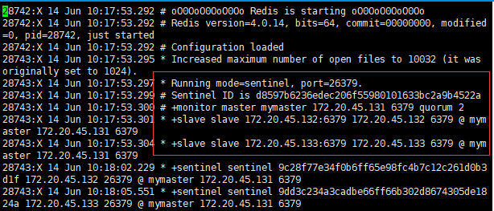
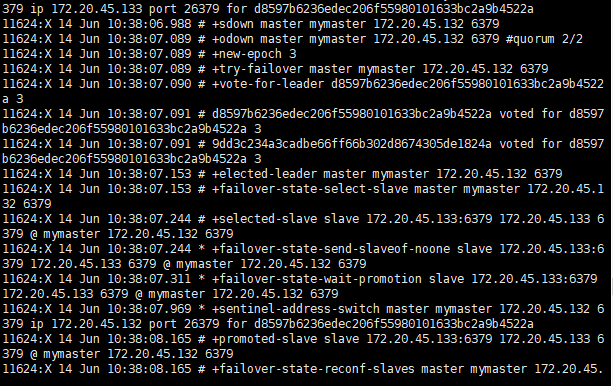
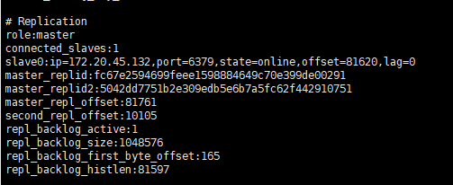
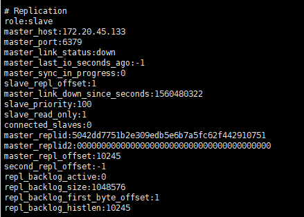

# Sentinel(哨兵)简介：解决 master 和 slave 角色的自动切换问题。
	sentinel进程是用于监控redis集群中master主服务器工作状态，在Master主服务器发生故障的时候，可以时间master和slave服务器的切换，保证系统的高可用
	哨兵是一个分布式系统，可以再一个架构中运行多个哨兵进程，这些进程使用流语言协议来接收关于master祝福去是否下线的信息，并使用偷笑协议来决定是否执行自动故障迁移，以及选择哪个slave作为新的master

- SDOWN
	每个哨兵(Sentinel)进程会向其它哨兵(Sentinel)、Master、Slave 定时发送消息，以确认方是否"活"着，如果发现对方在指定配置时间(可配置的)内未得到回应，则暂时认为对方已掉线，也就是所谓的”主观认为宕机” ，英文名称：Subjective Down，简称 SDOWN。

- ODOWN：
	当“哨兵集群”中的多数 Sentinel 进程在对 Master 主服务器做出 SDOWN 的判断，并且通过 SENTINEL is-masterdown-by-addr 命令互相交流之后，得出的 Master Server 下线判断，这种方式就是“客观宕机”，英文名称是：Objectively Down， 简称 ODOWN。通过一定的 vote 算法，从剩下的 slave 从服务器节点中，选一台提升为 Master 服务器节点，然后自动修改相关配置，并开启故障转移（failover）。

## 哨兵机制的实现
	需要手动先指定某一台 Redis 服务器为 master，然后将其他 slave 服务器使用命令配置为 master 服务器的 slave

[](http://aishad.top/wordpress/wp-content/uploads/2019/06/shaobing.png)

1. 配置redis 的master服务器

2. 在132服务器和133服务器配置为master的slave

3. 三台redis服务器哨兵配置：
	哨兵可以不和 Redis 服务器部署在一起
```bash
	cp /usr/local/src/redis-4.0.14/sentinel.conf /apps/redis/etc/ #拷贝sentinel配置文件
	vim /apps/redis/etc/sentinel.conf
		bind 0.0.0.0 
		port 26379   
		daemonize yes 
		dir /apps/redis 
		pidfile "redis_26379.pid"
		logfile "sentinel_26379.log"
		sentinel monitor mymaster 172.20.45.131 6379 2 
		sentinel auth-pass mymaster admin123 
		sentinel down-after-milliseconds mymaster 30000 
		sentinel parallel-syncs mymaster 1
		sentinel failover-timeout mymaster 180000
		sentinel deny-scripts-reconfig yes
```

- 哨兵配置文件详解：
```bash 
	bind 0.0.0.0 #监听的地址
	port 26379   # 监听的端口
	daemonize yes #是否以守护进程运行
	dir /apps/redis # log文件和pid文件的存放目录
	pidfile "redis_26379.pid"
	logfile "sentinel_26379.log"
	sentinel monitor mymaster 172.20.45.131 6379 2 #当前的master地址，端口和法定人数
			#法定人数：即有几个slave认为master 宕机了就进行故障转移
	sentinel auth-pass mymaster admin123 #master的name和密码，name和上面配置的name一样
	sentinel down-after-milliseconds mymaster 30000 #SDOWN)主观下线的时间，单位毫秒，各个哨兵的主管下线时间要一致
	sentinel parallel-syncs mymaster 1 #发生故障转移时候同时向新 master 同步数据的 slave 数量，数字越小总同步时间越长，数字过大的话会导致新的master节点的负载过大
	sentinel failover-timeout mymaster 180000
	#所有 slaves 指向新的 master 所需的超时时间，slave切换为master后，其他的slave在指定的时间内没有指向新的master，视为超时
	sentinel deny-scripts-reconfig yes #禁止修改脚本，类似于通知脚本
```

4. 启动哨兵
	三台哨兵都要启动
	redis-sentinel /apps/redis/etc/sentinel.conf 

5. 验证端口
[](http://aishad.top/wordpress/wp-content/uploads/2019/06/26379.png)


6. 查看哨兵日志
[](http://aishad.top/wordpress/wp-content/uploads/2019/06/rizhi.png)

6. 验证
	尤其是最后一行，涉及到 master IP 是多少，有几个 slave，有几个 sentinels，必须是符合全部服务器数量的。
```bash
[ root@localhost /]# redis-cli -p 26379
127.0.0.1:26379> info Sentinel
# Sentinel
sentinel_masters:1  #监控了一个master
sentinel_tilt:0
sentinel_running_scripts:0
sentinel_scripts_queue_length:0
sentinel_simulate_failure_flags:0
master0:name=mymaster,status=ok,address=172.20.45.131:6379,slaves=2,sentinels=4
```

7. 测试停止 Redis Master 测试故障转移

- master节点：
	kill -9 `cat /apps/redis/data/redis_26379.pid`

- 查看日志：
[](http://aishad.top/wordpress/wp-content/uploads/2019/06/rizhi2.png)

> master节点转移到133服务器，132服务器的master指向133

[](http://aishad.top/wordpress/wp-content/uploads/2019/06/rizhi3.png)

- 重新上线131的哨兵

> 131变为slave接点，master指向133

[](http://aishad.top/wordpress/wp-content/uploads/2019/06/rizhi4.png)

- 故障转移后的 redis 配置文件
	故障转移后 redis.conf 中的 replicaof 行的 master IP 会被修改，sentinel.conf 中的 sentinel monitor IP 会被修改。

```bash
grep -v "^#" /apps/redis/etc/sentinel.conf
	sentinel leader-epoch mymaster 3

	sentinel known-slave mymaster 172.20.45.132 6379
	sentinel known-slave mymaster 172.20.45.131 6379
	sentinel known-sentinel mymaster 172.20.45.131 26379 d8597b6236edec206f55980101633bc2a9b4522a
	sentinel known-sentinel mymaster 172.20.45.133 26379 9dd3c234a3cadbe66ff66b302d8674305de1824a
	sentinel known-sentinel mymaster 172.20.45.132 26379 9c28f77e34f0b6ff65e98fc4b7c12c261d0b3d1f
	sentinel current-epoch 3
```