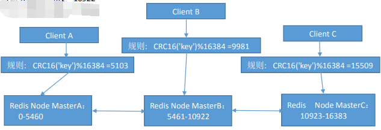
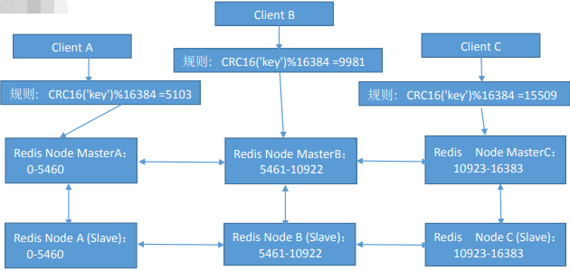
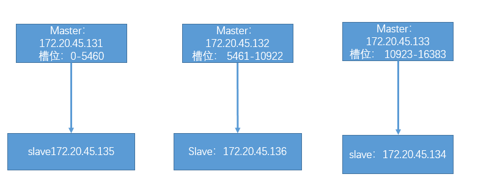
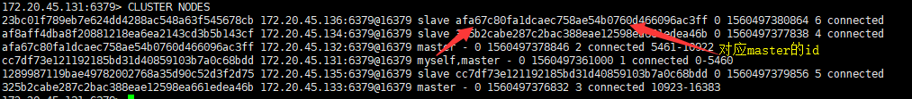

# 程序与redis之间的通信

1. java连接redis
	java 客户端连接 redis 是通过 jedis 来实现的，java 代码用的时候只要创建 jedis 对象就可以建多个 jedis 连接池来连接 redis，应用程序再直接调用连接池即可连接 Redis。
	而 Redis 为了保障高可用,服务一般都是 Sentinel 部署方式，当 Redis 服务中的主服务挂掉之后,会仲裁出另外一台 Slaves 服务充当 Master。这个时候,我们的应用即使使用了 Jedis 连接池,Master服务挂了,我们的应用奖还是无法连接新的 Master 服务，为了解决这个问题,Jedis 也提供了相应的Sentinel 实现,能够在 Redis Sentinel 主从切换时候,通知我们的应用,把我们的应用连接到新的Master 服务。
	Jedis Sentinel 的使用也是十分简单的,只是在 JedisPool 中添加了 Sentinel 和 MasterName 参数，Jedis Sentinel 底层基于 Redis 订阅实现 Redis 主从服务的切换通知，当 Reids 发生主从切换时，Sentinel 会发送通知主动通知 Jedis 进行连接的切换，JedisSentinelPool 在每次从连接池中获取链接对象的时候,都要对连接对象进行检测,如果此链接和 Sentinel 的 Master 服务连接参数不一致,则会关闭此连接,重新获取新的 Jedis 连接对象。

2. python与redis连接
	yum install python-pip
	pip install redis

```python
#!/bin/env python
#Author: ZhangJie
import redis
pool = redis.ConnectionPool(host="192.168.7.101", port=6379,password="123456")
r = redis.Redis(connection_pool=pool)
for i in range(100):
 r.set("k%d" % i,"v%d" % i)
 data=r.get("k%d" % i)
print(data)
```

## Redis的分布式方案：

1. 客户端分区：由客户端程序决定 key 写分配和写入的 redis node，但是需要客户端自己处理写入分配、高可用管理和故障转移等,例如java通过jedis管理。

2. 代理方案：基于三方软件实现 redis proxy，客户端先连接之代理层，由代理层实现 key 的写入分配，对客户端来说是有比较简单，但是对于集群管节点增减相对比较麻烦，而且代理本身也是单点和性能瓶颈。

## Redis cluster
	在哨兵 sentinel 机制中，可以解决 redis 高可用的问题，即当 master 故障后可以自动将 slave 提升为master 从而可以保证 redis 服务的正常使用，但是无法解决 redis 单机写入的瓶颈问题，即单机的 redis写入性能受限于单机的内存大小、并发数量、网卡速率等因素，因此 redis 官方在 redis 3.0 版本之后推出了无中心架构的 redis cluster 机制，在无中心的 redis 集群汇中，其每个节点保存当前节点数据和整个集群状态,每个节点都和其他所有节点连接，特点如下：

1. 所有 Redis 节点使用(PING 机制)互联

2. 集群中某个节点的失效，是整个集群中超过半数的节点监测都失效才算真正的失效

3. 客户端不需要 proxy 即可直接连接 redis，应用程序需要写全部的 redis 服务器 IP。

4. redis cluster 把所有的 redis node 映射到 0-16383 个槽位(slot)上，读写需要到指定的 redis node 上进行操作，因此有多少个 reids node 相当于 redis 并发扩展了多少倍。

5. Redis cluster 预先分配 16384 个(slot)槽位，当需要在 redis 集群中写入一个 key -value 的时候，会使用 CRC16(key) mod 16384 之后的值，决定将 key 写入值哪一个槽位从而决定写入哪一个 Redis 节点上，从而有效解决单机瓶颈。

### cluster基本架构
	加入三个主节点分别是：A, B, C 三个节点，采用哈希槽 (hash slot)的方式来分配 16384 个 slot 的话，它们三个节点分别承担的 slot 区间是：
	节点 A 覆盖 0－5460
	节点 B 覆盖 5461－10922
	节点 C 覆盖 10923－16383
[](http://aishad.top/wordpress/wp-content/uploads/2019/06/cluster.png)

### cluster的主从架构
	Redis cluster 的架构虽然解决了并发的问题，但是又引入了一个新的问题，每个 Redis master 的高可用如何解决？
[](http://aishad.top/wordpress/wp-content/uploads/2019/06/mscluster.png)


## Redis Cluster的实现

- 实验方式一：三台服务器，每台服务器启动 6379 和 6380 两个 redis 服务。

- 实验方式二：7台服务器，前6台服务器启动6379端口的redis服务，另外预留一台服务器做集群添加节点测试。

- 创建redis cluster集群的前提：

1. 每个 redis node 节点采用相同的硬件配置、相同的密码
2. 每个节点必须开启的参数
	cluster-enabled yes #必须开启集群状态，开启后 redis 进程会有 cluster 显示
	cluster-config-file nodes-6380.conf #此文件有 redis cluster 集群自动创建和维护，不需要任何手动操作，配置文件会保存在上面指定的dir中

3. 所有 redis 服务器必须没有任何数据

4. 先启动为单机 redis 且没有任何 key value

5. 设置masterauth密码，为了让创建集群后slave节点用来同步使用

### Redis 3 和 4 版本redis cluster的实现
	需要使用到集群管理工具 redis-trib.rb，这个工具是 redis 官方推出的管理 redis 集群的工具，集成在redis 的源码 src 目录下，是基于 redis 提供的集群命令封装成简单、便捷、实用的操作工具，redis-trib.rb是 redis 作者用 ruby 完成的，centos 系统 yum 安装的 ruby 存在版本较低问题，因此要编译安装ruby

1. 在所有节点安装redis为master节点。并打开集群功能，redis会开启6379端口和16379端口，16379端口是集群通讯端口，集群的服务器会通过这个端口来进行状态通告

2. 在任意一台服务器编译安装ruby：需要2.3以上的版本
```bash
[ root@localhost src]# wget https://cache.ruby-lang.org/pub/ruby/2.5/ruby-2.5.5.tar.xz
[ root@localhost src]# tar -xvf ruby-2.5.5.tar.gz
[ root@localhost src]# cd ruby-2.5.5/
[ root@localhost ruby-2.5.5]# ./configure
[ root@localhost ruby-2.5.5]# make -j 4
[ root@localhost ruby-2.5.5]# make install
[ root@localhost ruby-2.5.5]# gem install redis  安装redis模块
```

3. redis-trib.rb命令
```bash
Usage: redis-trib <command> <options> <arguments ...>
 create 	host1:port1 ... hostN:portN #创建集群
 		--replicas <arg> #指定 master 的副本数量
 check 		host:port #检查集群信息
 info 		host:port #查看集群主机信息
 fix 		host:port #修复集群
 		--timeout <arg>
 reshard 	host:port #在线热迁移集群指定主机的 slots 数据
		 --from <arg>
		 --to <arg>
		 --slots <arg>
		 --yes
		 --timeout <arg>
		 --pipeline <arg>
 rebalance 	host:port #平衡集群中各主机的 slot 数量
		 --weight <arg>
		 --auto-weights
		 --use-empty-masters
		 --timeout <arg>
		 --simulate
		 --pipeline <arg>
		 --threshold <arg>
 add-node new_host:new_port existing_host:existing_port #添加主机到集群
		 --slave
		 --master-id <arg>
 del-node 	host:port node_id #删除主机
 set-timeout host:port milliseconds #设置节点的超时时间
 call host:port command arg arg .. arg #在集群上的所有节点上执行命令
 import host:port #导入外部 redis 服务器的数据到当前集群
		 --from <arg>
		 --copy
		 --replace
 help (show this help)
```

4. 创建集群

- 添加集群的登录密码
```bash
 vim /usr/local/lib/ruby/gems/2.5.0/gems/redis-4.1.2/lib/redis/client.rb
```
- 创建集群
```bash
[ root@localhost ruby-2.5.5]# redis-trib.rb create --replicas 1 172.20.45.131:6379 172.20.45.132:6379 172.20.45.133:6379 172.20.45.134:6379 172.20.45.135:6379 172.20.45.136:6379
>>> Creating cluster
>>> Performing hash slots allocation on 6 nodes...
Using 3 masters:
172.20.45.131:6379
172.20.45.132:6379
172.20.45.133:6379
Adding replica 172.20.45.135:6379 to 172.20.45.131:6379
Adding replica 172.20.45.136:6379 to 172.20.45.132:6379
Adding replica 172.20.45.134:6379 to 172.20.45.133:6379
M: cc7df73e121192185bd31d40859103b7a0c68bdd 172.20.45.131:6379  #带 M 的为 master
   slots:0-5460 (5461 slots) master  #当前 master 的槽位起始和结束位
M: afa67c80fa1dcaec758ae54b0760d466096ac3ff 172.20.45.132:6379
   slots:5461-10922 (5462 slots) master
M: 325b2cabe287c2bac388eae12598ea661edea46b 172.20.45.133:6379
   slots:10923-16383 (5461 slots) master
S: af8aff4dba8f20881218ea6ea2143cd3b5b143cf 172.20.45.134:6379   #带 S 的 为slave
   replicates 325b2cabe287c2bac388eae12598ea661edea46b
S: 1289987119bae49782002768a35d90c52d3f2d75 172.20.45.135:6379
   replicates cc7df73e121192185bd31d40859103b7a0c68bdd
S: 23bc01f789eb7e624dd4288ac548a63f545678cb 172.20.45.136:6379
   replicates afa67c80fa1dcaec758ae54b0760d466096ac3ff
Can I set the above configuration? (type 'yes' to accept): yes  #输入yes
>>> Nodes configuration updated
>>> Assign a different config epoch to each node
>>> Sending CLUSTER MEET messages to join the cluster
Waiting for the cluster to join....
>>> Performing Cluster Check (using node 172.20.45.131:6379)
M: cc7df73e121192185bd31d40859103b7a0c68bdd 172.20.45.131:6379 
   slots:0-5460 (5461 slots) master 
   1 additional replica(s)
S: 23bc01f789eb7e624dd4288ac548a63f545678cb 172.20.45.136:6379
   slots: (0 slots) slave
   replicates afa67c80fa1dcaec758ae54b0760d466096ac3ff
S: af8aff4dba8f20881218ea6ea2143cd3b5b143cf 172.20.45.134:6379
   slots: (0 slots) slave
   replicates 325b2cabe287c2bac388eae12598ea661edea46b
M: afa67c80fa1dcaec758ae54b0760d466096ac3ff 172.20.45.132:6379
   slots:5461-10922 (5462 slots) master
   1 additional replica(s)
S: 1289987119bae49782002768a35d90c52d3f2d75 172.20.45.135:6379
   slots: (0 slots) slave
   replicates cc7df73e121192185bd31d40859103b7a0c68bdd
M: 325b2cabe287c2bac388eae12598ea661edea46b 172.20.45.133:6379
   slots:10923-16383 (5461 slots) master
   1 additional replica(s)
[OK] All nodes agree about slots configuration.   #所有节点槽位分配完成
>>> Check for open slots...     #检查打开的槽位
>>> Check slots coverage...     #检查插槽覆盖范围
[OK] All 16384 slots covered.  #所有槽位(16384 个)分配完成
```

> 如果有之前的操作导致 Redis 集群创建报错，则执行清空数据和集群命令：
> 127.0.0.1:6379> FLUSHALL
> OK
> 127.0.0.1:6379> cluster reset
> OK

### Redis 5 版本redis cluster的实现
```bash
	[root@redis-s1 ~]# redis-cli -a admin123 --cluster create 172.20.45.131:6379 172.20.45.132:6379 172.20.45.133:6379 172.20.45.134:6379 172.20.45.135:6379 172.20.45.136:6379

```
#### 创建后的集群信息：
[](http://aishad.top/wordpress/wp-content/uploads/2019/06/cluster2.png)

> 如果在配置文件中没有设置masterauth的密码，那么需要到每台slave节点手动配置master的密码
> CONFIG SET masterauth admin123

#### 验证集群状态

1. 172.20.45.131:6379> CLUSTER NODES：查看集群 node 对应关系
[](http://aishad.top/wordpress/wp-content/uploads/2019/06/cluster3.png)

2. 验证集群写入 key
```bash
	172.20.45.131:6379> SET key1 aaa  #经过算法计算，当前 key 的槽位需要写入指定的 node 
	(error) MOVED 9189 172.20.45.132:6379   #槽位不在当前 node 所以无法写入

```

3. 集群状态监控
```bash
[ root@localhost ruby-2.5.5]# redis-trib.rb check 172.20.45.131:6379（任意节点的ip+端口）
>>> Performing Cluster Check (using node 172.20.45.131:6379)
M: cc7df73e121192185bd31d40859103b7a0c68bdd 172.20.45.131:6379
   slots:0-5460 (5461 slots) master
   1 additional replica(s)
S: 23bc01f789eb7e624dd4288ac548a63f545678cb 172.20.45.136:6379
   slots: (0 slots) slave
   replicates afa67c80fa1dcaec758ae54b0760d466096ac3ff
S: af8aff4dba8f20881218ea6ea2143cd3b5b143cf 172.20.45.134:6379
   slots: (0 slots) slave
   replicates 325b2cabe287c2bac388eae12598ea661edea46b
M: afa67c80fa1dcaec758ae54b0760d466096ac3ff 172.20.45.132:6379
   slots:5461-10922 (5462 slots) master
   1 additional replica(s)
S: 1289987119bae49782002768a35d90c52d3f2d75 172.20.45.135:6379
   slots: (0 slots) slave
   replicates cc7df73e121192185bd31d40859103b7a0c68bdd
M: 325b2cabe287c2bac388eae12598ea661edea46b 172.20.45.133:6379
   slots:10923-16383 (5461 slots) master
   1 additional replica(s)
[OK] All nodes agree about slots configuration.
>>> Check for open slots...
>>> Check slots coverage...
[OK] All 16384 slots covered.


#redis5：redis-cli -a 123456 --cluster check 192.168.7.101:6379
```

4. 集群状态监控
```bash
[ root@localhost ruby-2.5.5]# redis-trib.rb info 172.20.45.131:6379
172.20.45.131:6379 (cc7df73e...) -> 0 keys | 5461 slots | 1 slaves.
172.20.45.132:6379 (afa67c80...) -> 0 keys | 5462 slots | 1 slaves.
172.20.45.133:6379 (325b2cab...) -> 0 keys | 5461 slots | 1 slaves.
[OK] 0 keys in 3 masters.
0.00 keys per slot on average.
```