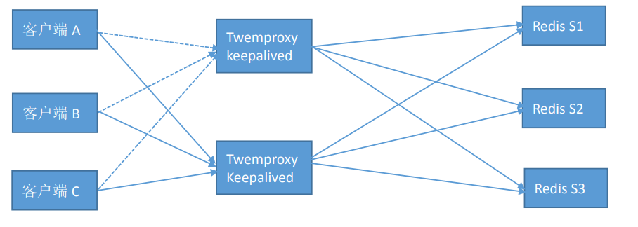

# redis 扩展集群方案：
	除了 Redis 官方自带的 Redis cluster 集群之外，还有一些开源的集群解决方案可供参考使用

## codis
	Codis 是一个分布式 Redis 解决方案, 对于上层的应用来说, 连接到 Codis Proxy 和连接原生的Redis Server 没有显著区别 (令不支持的命列表), 上层应用可以像使用单机的 Redis 一样使用, Codis底层会处理请求的转发, 不停机的数据迁移等工作, 所有后边的一切事情, 对于前面的客户端来说是透明的, 可以简单的认为后边连接的是一个内存无限大的 Redis 服务。
	
	codis-proxy 相当于 redis，即连接 codis-proxy 和连接 redis 是没有任何区别的，codis-proxy 无状态，不负责记录是否在哪保存，数据在 zookeeper 记录，即 codis proxy 向 zookeeper 查询 key 的记录位置，proxy 将请求转发到一个组进行处理，一个组里面有一个 master 和一个或者多个 slave 组成，默认有1024 个槽位，redis cluster 默认有 16384 个槽位，其把不同的槽位的内容放在不同的 group。
[Github 地址](：https://github.com/CodisLabs/codis/blob/release3.2/doc/tutorial_zh.md "Github 地址")

#### 详细的部署见大神的文档
[redis集群codis实现(上)][redis集群codis实现(上)]
[redis集群codis实现(下)][redis集群codis实现(下)]

## twemproxy
	由 Twemproxy 双向代理客户端实现分片，即代替用户将数据分片并到不同的后端服务器进行读写，其还支持 memcached，可以为 proxy 配置算法，缺点为 twemproxy 是瓶颈，不支持数据迁移，官方
[github 地址](https://github.com/twitter/twemproxy "github 地址")

[1]: http://blogs.studylinux.net/?p=3832 "redis集群codis实现(上)"
[redis集群codis实现(上)]: http://blogs.studylinux.net/?p=3832 "redis集群codis实现(上)"
[redis集群codis实现(下)]: http://blogs.studylinux.net/?p=3890 "redis集群codis实现(下)"
[redis集群codis实现(下)]: http://blogs.studylinux.net/?p=3890 "redis集群codis实现(下)"
[redis集群codis实现(上)]: http://blogs.studylinux.net/?p=3832 "redis集群codis实现(上)"