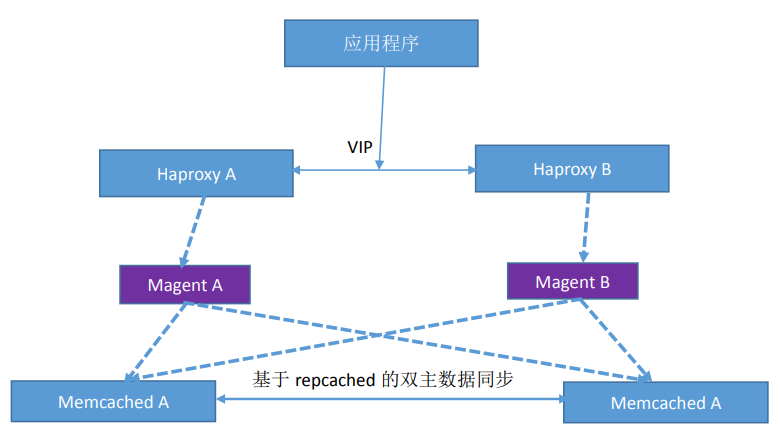
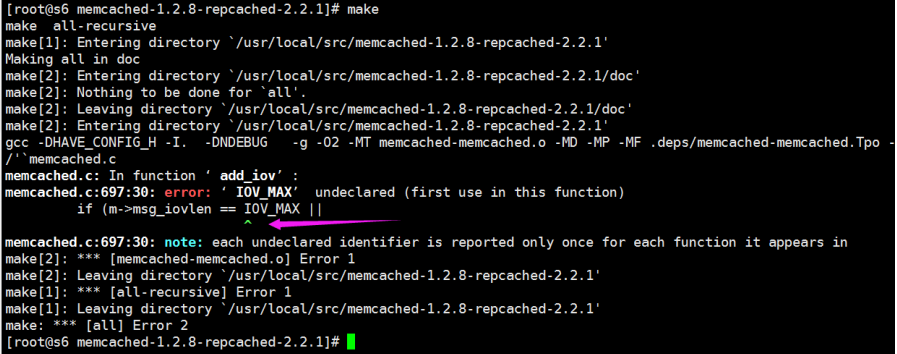

# memcached
	memcache 本身没有像 redis 所具备的数据持久化功能，比如 RDB 和 AOF 都没有，但是可以通过做集群同步的方式，让各 memcache 服务器的数据进行同步，从而实现数据的一致性，即保证各 memcache的数据是一样的，即使有任何一台 memcache 发生故障，只要集群种有一台 memcache 可用就不会出现数据丢失，当其他 memcache 重新加入到集群的时候可以自动从有数据的 memcache 当中自动获取数据并提供服务。
	Memcache 借助了操作系统的 libevent 工具做高效的读写。libevent 是个程序库，它将 Linux 的 epoll、BSD 类操作系统的 kqueue 等事件处理功能封装成统一的接口。即使对服务器的连接数增加，也能发挥高性能。memcached 使用这个 libevent 库，因此能在 Linux、BSD、Solaris 等操作系统上发挥其高性能。
	Memcache 支持最大的内存存储对象为 1M，超过 1M 的数据可以使用客户端压缩或拆分报包放到多个key 中，比较大的数据在进行读取的时候需要消耗的时间比较长，memcache 最适合保存用户的 session实现 session 共享，Memcached 存储数据时, Memcached 会去申请 1MB 的内存, 把该块内存称为一个slab, 也称为一个 page。

> memcached 具有多种语言的客户端开发包，包括：Perl/PHP/JAVA/C/Python/Ruby/C#/

## memcached单机部署

1. 安装使用
```bash
yum install memcached -y

vim /etc/sysconfig/memcached
	PORT="11211" #监听端口
	USER="memcached" #启动用户
	MAXCONN="1024" #最大连接数
	CACHESIZE="1024" #最大使用内存
	OPTIONS="" #其他选项

systemctl start memcached
```

2. python操作memcache
```python
#!/usr/bin/env python
#coding:utf-8
#Author:Zhang ShiJie
import memcache
m = memcache.Client(['172.18.200.106:11211'], debug=True)
for i in range(100):
 m.set("key%d" % i,"v%d" % i)
 ret = m.get('key%d' % i)
 print ret
```

3. 编译安装：
```bash
yum install libevent libevent-devel –y
pwd
/usr/local/src
tar xvf memcached-1.5.12.tar.gz
./configure --prefix=/usr/local/memcache
make && make install
## 启动
/usr/local/memcache/bin/memcached -u memcached -p 11211 -m 2048 -c 65536 &
```

## memcached集群部署架构

### 基于 magent 的部署架构：
	该部署方式依赖于 magent 实现高可用，应用端通过负载服务器连接到 magent，然后再由 magent代理用户应用请求到 memcached 处理，底层的 memcached 为双主结构会自动同步数据，本部署方式存在 magent 单点问题因此需要两个 magent 做高可用。
[](http://aishad.top/wordpress/wp-content/uploads/2019/06/memaged.png)

	magent 已经有很长时间没有更新，因此可以不再使用 magent，直接通过负载均衡连接之 memcached，任然有两台 memcached 做高可用，memcached 会自动同步数据保持数据一致性，即使一台 memcached故障也不影响业务正常运行，故障的 memcached 修复上线后再自动从另外一台同步数据即可保持数据一致性。

### Repcached
	在 master 上可以通过 -X 指定 replication port，在 slave 上通过 -x/-X 找到 master 并 connect 上去，事实上，如果同时指定了 -x/-X， repcached 一定会尝试连接，但如果连接失败，它就会用 -X 参数来自己 listen（成为 master）；如果 master坏掉，slave侦测到连接断了，它会自动 listen而成为 master；而如果 slave 坏掉， master 也会侦测到连接断，它就会重新 listen 等待新的 slave 加入。从这方案的技术实现来看，其实它是一个单 master 单 slave 的方案，但它的 master/slave 都是可读写的，而且可以相互同步，所以从功能上看，也可以认为它是双机 master-master 方案。

### 部署 repcached
	http://repcached.sourceforge.net/

```bash
[root@s6 src]# yum install libevent libevent-devel –y
[root@s6 src]# tar xvf memcached-1.2.8-repcached-2.2.1.tar.gz
[root@s6 src]# cd memcached-1.2.8-repcached-2.2.1
[root@s6 memcached-1.2.8-repcached-2.2.1]# ./configure --prefix=/usr/local/repcached --enable-replication
```

- 编译完成后执行make编译时会报错：
[](http://aishad.top/wordpress/wp-content/uploads/2019/06/error_mem.png)

- 解决方法：
```bash
[root@s6 memcached-1.2.8-repcached-2.2.1]# vim memcached.c
 56 #ifndef IOV_MAX
 57 #if defined(__FreeBSD__) || defined(__APPLE__)
 58 # define IOV_MAX 1024
 59 #endif
 60 #endif
改为如下内容：
 55 /* FreeBSD 4.x doesn't have IOV_MAX exposed. */
 56 #ifndef IOV_MAX
 57 # define IOV_MAX 1024
 58 #endif

```
- 再次编译安装：
	 make && make install

- 验证是否可执行:/usr/local/repcached/bin/memcached -h

- 启动memcaced
	通过 repcached 安装的 memcached 命令启动 memcache 服务并实现 memcache 主备结构，其中-x 为对方即主 memcache 的 IP，-X 为本地启动的用数据同步的端口：

1. server1操作：ip：172.20.45.138
	/usr/local/repcached/bin/memcached -d -m 2048 -p 11211 -u root -c 2048 -x 172.20.45.139 -X 16000

2. server2操作：ip：172.20.45.139
	/usr/local/repcached/bin/memcached -d -m 2048 -p 11211 -u root -c 2048 -x 172.20.45.138 -X 16000

- 测试：

1. 在server1执行命令
```bash
[ root@localhost ~]# telnet 127.0.0.1 11211
Trying 127.0.0.1...
Connected to 127.0.0.1.
Escape character is '^]'.
set name 0 0 4
jack
STORED
get name
VALUE name 0 4
jack
END
get name2
VALUE name2 0 4
toom
END
```

2. 在server2执行名

```bash
[ root@localhost ~]# telnet 127.0.0.1 11211
Trying 127.0.0.1...
Connected to 127.0.0.1.
Escape character is '^]'.
get name
VALUE name 0 4
jack
END
set name2 0 0 4
toom
STORED
get name2
VALUE name2 0 4
toom
END
```
> 可以实现互相同步，配置成功