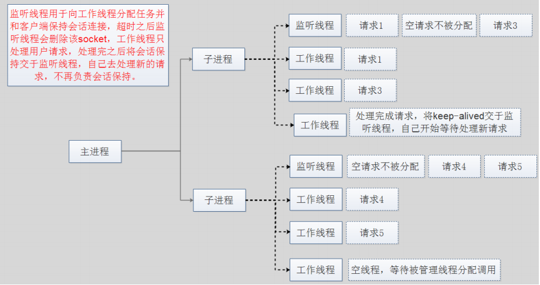

# Nginx第一篇：WEB基础知识
	简单的单次WEB服务的访问流程

## 重温Apache的三种工作方式：
1. prefork模型
	预派生模式(多进程模型)，一个主进程控制，然后生成多个子进程，使用select模型，最大并发1024，每个子进程有一个独立的想吃响应用户请求，相对比较占用内存，但是比较稳定，

2. worker模型
	一种多进程多线程混合的模型，由一个控制进程来启动多个子进程，每个子进程里面包含固定的线程，使用线程来处理请求，当线程不够使用的时候，会再启动一个新的子进程，然后在进程里面再启动线程处理请求，由于其使用了线程处理请求，因此可以承受更高的并发。优点：相比prefork占用的内存较小，可以同时处理更多的请求。缺点：使用长连接方式，某一线程即使没有数据传输也会被一直占用，需要等待到超时才会被释放如果过多的线程，被这样占据，也会导致在高并发场景下的无服务线程可用。（该问题在prefork模式下，同样会发生）

3. event模型
	事件驱动模型，每个进程响应多个请求，和worker很像，最大的区别在于，event解决了在长连接场景下，长期被占用的线程的资源浪费的问题，event中，会有专门的线程来管理这些长连接类型的线程，当有真实的请求过来的时候，将请求传递给服务器线程，执行完毕后，又允许它释放，这样增强了高并发场景下的请求处理能力。有点：单线程响应更多请求，占用更少的内存，高并发下会更优秀。缺点：没有线程安全控制

## Nginx-高性能的web服务器
	Nginx以功能丰富著称，它既可以是http服务器，也可以作为反向代理服务器或邮件服务器，能够快速的响应静态网页的请求，支持FastCGI/SSL/Virtual Host/URL Rwrite/Gzip/HTTP Basic Auth/http或者TCP的负载均衡等功能，而且支持第三方的功能扩展
	
	基于Nginx的访问流程如下

### WEB服务器的性能影响
- 客户端
1. 硬件配置
2. 网络速率
3. 客户端与服务器端的距离

- 服务器端
1. 网络速率
2. 硬件配置
3. 架构设计
4. 应用程序工作模式
5. 并发数量
6. 响应文件大小及数量
7. I/O压力

#### 服务器端I/O
	I/O在计算机中指Input/Output， IOPS (Input/Output Per Second)即每秒的输入输出量(或读写次数)，是衡量磁盘性能的主要指标之一。IOPS是指单位时间内系统能处理的I/O请求数量，一般以每秒处理的I/O请求数量为单位，I/O请求通常为读或写数据操作请求
	
	一次完整的I/O是用户空间的进程数据与内核空间的内核数据的报文的完整交换，但是由于内核空间与用户空间是严格隔离的，所以其数据交换过程中不能由用户空间的进程直接调用内核空间的内存数据，而是需要经历一次从内核空间中的内存数据copy到用户空间的进程内存当中，所以简单说I/O就是把数据从内核空间中的内存数据复制到用户空间中进程的内存当中。

	磁盘I/O是进程向内核发起系统调用，请求磁盘上的某个资比如是文件或者是图片，然后内核通过相应的驱动程序将目标图片加载到内核的内存空间，加载完成之后把数据从内核存再复制给进程内存，如果是比较大的数据也需要等待时间

- 每次IO，都要经由两个阶段：
	第一步：将数据从文件先加载至内核内存空间（缓冲区），等待数据准备完成，时间较长
	第二步：将数据从内核缓冲区复制到用户空间的进程的内存中，时间较短

#### 系统I/O模型
- 同步和异步
	关注的是消息通信机制，即在等待一件事情的处理结果时，被调用者是否提供完成通知

1. 同步：进程发出请求调用后，等内核返回响应以后才继续下一个请求，即如果内核一直不返回数据，那么进程就一直等
2. 异步：进程发出请求调用后，不等内核返回响应，接着处理下一个请求,Nginx是异步的。

#### 网络I/O模型
- 阻塞型、非阻塞型、复用型、信号驱动型、异步

##### 同步阻塞星I/O模型(blocking IO)
	同步阻塞：程序向内核发送IO请求后一直等待内核响应，如果内核处理请求的IO操作不能立即返回,则进程将一直等待并不再接受新的请求，并由进程轮训查看IO是否完成，完成后进程将IO结果返回给Client，在IO没有返回期间进程不能接受其他客户的请求，而且是有进程自己去查看IO是否完成，这种方式简单，但是比较慢，用的比较少。

##### 同步非阻塞型I/O模型(nonblocking IO)
	同步非阻塞：程序向内核发送请IO求后一直等待内核响应，如果内核处理请求的IO操作不能立即返回IO结果，进程将不再等待，而且继续处理其他请求，但是仍然需要进程隔一段时间就要查看内核IO是否完成。

##### IO多路复用型(IO multiplexing)
	IO multiplexing就是我们说的select，poll，epoll，有些地方也称这种IO方式为event driven IO。select/epoll的好处就在于单个process就可以同时处理多个网络连接的IO。它的基本原理就是select，poll，epoll这个function会不断的轮询所负责的所有socket，当某个socket有数据到达了，就通知用户进程。 当用户进程调用了select，那么整个进程会被block，而同时，kernel会“监视”所有select负责的socket，当任何一个socket中的数据准备好了，select就会返回。这个时候用户进程再调用read操作，将数据从kernel拷贝到用户进程
	
	Apache prefork是此模式的select，work是poll模式。

##### 信号驱动式IO(signal-driven IO)
	异步阻塞：程序进程向内核发送IO调用后，不用等待内核响应，可以继续接受其他请求，内核收到进程请求后进行的IO如果不能立即返回，就由内核等待结果，直到IO完成后内核再通知进程，apache event是此模式。

##### 异步(非阻塞) IO(asynchronous IO)
	异步非阻塞：程序进程向内核发送IO调用后，不用等待内核响应，可以继续接受其他请求，内核调用的IO如果不能立即返回，内核会继续处理其他事物，直到IO完成后将结果通知给内核，内核在将IO完成的结果返回给进程，期间进程可以接受新的请求，内核也可以处理新的事物，因此相互不影响，可以实现较大的同时并实现较高的IO复用，因此异步非阻塞使用最多的一种通信方式。

