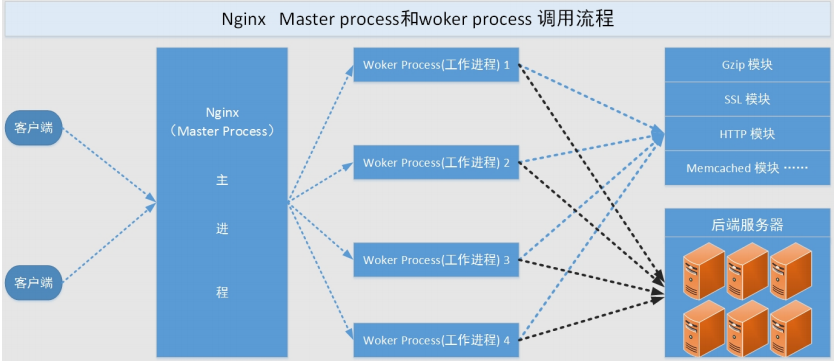

# Nginx第二篇：Nginx基础配置(一)
	Nginx：engine X ，2002年，开源，商业版 Nginx是免费的、开源的、高性能的HTTP和反向代理服务器、邮件代理服务器、以及TCP/UDP代理服务器

## 基础特性：
	模块化设计，较好的扩展性
	高可靠性
	支持热部署：不停机更新配置文件，升级版本，更换日志文件
	低内存消耗：10000个keep-alive连接模式下的非活动连接，仅需2.5M内存
	event-driven,aio,mmap，sendfile
## 基本功能：
	静态资源的web服务器
	http协议反向代理服务器
	pop3/imap4协议反向代理服务器
	FastCGI(LNMP),uWSGI(python)等协议
	模块化（非DSO），如zip，SSL模块

- ：和web服务相关的功能：
	虚拟主机（server）
	支持 keep-alive 和管道连接(利用一个连接做多次请求)
	访问日志（支持基于日志缓冲提高其性能）
	url rewirte
	路径别名
	基于IP及用户的访问控制
	支持速率限制及并发数限制
	重新配置和在线升级而无须中断客户的工作进程

## WEB请求处理机制
1. 多进程方式：服务器每接收到一个客户端请求就有服务器的主进程生成一个子进程响应客户端，直到用户关闭连接，这样的优势是处理速度快，子进程之间相互独立，但是如果访问过大会导致服务器资源耗尽而无法提供请求。

2. 、多线程方式：与多进程方式类似，但是每收到一个客户端请求会有服务进程派生出一个线程来个客户方进行交互，一个线程的开销远远小于一个进程，因此多线程方式在很大程度减轻了web服务器对系统资源的要求，但是多线程也有自己的缺点，即当多个线程位于同一个进程内工作的时候，可以相互访问同样的内存地址空间，所以他们相互影响，一旦主进程挂掉则所有子线程都不能工作了，IIS服务器使用了多线程的方式，需要间隔一段时间就重启一次才能稳定。

### Nginx的工作方式：
	Nginx是多进程组织模型，而且是一个由Master主进程和Worker工作进程组成。
[](http://aishad.top/wordpress/wp-content/uploads/2019/05/nginx_work.png)

- 主进程的功能

1. 读取Nginx配置文件并进行验证其有效性和正确定
2. 建立、绑定、和关闭socket连接
3. 按照配置生成、管理和结束工作进程
4. 接收外界指令，比如重启、升级、及退出服务器等指令
5. 不中断服务，实现平滑升级，重启服务并应用新的配置
6. 开启日志文件，获取文件描述符
7. 不中断服务，实现平滑升级，升级失败进行回滚处理
8. 编译和处理perl脚本

- 工作进程的功能

1. 接收处理客户的请求
2. 将请求以此送入各个功能模块进行处理
3. IO调用，获取响应数据
4. 与后端服务器通信，接收后端服务器处理结果
5. 缓存数据，访问缓存索引，查询和调用缓存数据
6. 发送请求结果，响应客户的请求
7. 接收主程序指令

### 进程间通信
- 主进程与工作进程的通信
	工作进程是由主进程生成的，主进程使用fork()函数，在Nginx服务器启动过程中主进程根据配置文件决定启动工作进程的数量，然后建立一张全局的工作表用于存放当前未退出的所有的工作进程，主进程生成工作进程后会将新生成的工作进程加入到工作进程表中，并建立一个单向的管道并将其传递给工作进程，该管道与普通的管道不同，它是由主进程指向工作进程的单项通道，包含了主进程向工作进程发出的指令、工作进程ID、工作进程在工作进程表中的索引和必要的文件描述符等信息。 主进程与外界通过信号机制进行通信，当接收到需要处理的信号时，它通过管道向相关的工作进程发送正确的指令，每个工作进程都有能力捕获管道中的可读事件，当管道中有可读事件的时候，工作进程就会从管道中读取并解析指令，然后采取相应的执行动作，这样就完成了主进程与工作进程的交互。

- 工作进程间的通信：
	工作进程之间的通信原理基本上和主进程与工作进程之间的通信是一样的，只要工作进程之间能够取得彼此的信息，建立管道即可通信，但是由于工作进程之间是完全隔离的，因此一个进程想要直到另外一个进程的状态信息就只能通过主进程来设置了。
	为了实现工作进程之间的交互，主进程在生成工作进程只之后，在工作进程表中进行遍历，将该新进程的ID以及针对该进程建立的管道句柄传递给工作进程中的其他进程，为工作进程之间的通信做准备，当工作进程1向工作进程2发送指令的时候，首先在主进程给它的其他工作进程工作信息中找到2的进程ID，然后将正确的指令写入指向进程2的管道，工作进程2捕获到管道中的事件后，解析指令并进行相关操作，这样就完成了工作进程之间的通信。

[](http://aishad.top/wordpress/wp-content/uploads/2019/05/进程间通信.png)

### Nginx的模块
- 核心模块：core module
	：是 Nginx 服务器正常运行 必不可少 的模块，提供 错误日志记录 、 配置文件解析 、 事件驱动机制 、 进程管理 等核心功能 标准HTTP模块：提供 HTTP 协议解析相关的功能，比如： 端口配置 、 网页编码设置 、 HTTP响应头设置 等等

- 标准模块
	主要用于扩展标准的 HTTP 功能，让 Nginx 能处理一些特殊的服务，比如：Flash 多媒体传输 、解析 GeoIP 请求、 网络传输压缩 、 安全协议 SSL 支持等

1. HTTP模块：ngx_http_*
	HTTP Core modules 默认功能
	HTTP Optional modules 需编译时指定

2. Mail模块：ngx_mail_*
	：主要用于支持 Nginx的 邮件服务 ，包括对 POP3 协议、 IMAP 协议和 SMTP协议的支持

3. Stream模块：ngx_stream_*
- 第三方模块
	是为了扩展 Nginx 服务器应用，完成开发者自定义功能，比如： Json 支持、 Lua 支持等
[](http://aishad.top/wordpress/wp-content/uploads/2019/05/nginx_mode.png)

## Nginx的安装
- yum安装：
	需要提前配置好epel源
	yum -y install nginx 
	（如果想yum安装高版本的nginx，需要自己手动配置yum源，详细见官网nginx.org）
```bash
yum install yum-utils
vim /etc/yum.repos.d/nginx.repo
	[nginx-stable]
	name=nginx stable repo
	baseurl=http://nginx.org/packages/centos/$releasever/$basearch/
	gpgcheck=1
	enabled=1
	gpgkey=https://nginx.org/keys/nginx_signing.key

	[nginx-mainline]
	name=nginx mainline repo
	baseurl=http://nginx.org/packages/mainline/centos/$releasever/$basearch/
	gpgcheck=1
	enabled=0
	gpgkey=https://nginx.org/keys/nginx_signing.key
```

- 编译安装：
1. 安装依赖包
	yum install -y vim lrzsz tree screen psmisc lsof tcpdump wget ntpdate gcc gcc-c++ glibc glibc-devel pcre pcre-devel openssl openssl-devel systemd-devel net-tools iotop bc zip unzip zlib-devel bash-completion nfs-utils automake libxml2 libxml2-devel libxslt libxslt-devel perl perl-ExtUtils-Embed

2.下载官方源码包并解压：
	wget http://nginx.org/download/nginx-1.14.2.tar.gz

3. 编译安装：
```bash
	./configure --prefix=/apps/nginx \
	--user=nginx \
	--group=nginx \
	--with-http_ssl_module \
	--with-http_v2_module \
	--with-http_realip_module \
	--with-http_stub_status_module \
	--with-http_gzip_static_module \
	--with-pcre \
	--with-stream \
	--with-stream_ssl_module \
	--with-stream_realip_module
```

	make && make install

4. 创建启动用户
	useradd nginx -s /sbin/nologin -u 2000
	chown nginx.nginx -R /apps/nginx/

5. 创建启动脚本
```bash
vim /usr/lib/systemd/system/nginx.service
	[Unit]
	Description=nginx - high performance web server
	Documentation=http://nginx.org/en/docs/
	After=network-online.target remote-fs.target nss-lookup.target
	Wants=network-online.target

	[Service]
	Type=forking
	PIDFile=/apps/nginx/logs/nginx.pid
	ExecStart=/apps/nginx/sbin/nginx -c /apps/nginx/conf/nginx.conf
	ExecReload=/bin/kill -s HUP $MAINPID
	ExecStop=/bin/kill -s TERM $MAINPID

	[Install]
	WantedBy=multi-user.target

systemctl  daemon-reload
```

6. ln -sv /apps/nginx/sbin/nginx /usr/sbin/

### Nginx的使用
- nginx -h :查看帮助信息
- nginx -v：查看版本信息
- nginx -V：显示版本和编译参数
	编译参数用于再次编译环境相同的ngxin时使用
- nginx -t：检查配置文件是否有语法错误
- ngxin -T：显示nginx启动后生效的配置
- nginx -q：静默模式
- nginx -s 信号：给nginx发送信号 默认start，还有 stop，reload，quit
	reload：旧的工作进程不断开，等待结束后回收，新的工作进程会连接到新加载的工作进程
- nginx -p 路径：指定Nginx 目录
- nginx -c filename：指定配置文件
- g directives：全局配置指令

## 配置Nginx
- 主配置文件：nginx.conf
	主配置文件的配置指令：directive value [value2 ...];

- 辅助配置文件 include conf.d/*.conf

- 配置须知：
1. 指令必须以分号结尾
2. 支持使用配置变量
	内建变量：由Nginx模块引入，可直接引用
	自定义变量：由用户使用set命令定义
		set variable_name value;
	引用变量：$variable_name

### 全局配置指令：
1. user nginx;	nginx启动后工作进程的属主
	属主对于nginx来说非常重要，当我们通过nginx上传数据的时候，存储在后端的时候会以该后端服务进程的属主的身份上传，如果后端服务器的启动用户和nginx不一样的话，读取的时候回导致没有权限读取该文件，所以应该在一个架构中，所有服务的启动用户以及用户的UID都应该是一样的

2. worker_processes  1; 	启动后工作进程的数量，一般设置为CPU的核心数，支持auto自动判断

3. worker_cpu_affinity 00000001 00000010; 	目前指定的是两核cpu
	将Nginx工作进程绑定到指定的CPU核心，默认Nginx是不进行进程绑定的，绑定并不是意味着当前nginx进程独占以一核心CPU，但是可以保证此进程不会运行在其他核心上，这就极大减少了nginx的工作进程在不同的cpu核心上的来回跳转，减少了CPU对进程的资源分配与回收以及内存管理等，因此可以有效的提升nginx服务器的性能。一般不将nginx的工作进程绑定在第一核CPU，将第一核CPU单独留个内核使用

	 ps axo pid,cmd,psr | grep nginx：查看工作进程工作在哪颗CPU

4. 错误日志配置，语法 error_log file [debug | info | notice | warn | error | crit |alert | emerg]
	error_log logs/error.log;
	error_log logs/error.log notice;
	error_log /apps/nginx/logs/error.log error;

5. PID文件保存路径：
	pid		/apps/nginx/logs/nginx.pid （nginx用户要对指定的目录有写入权限，否则nginx pid文件不会创建）

6. worker_priority  	0; 工作进程优先级 	 	-20~19
	watch -n1 'ps -axo pid,cmd,nice | grep nginx #验证进程优先级

7. worker_rlimit_nofile 	65536; 
	这个数字包括Nginx的所有连接（例如与代理服务器的连接等），而不仅仅是与客户端的连接,另一个考虑因素是实际的并发连接数不能超过系统级别的最大打开文件数的限制

8. daemon 	off; 是否前台运行nginx服务，一般用于测试、docker等环境

9. master_process 		off|on; 是否开启nginx的master-worker工作模型，默认开启

### event配置字段

1. worker_connections 65536;
	设置单个nginx工作进程可以接受的最大并发，作为web服务器的时候最大并发数为worker_connections * worker_processes，作为反向代理的时候为(worker_connections * worker_processes)/2

2. use epoll；使用epoll事件驱动，nginx支持众多的事件驱动，比如select，poll，epoll，这个字段只能设置在event中

3. accept_mutex 	on;优化同一时刻只有一个请求而避免多个睡眠进行被唤醒的设置，on为防止被同时唤醒，默认为off，全部唤醒的过程被称为“惊群”，因此nginx完成安装后要进行适当的优化

4. multi_accept 	on;nginx服务器的每个工作进程可以同时接受多个新的网络连接请求，但是需要在配置文件中配置，此选项默认为关闭，即默认一个工作进程只能一次接受一个新的网络请求，打开后几个同时接受多个

### http配置段：在所有的server中生效
	#http块是Nginx服务器配置中的重要部分，缓存、代理和日志格式定义等绝大多数功能和第三方模块都可以在这设置，http块可以包含多个server块，而一个server块中又可以包含多个location块，server块可以配置文件引入、MIME-Type定义、日志自定义、是否启用sendfile、连接超时时间和单个链接的请求上限等。

1. include 		mime.types;导入支持的文件类型,默认定义类型的文件在nginx.conf文件所在目录下的mime.types

2. defaule_type 	application/octet-stream;除了定义的MIME类型之外的类型怎么处理，这里指的会将文件下载下来

3. sendfile 	on;作为web服务器的时候打开sendfile加快文件传输，只有是nginx作为web服务器的时候才会生效
	sendfile系统调用来传输文件，sendfile系统调用在两个文件描述符之间传递数据(完全在内核中操作)，从而避免了数据在内核缓冲区之间的拷贝，操作效率极高，被称为零拷贝(只有用户请求的资源在nginx本地是再回生效)，硬盘 >> kernel buffer(快速拷贝到kernel socket buffer) >> 协议栈
	tcp_nopush on; #在开启了sendfile的情况下，合并请求后统一发送给客户端。
	tcp_nodelay off; #在开启了keepalived模式下的连接是否启用TCP_NODELAY选项，当为off时，延迟0.2s发送，默认On时，不延迟发送，立即发送用户相应报文。

4. keepalive_timeout 65 60;长连接超时时间，单位是秒,无操作时长的链接断开时间
	第一个值是nginx定义的连接断开时间，第二个值是在响应报文中传递给客户端显示的时间，准确时间以第一个值为准，keepalive_timeout 0；为不开启长连接的

5. gzip 	on;是否开启压缩

### http中的server配置段：在当前的server中生效
	#设置一个虚拟机主机，可以包含自己的全局快，同时也可以包含多个locating模块。比如本虚拟机监听的端口、本虚拟机的名称和IP配置，多个server 可以使用一个端口，比如都使用80端口提供web服务

1. listen 80; #配置server监听的端口
	listen ip:port;
	listen *:port;

2. server_name localhost; 本server的名称，当访问此名称的时候nginx会调用当前serevr内部的配置进程匹配。，可以使用空格隔开写多个，并支持正则表达式
	*.aishad.top 	www.aishad.* 	~^www\d+\.magedu\.com$   default_server

3. charset 	 utf-8;设置编码格式，默认为koi8-r俄语格式


- location 模块：
	location其实是server的一个指令，为nginx服务器提供比较多而且灵活的指令，都是在location中提现的，主要是基于nginx接受到的请求字符串，对用户请求的UIL进行匹配，并对特定的指令进行处理，包括地址重定向、数据缓存和应答控制等功能都是在这部分实现，另外很多第三方模块的配置也是在location模块中配置 

	一个location中只要要有一个root字段和一个index字段

1. root html; #相当于默认页面的目录名称，默认是相对路径，可以使用绝对路径配置。(yum安装默认在/usr/share/nginx/html)

2. index index.html index.htm; #默认的页面文件名称

3. error_page 500 502 503 504 /50x.html; #错误页面的文件名称

4. location ~ /\.ht { #拒绝web形式访问指定文件，如很多的网站都是通过.htaccess文件来改变自己的重定向等功能。
	location ~ /\.passwd.html {deny all;}

5. root和alias

- root：指定web的加目录，在定义location的时候，文件的绝对路径是root+location
```bash
	server{
        listen 80;
        server_name www.weiying.com;
        location / {
                root /data/html/pc;
}
	# 绝对路径是：/data/html/weiying/index.html
```

- alias：定义路径别名，会把访问的路径重新定义到其他指定的路径
```bash
	server{
        listen 80;
        server_name www.weiying.com;
        location / {
                root /data/html/pc;
                index index.html;
        }
        location /alias {
                alias /data/html/pc;
                index index.html;
        }
}
	访问www.weiying.com/alias的时候，理论上是去访问/data/html/pc/alias/index.html,在定义alias后，实际访问的是/data/html/pc/index.html
```

### 实验一：实现基于location的多页面nginx
方法一：

1. vim /apps/nginx/conf/nginx.conf：在http段添加
	location /weiying {
            root   /data/html;
            index  index.html index.htm;
        }

2. mkdir -p /data/html/weiying
3. echo weiying > /data/html/weiying/index.html

方法二：
1. vim /apps/nginx/conf/nginx.conf：在http段添加
	include /apps/nginx/conf/vhosts/*.conf;
2. mkdir /apps/nginx/conf/server
3. vim apps/nginx/conf/server/test.conf
```bash
	server{
		listen 80;
		server_name www.weiying.com;
		location / {
			root /data/html/weiying;
			index index.html;
		}
	}
```

### 实验二：模拟现实在一个web网站上创建pc端和移动端
```bash
	echo pc page > /data/html/pc/index.html
	echo mobile page > /data/html/mobile/index.html
	vim /apps/nginx/conf/vhosts/pc.conf 
		server{
			listen 80;
			server_name www.weiying.com;
			location / {
				root /data/html/pc;
				index index.html;
			}
		}
	vim /apps/nginx/conf/vhosts/mobile.conf 
		server{
			listen 80;
			server_name m.weiying.com;
			location / {
				root /data/html/mobile;
				index index.html;
			}
		}
```