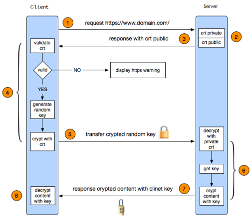

# Nginx高级配置(二) 

## Nginx自定义访问日志

	访问日志是记录客户端即用户的具体请求内容信息，全局配置模块中的error_log是记录nginx服务器运行时的日志保存路径和记录日志的level，因此，有着本质的区别，而且nginx的错误日志一般只有一个，但是访问日志可以再不同的server中定义多个，定义一个日志需要使用access_log指定日志的保存路径，使用log_format指定日志的格式，格式中定义要保存的日志具体日志内容

### 自定义默认格式日志
	如果是要保留日志的源格式，知识添加响应的日志内容，则配置如下：
``` bash
	log_format nginx_format '$remote_addr - $remote_user [$time_local] "$request"'
		'$status $body_bytes_sent "$http_referer" '
		'"$http_user_agent" "$http_x_forwarded_for"'
		'$server_name:$server_port';
		access_log logs/access.log nginx_format1;
```

- 默认日志记录示例：
	221.216.26.65 - - [02/Jun/2019:09:21:10 +0800] "POST /wordpress/wp-admin/admin-ajax.php HTTP/1.1" 200 157 "http://aishad.top/wordpress/wp-admin/post-new.php" "Mozilla/5.0 (Windows NT 10.0; WOW64; Trident/7.0; rv:11.0; SE 2.X MetaSr 1.0) like Gecko"

### 自定义json格式日志
	Nginx的默认访问日志记录的内容相对比较单一，默认的格式也不方便火气做日志统计分析，生产环境中通常将nginx日志转换为json日志，然后配合使用ELK做日志收集-统计-分析

- 设置方法：
```bash
	log_format access_json '{"@timestamp":"$time_iso8601",'
		'"host":"$server_addr",'
		'"clientip":"$remote_addr",'
		'"size":$body_bytes_sent,'
		'"responsetime":$request_time,'
		'"upstreamtime":"$upstream_response_time",'
		'"upstreamhost":"$upstream_addr",'
		'"http_host":"$host",'
		'"uri":"$uri",'
		'"domain":"$host",'
		'"xff":"$http_x_forwarded_for",'
		'"referer":"$http_referer",'
		'"tcp_xff":"$proxy_protocol_addr",'
		'"http_user_agent":"$http_user_agent",'
		'"status":"$status"}';
		
	access_log /apps/nginx/logs/access_json.log access_json;
```

#### json格式的日志访问统计示例
```bash
	#!/usr/bin/env python
	#coding:utf-8

	status_200= []
	status_404= []
	with open("access_json.log") as f:
		for line in f.readlines():
			line = eval(line)
			if line.get("status") == "200":
				status_200.append(line.get)
			elif line.get("status") == "404":
				status_404.append(line.get)
			else:
				print("状态码 ERROR")
	f.close()
	print "状态码200的有--:",len(status_200)
	print "状态码404的有--:",len(status_404)
```

## nginx压缩功能
	Nginx支持对指定类型的文件进行压缩然后再传输给客户端，而且压缩还可以设置压缩比例，压缩后的文件大小将比源文件显著变小，这样有助于降低出口带宽的利用率，降低企业的IT支出，不过会占用相应的CPU资源。

- Nginx对文件的压缩功能是依赖于模块ngx_http_gzip_module

### 压缩功能具体配置

- 启用或禁用gzip压缩，默认关闭
	gzip on | off;
- 压缩比由低到高从1到9，默认为1
	gzip_comp_level level;
- 禁用IE6 gzip功能
	gzip_disable "MSIE [1-6]\.";
- gzip压缩的最小文件，小于设置值的文件将不会压缩
	gzip_min_length 1k;
- 启用压缩功能时，协议的最小版本，默认HTTP/1.1
	gzip_http_version 1.0 | 1.1;
- 指定Nginx服务需要向服务器申请的缓存空间的个数*大小，默认32 4k|16 8k;
	gzip_buffers number size;
- 指明仅对哪些类型的资源执行压缩操作；默认为gzip_types text/html，不用显示指定，否则出错
	gzip_types mime-type ...;
- 如果启用压缩，是否在响应报文首部插入“Vary: Accept-Encoding”
	gzip_vary on | off;


## https功能
	Web网站的登录页面都是使用https加密传输的，加密数据以保障数据的安全，HTTPS能够加密信息，以免敏感信息被第三方获取，所以很多银行网站或电子邮箱等等安全级别较高的服务都会采用HTTPS协议，HTTPS其实是有两部分组成：HTTP + SSL / TLS，也就是在HTTP上又加了一层处理加密信息的模块。服务端和客户端的信息传输都会通过TLS进行加密，所以传输的数据都是加密后的数据。

[](http://aishad.top/wordpress/wp-content/uploads/2019/06/https.png)

### https具体实现过程

1. 客户端发起HTTPS请求：
	客户端访问某个web端的https地址，一般都是443端口

2. 服务端的配置：
	采用https协议的服务器必须要有一套证书，可以通过一些组织申请，也可以自己制作，目前国内很多网站都自己做的，当你访问一个网站的时候提示证书不可信任就表示证书是自己做的，证书就是一个公钥和私钥匙，就像一把锁和钥匙，正常情况下只有你的钥匙可以打开你的锁，你可以把这个送给别人让他锁住一个箱子，里面放满了钱或秘密，别人不知道里面放了什么而且别人也打不开，只有你的钥匙是可以打开的。

3. 传送证书：
	服务端给客户端传递证书，其实就是公钥，里面包含了很多信息，例如证书得到颁发机构、过期时间等等

4. 客户端解析证书：
	这部分工作是有客户端完成的，首先回验证公钥的有效性，比如颁发机构、过期时间等等，如果发现异常则会弹出一个警告框提示证书可能存在问题，如果证书没有问题就生成一个随机值，然后用证书对该随机值进行加密，就像2步骤所说把随机值锁起来，不让别人看到。

5. 传送4步骤的加密数据：
	就是将用证书加密后的随机值传递给服务器，目的就是为了让服务器得到这个随机值，以后客户端和服务端的通信就可以通过这个随机值进行加密解密了。

6. 服务端解密信息：
	服务端用私钥解密5步骤加密后的随机值之后，得到了客户端传过来的随机值(私钥)，然后把内容通过该值进行对称加密，对称加密就是将信息和私钥通过算法混合在一起，这样除非你知道私钥，不然是无法获取其内部的内容，而正好客户端和服务端都知道这个私钥，所以只要机密算法够复杂就可以保证数据的安全性。

7. 传输加密后的信息:
	服务端将用私钥加密后的数据传递给客户端，在客户端可以被还原出原数据内容。

8. 客户端解密信息：
	客户端用之前生成的私钥获解密服务端传递过来的数据，由于数据一直是加密的，因此即使第三方获取到数据也无法知道其详细内容。

### 实现httpd的具体配置

1. ssl on | off;
	为指定的虚拟主机配置是否启用ssl功能，此功能在1.15.0废弃，使用listen [ssl]替代。

2. ssl_certificate /path/to/file;
	当前虚拟主机使用使用的公钥文件，一般是crt文件

3. ssl_certificate_key /path/to/file;
	当前虚拟主机使用的私钥文件，一般是key文件

4. ssl_protocols [SSLv2] [SSLv3] [TLSv1] [TLSv1.1] [TLSv1.2];
	支持ssl协议版本，早期为ssl现在是TSL，默认为后三个

5. ssl_session_cache off | none | [builtin[:size]] [shared:name:size];
	配置ssl缓存
	off： 关闭缓存
	none: 通知客户端支持ssl session cache，但实际不支持
	builtin[:size]：使用OpenSSL内建缓存，为每worker进程私有
	[shared:name:size]：在各worker之间使用一个共享的缓存，需要定义一个缓存名称和缓存空间大小，一兆可以存储4000个会话信息，多个虚拟主机可以使用相同的缓存名称。

6. ssl_session_timeout time;#客户端连接可以复用ssl session cache中缓存的有效时长，默认5m

### 实现多域名的https
	Nginx支持基于单个IP实现多域名的功能，并且还支持单IP多域名的基础之上实现HTTPS，其实是基于Nginx的SNI（Server Name Indication）功能实现，SNI是为了解决一个Nginx服务器内使用一个IP绑定多个域名和证书的功能，其具体功能是客户端在连接到服务器建立SSL链接之前先发送要访问站点的域名（Hostname），这样服务器再根据这个域名返回给客户端一个合适的证书。

#### 具体实现步骤：
1. 制作key和csr文件
```bash
[root@s2 certs]# openssl req -newkey rsa:4096 -nodes -sha256 -keyout mobile.magedu.net.key -out mobile.magedu.net.csr
	Generating a 4096 bit RSA private key
	..........
	Country Name (2 letter code) [XX]:CN
	State or Province Name (full name) []:BeiJing
	Locality Name (eg, city) [Default City]:BeiJing
	Organization Name (eg, company) [Default Company Ltd]:magedu
	Organizational Unit Name (eg, section) []:magedu
	Common Name (eg, your name or your server's hostname) []:mobile.magedu.net
	Email Address []:2973707860@qq.com
	Please enter the following 'extra' attributes
	to be sent with your certificate request
	A challenge password []:
	An optional company name []:
```

2. 签名证书
```bash
[root@s2 certs]# openssl x509 -req -days 3650 -in mobile.magedu.net.csr -CA ca.crt -CAkey ca.key -CAcreateserial -out mobile.magedu.net.crt
	Signature ok
	subject=/C=CN/ST=BeiJing/L=BeiJing/O=magedu/OU=magedu/CN=mobile.magedu.net/emailAdd
ress=2973707860@qq.com
	Getting CA Private Key
```

3. 验证证书内容
```bash
	[root@s2 certs]# openssl x509 -in mobile.magedu.net.crt -noout -text
	Certificate:
		Data:
			Version: 1 (0x0)
			Serial Number:
				bb:76:ea:fe:f4:04:ac:07
		Signature Algorithm: sha256WithRSAEncryption
			Issuer: C=CN, ST=BeiJing, L=Beijing, O=magedu.Ltd, OU=magedu,CN=magedu.ca/emailAddress=2973707860@qq.com
		Validity
			Not Before: Feb 22 13:50:43 2019 GMT
			Not After : Feb 19 13:50:43 2029 GMT
			Subject: C=CN, ST=BeiJing, L=BeiJing, O=magedu, OU=magedu,CN=mobile.magedu.net/emailAddress=2973707860@qq.com
		Subject Public Key Info:
			Public Key Algorithm: rsaEncryption
				Public-Key: (4096 bit)
..............
```

4. nginx配置

```bash
[root@s2 certs]# cat /apps/nginx/conf/conf.d/mobile.conf
	server {
		listen 80 default_server;
		server_name mobile.magedu.net;
		rewrite ^(.*)$ https://$server_name$1 permanent;
	}
	server {
		listen 443 ssl;
		server_name mobile.magedu.net;
		ssl_certificate /apps/nginx/certs/mobile.magedu.net.crt;
		ssl_certificate_key /apps/nginx/certs/mobile.magedu.net.key;
		ssl_session_cache shared:sslcache:20m;
		ssl_session_timeout 10m;
	location / {
		root "/data/nginx/html/mobile";
	}
	location /mobile_status {
		stub_status;
		#allow 172.16.0.0/16;
		#deny all;
	}
	}

```

## 关于favicon.ico
	favicon.ico 文件是浏览器收藏网址时显示的图标，当客户端使用浏览器问页面时，浏览器会自己主动发起请求获取页面的favicon.ico文件，但是当浏览器请求的favicon.ico文件不存在时，服务器会记录404日志，而且浏览器也会显示404报错。

- 配置：

```bash
一：服务器不记录访问日志：
	location = /favicon.ico {
	log_not_found off;
	access_log off;
	}
二：将图标保存到指定目录访问：
	location ~ ^/favicon\.ico$ {
	location = /favicon.ico {
	root /data/nginx/html/pc/images;
	}

```