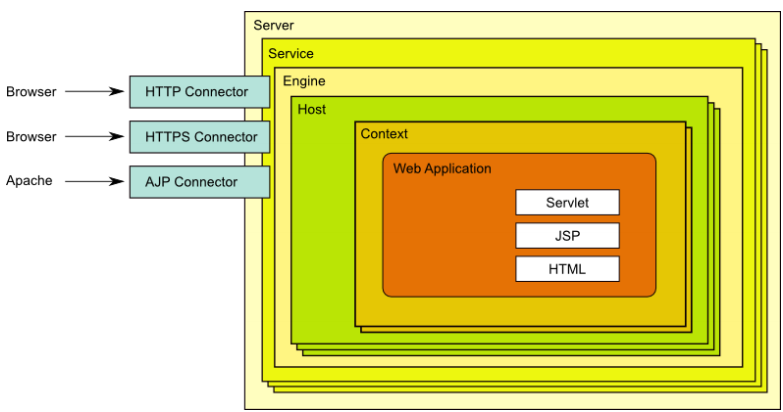

# 简介
起始于SUN的一个Servlet的参考实现项目Java Web Server，作者是James Duncan Davidson，后将项目贡献给了ASF。和ASF现有的项目合并，并开源成为顶级项目，官网http://tomcat.apache.org/

Tomcat仅仅实现了Java EE规范的与Servlet、JSP相关的类库，是JavaEE不完整实现

# 安装

1. 使用系统自带的yum源
yum源中是Tomcat 7.0版本。安装完通过浏览器可以观察一下首页。
```bash
yum -y install tomcat

systemctl start tomcat
#监听本机的8080端口，可以通过浏览器访问
```

2. 采用Apache官网下载，下载8.x.x
安装前提要部署JDK环境，可以使用yum源中自带的openjdk或者官方的jdk

```bash
# 安装jdk
[ root@localhost ~]# rpm -ivh jdk-8u191-linux-x64.rpm
# 安装tomcat
[ root@localhost ~]# tar -xvf apache-tomcat-8.5.42.tar.gz -C /usr/local
[ root@localhost ~]# ln -sv /usr/local/apache-tomcat-8.5.42 /usr/local/tomcat
# 创建用于启动tomcat的系统账号
useradd -r java
chown -R java.java /usr/local/tomcat
su - java -c '/usr/local/tomcat/bin/catalina.sh start'
```
3. 创建环境变量
```bash
vim /etc/profile.d/tomcat.sh
export CATALINA_HOME=/usr/local/tomcat
export PATH=$CATALINA_HOME/bin:$PATH

```

## tomcat的目录结构

- bin：服务启动、停止等相关，存放了脚本启动或停止时用到的类文件

- conf：配置文件

- lib：存放库文件

- logs：日志目录

- webapps：应用程序，应用默认部署目录

- work：jsp文件编译后的结果文件

## tomcat的配置文件

- server.xml： 主配置文件

- web.xml：每个webapp之后部署后才能被访问，他的部署方式通常由web.xml进行定义，其存放位置为WEB-INF/目录中，此文件为所有的webapps提供默认部署相关的配置

- context.xml：每个webapp都可以有专用的配置文件，它通常由专用的配置文件context.xml来定义，其存放位置为WEB-INF/目录中，用于定义会话管理器、JDBC等，context.xml视为各个webapp提供默认配置

- tomcat-users.xml：用户认证的账号个密码文件

- catalina.policy：当使用-security选项启动tomcat时，用于为tomcat设置安全策略

- catalina.properties：java属性的定义文件，用于设定类加载器路径，以及一些与JVM调优相关的参数

- logging.properties：日志系统相关的配置，log4j

## tomcat的各个组件

- 顶级组件：server，代表整个tomcat容器

- 服务类组件：service，组织Engine和Connector，里面之鞥呢包含一个Engine

- 连接器组件：connector没有HTTP、HTTPS和AJP协议的连接器

- 容器类组件：Engine、Host、Context都市容器类组件，可以嵌入其他组件，内部配置如何运行应用程序

- 内嵌类：可以内嵌到其他组件中，valve、logger、realm、loader、manager，可以再不同容器组件中定义

- 集群类组件：listener、cluster

### Tomcat各个组件的内部组成
[](http://aishad.top/wordpress/wp-content/uploads/2019/07/tomcat_serice.png)

- server
Tomcat运行的进程实例

- Connector
负责客户端的HTTP、HTTPS、AJP等协议的连接，一个Connector只属于摸一个Engine，AJP（Apache Jserv protocol）是一种基于TCP的二进制通讯协议。

- service
用来组织Engine和Connector的关系

- Engine
响应并处理用户请求，一个service上只能绑定一个Engine，但是一个Engine上可以绑定多个Connector

- Host
虚拟主机

- Context
应用的上下文，配置路径映射path => directory

#### Tomcat的核心组件

- Tomcat启动一个或多个server进行，一般只有一个

- 创建一个或多个service提供服务，一般也只创建一个
	每个service中，是Engine和其连机器Connector的关联配置

- 可以为这个service提供多个Connector，这些Connector使用了不同的协议，绑定了不同的端口，其作用就是处理来自客户端的不同的连接请求或响应

- service内部还定义看Engine，引擎才是正在的处理请求的入口，其内部定义了多个虚拟主机host
	Engine最请求头部做分析，将请求发送给相应的虚拟主机
	如果没有匹配，数据就发送到Engine中的defaultHost缺省虚拟主机
	Engine上缺省虚拟主机可以修改

- Host定义虚拟主机，虚拟主机中有name名称，通过名称匹配

- Context定义应用程序单独的路径映射和配置
```bash
<?xml version="1.0" encoding="UTF-8"?>
<Server port="8005" shutdown="SHUTDOWN">
 	<Service name="Catalina">
 		<Connector port="8080" protocol="HTTP/1.1"
			 connectionTimeout="20000"
			 redirectPort="8443" />
 		<Connector port="8009" protocol="AJP/1.3" redirectPort="8443" />

		<Engine name="Catalina" defaultHost="localhost">
 			<Host name="localhost" appBase="webapps"
 				unpackWARs="true" autoDeploy="true">
			 </Host>
		 </Engine>
 	</Service>
</Server>
```

一次完整的客户端请求流程

1. 浏览器端请求服务器的上的资源：http://localhost:8080/test/index.jsp 请求被发送到服务器端的8080端口，tomcat进程监听的此端口上，通过侦听HTTP/1.1 Connector活得此请求

2. Connector把请求交给它所在的service的Engine进行处理，并等待Engine的响应

3. Engine活得请求localhost:8080/test/index.jsp，匹配它的所有虚拟主机host

4. Engine匹配打名为localhost的虚拟主机，即使匹配不到也把请求交给该Host处理，因为该Host被定义为该Engine的默认主机

5. localhost的虚拟主机活得请求/test/index.jsp，匹配它所拥有的Context

6. Host匹配到的路径为/test的Context

7. path=/test的Context获得请求/index.jsp，在它的mapping table中寻找对应的servlet

8. Context匹配到URL PATTERN为 *.jsp 的servlet，对应于JspServlet类构造HttpServletRequest对象和HttpServletResponse对象，作为参数调用JspServlet的doGet或doPost方法

9. Context把执行完了之后的HttpServletResponse对象返回给Host

10. Host把HttpServletResponse对象返回给Engine

11. Engine把HttpServletResponse对象返回给Connector

12. Connector把HttpServletResponse对象返回给浏览器端


## 应用部署
tomcat中默认网站的根目录是是CATALINA_BASE/webapps/
在Tomcat中部署主站应用程序和其他应用程序，和之前WEB服务程序不同。

- nginx
假设在nginx中部署2个网站应用eshop、bbs，假设网站根目录是/var/www/html，那么部署可以是这样的。
eshop解压缩所有文件放到/var/www/html/目录下。
bbs的文件放在/var/www/html/bbs下。

- Tomcat
Tomcat中默认网站根目录是CATALINA_BASE/webapps/
在Tomcat的webapps目录中，有个非常特殊的目录ROOT，它就是网站默认根目录。
将eshop解压后的文件放到这个ROOT中。
bbs解压后文件都放在CATALINA_BASE/webapps/bbs目录下。
每一个虚拟主机的目录都可以使用appBase配置自己的站点目录，里面都可以使用ROOT目录作为主站目录

### JSP WebApp目录结构.
- 主页配置：一般指定为index.jsp或index.html
- WEB-INF/：当前WebApp的私有资源路径，通常存储当前应用使用的web.xml和context.xml配置文件，该文件的优先级高于conf/web.xml里面的定义，如果在该目录中没有定义，那么会使用conf/web.xml中的默认配置
- META-INF/：类似于WEB-INF
- classes/：类文件，当前webapp需要的类
- lib/：当前应用依赖的jar包

webapp归档格式

- war：WebApp打包
- .jar：EJB类打包文件
- .rar：资源适配器类打包文件
- .ear：企业级WebApp打包

传统，应用开发测试后，通常打包为war格式，这种文件部署到了Tomcat的webapps下，还可以自动展开。
```bash
<Host name="localhost" appBase="webapps" unpackWARs="true" autoDeploy="true">
```

## 部署
将webapp的源文件放置到目标目录，通过web.xml和context.xml文件中配置的路径就可以访问该webapp，通过类加载器加载其特有的类和依赖的类到JVM上。


- 自动部署Auto Deploy
Tomcat发现多了这个应用就把它加载并启动起来

- 手动部署
冷部署：将webapp放到指定目录，才去启动Tomcat
热部署：Tomcat服务不停止，需要依赖工具manager、ant脚本、tcd（tomcat client deployer）等

### 模拟部署一个应用
```bash
[ root@localhost ~]#  mkdir /usr/local/tomcat/webapps/myapp/{WEB-INF,classes,lib} -pv

[ root@localhost ~]# vim /usr/local/tomcat/webapps/myapp/index.jsp
<%@ page language="java" contentType="text/html; charset=UTF-8"
 pageEncoding="UTF-8"%>
<!DOCTYPE html>
<html>
<head>
 <meta charset="utf-8">
 <title>jsp例子</title>
</head>
<body>
myapp-index.jsp 后面的内容是服务器端动态生成字符串，最后拼接在一起
<%
out.println("hello jsp");
%>
</body>
</html>

# 访问用http://IP:8080/myapp/
```
> 因为启用了autoDeploy="true，所以上面部署的程序可以不用重启服务就可以访问