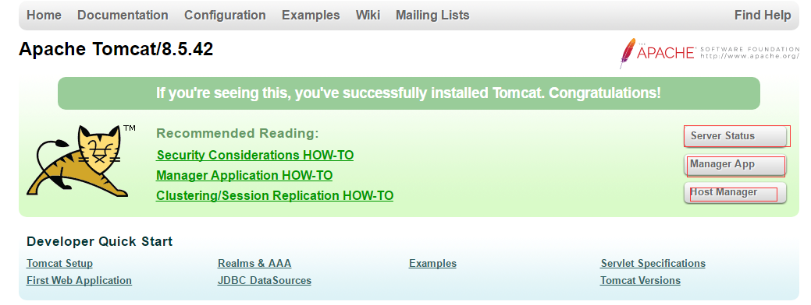

# 详细配置
server.xm
```bash
<?xml version="1.0" encoding="UTF-8"?>
<Server port="8005" shutdown="SHUTDOWN">
 	<Service name="Catalina"> #一般情况下，一个Server实例配置一个Service，name属性相当于该Service的ID。
 		<Connector port="8080" protocol="HTTP/1.1"
			 connectionTimeout="20000"
			 redirectPort="8443" /> #连接器设置
 		<Connector port="8009" protocol="AJP/1.3" redirectPort="8443" />  #连接器设置
 
 		<Engine name="Catalina" defaultHost="localhost"> #引擎配置，defaultHost指向内部定义某虚拟主机。缺省虚拟主机可以改动，默认localhost
 			<Host name="localhost" appBase="webapps"
				 unpackWARs="true" autoDeploy="true">  #虚拟主机配置
			 </Host>
 		</Engine>
 	</Service>
</Server>
```

## 本地8005端口的作用
```bash
<Server port="8005" shutdown="SHUTDOWN">
```
8005是Tomcat的管理端口，默认监听在127.0.0.1上。SHUTDOWN这个字符串接收到后就会关闭此Server。

```bash
[ root@localhost tomcat]# telnet 127.0.0.1 8005
Trying 127.0.0.1...
Connected to 127.0.0.1.
Escape character is '^]'.
SHUTDOWN
Connection closed by foreign host.
[ root@localhost tomcat]# ss -tnl
State       Recv-Q Send-Q Local Address:Port                Peer Address:Port              
LISTEN      0      128                *:111                            *:*                  
LISTEN      0      128                *:22                             *:*                  
LISTEN      0      100        127.0.0.1:25                             *:*                  
LISTEN      0      128               :::111                           :::*                  
LISTEN      0      128               :::22                            :::*                  
LISTEN      0      100              ::1:25 
```
这个管理功能建议禁用，改shutdown为一串猜不出的字符串。
```bash
[ root@localhost ~]# openssl rand -hex 16
8bf632bd844fe4dddb12e08e158bf1e4

<Server port="8005" shutdown="8bf632bd844fe4dddb12e08e158bf1e4">
```

## tomcat的用户管理
```bash
<!-- Global JNDI resources
       Documentation at /docs/jndi-resources-howto.html
  -->
  <GlobalNamingResources>
    <!-- Editable user database that can also be used by
         UserDatabaseRealm to authenticate users
    -->
    <Resource name="UserDatabase" auth="Container"
              type="org.apache.catalina.UserDatabase"
              description="User database that can be updated and saved"
              factory="org.apache.catalina.users.MemoryUserDatabaseFactory"
              pathname="conf/tomcat-users.xml" />
  </GlobalNamingResources>
```
用户认证，配置文件是conf/tomcat-users.xml

### tomcat的状态页与管理页面
可以实现tomcat的状态查看、应用的部署与反部署或者动态部署虚拟主机


1. 授权角色和用户
```bash
[ root@localhost tomcat]# vim conf/tomcat-users.xml
# 授权角色manager-gui、admin-gui和用户
  <role rolename="manager-gui"/>
  <role rolename="admin-gui"/>
  <user username="weiying" password="admin123" roles="manager-gui,admin-gui"/>
[ root@localhost tomcat]# vim /usr/local/tomcat/webapps/host-manager/META-INF/context.xml
```
2. 授权允许访问的ip地址
```bash
[ root@localhost ~]# vim /usr/local/tomcat/webapps/manager/META-INF/context.xml
<Valve className="org.apache.catalina.valves.RemoteAddrValve"
     allow="127\.\d+\.\d+\.\d+|::1|0:0:0:0:0:0:0:1|192\.168\.\d+\.\d+" />

[ root@localhost ~]# vim /usr/local/tomcat/webapps/host-manager/META-INF/context.xml
<Valve className="org.apache.catalina.valves.RemoteAddrValve"
     allow="127\.\d+\.\d+\.\d+|::1|0:0:0:0:0:0:0:1|192\.168\.\d+\.\d+" />
```

3. 重启服务

4. 访问测试


5. 在manager app页面实现热部署

> 访问http://ip:8080/test1/ 部署成功


### 虚拟主机配置
```bash
<Host name="localhost" appBase="webapps"
	unpackWARs="true" autoDeploy="true">  #虚拟主机配置
</Host>
```
name：必须是主机名，用主机名来匹配。
appBase：当期主机的网页根目录，相对于CATALINA_HOME，也可以使用绝对路径
unpackWARs：是否自动解压war格式
autoDeploy：热部署，自动加载并运行应

#### 添加新的虚拟主机
1. 创建项目主目录
```bash
[ root@localhost ~]# mkdir /data/webapps/ROOT/{WEB-INF,classes,lib} -pv
```

2. 配置虚拟主机
```bash
[ root@localhost ~]# vim /usr/local/tomcat/conf/server.xml
<Host name="node1.weiying.com" appBase="/data/webapps/" unpackWARs="True" autoDeploy="fa
lse" />
```

3. 配置主目录的页面文件
```bash
[ root@localhost ~]# vim /data/webapps/ROOT/index.jsp
<%@ page language="java" contentType="text/html; charset=UTF-8"
 pageEncoding="UTF-8"%>
<!DOCTYPE html>
<html>
<head>
 <meta charset="utf-8">
 <title>jsp例子</title>
</head>
<body>
vhost1_test.index.jsp 后面的内容是服务器端动态生成字符串，最后拼接在一起
<%
out.println("hello jsp");
%>
%%</body>
%%</html>
```

4. 重启服务

5. 访问测试


## context配置
路径映射
应用独立配置，例如单独配置应用日志、单独配置应用访问控制
```bash
[ root@localhost bin]# vim /usr/local/tomcat/conf/server.xml
<Host name="node1.weiying.com" appBase="/data/webapps/" unpackWARs="True" autoDeploy="f
alse" >
	 <Context path="/test_host" docBase="/data/webapps/test1" reloadable="" />
</Host>

[ root@localhost bin]# ln -sv /data/webapps/test1 /data/webapps/ROOT/

[ root@localhost bin]# ln -sv /projects/myapp/ /data/webapps/test1

[ root@localhost bin]# ls /projects/myapp/
classes  index.jsp  lib  test1  WEB-INF
```
