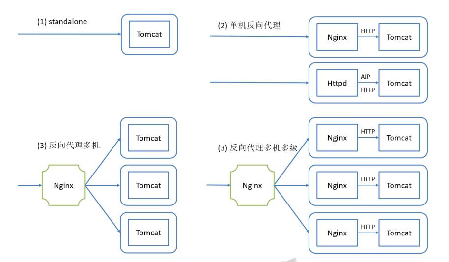

# Tomcat的部署方式


nginx/httpd服务器：192.168.1.150
tomcat服务器1:192.168.1.151
tomcat服务器2:192.168.1.152

## 使用nginx反向代理单台Tomcat

1. 安装nginx
```bash
[ root@localhost ~]# yum -y install nginx
```
2. 修改配置文件实现全部反向代理
```bash
[ root@localhost ~]# vim /etc/nginx/nginx.conf
location / {
            proxy_pass http://node1.weiying.com:8080;
        }
```
3. 启动nginx测试

4. 实现nginx代理tomcat的动静分离
```bash
[ root@localhost ~]# vim /etc/nginx/nginx.conf
location / {
            root /usr/share/nginx/html;
            index index.html;
        }
        location ~* \.jsp$ {
            proxy_pass http://node1.weiying.com:8080;
        }

# 重启nginx并测试
```

## 使用AJP代理tomcat
proxy_ajp_module模块代理配置
```bash
<VirtualHost *:80>
 ServerName node0.weiying.com
 ProxyRequests Off
 ProxyVia On
 ProxyPreserveHost On
 ProxyPass / ajp://node1.weiying.com:8009/
</VirtualHost>
```
查看Server Status可以看到确实使用的是ajp连接了

## 使用httpd反向代理单台tomcat
这种情况基本上生产环境不会使用，了解即可

1. 安装httpd
```bash
[ root@localhost ~]# yum -y install httpd
```

2. 配置httpd实现反向代理
```bash
[ root@localhost ~]# vim /etc/httpd/conf.d/vhost.conf
<VirtualHost *:80>
 ServerName node0.weiying.com
 ProxyRequests Off
 ProxyVia On
 ProxyPreserveHost Off
 ProxyPass / http://node1.weiying.com:8080/
 ProxyPassReverse / http://node1.weiying.com:8080/
</VirtualHost>

#ProxyRequests：Off关闭正向代理。
#ProxyPass：反向代理指令
#ProxyPassReverse：保留代理的response头不重写（个别除外）
#ProxyPreserveHost：Off开启。让代理不保留原请求的Host首部

## 如果ProxyPreserveHost 开启，那么当访问node0.weiying.com时，会被代理到后端的http://node1.weiying.com:8080/ ，但是在后端的tomcat服务器找不到node0.weiying.com的hosts，就会访问默认的host
## 如果ProxyPreserveHost 关闭，那么当访问node0.weiying.com时，请求就直接会被代理到后端的node1.weiying.com对应的host

# 重启httpd测试
```
# tomcat的负载均衡
tomcat的负载均衡是要注意的问题就是seccion的保持,nginx可以通过源ip来实现，HAProxy通过cookie实现

nginx/httpd服务器：192.168.1.150 node0.weiying.com
tomcat服务器1:192.168.1.151 node1.weiying.com
tomcat服务器2:192.168.1.152 node2.weiying.com
## 基于nginx的负载均衡

1. 两台tomcat服务器准备测试的index.jsp页面
```bash
[ root@localhost ~]# mkdir /data/webapps/ROOT/{classes,lib,WEB-INF} -pv

[ root@localhost tomcat]# vim /data/webapps/ROOT/index.jsp
<%@ page import="java.util.*" %>
<!DOCTYPE html>
<html lang="en">
<head>
 <meta charset="UTF-8">
 <title>lbjsptest</title>
</head>
<body>
<div>On <%=request.getServerName() %></div>
<div><%=request.getLocalAddr() + ":" + request.getLocalPort() %></div>
<div>SessionID = <span style="color:blue"><%=session.getId() %></span></div>
<%=new Date()%>
</body>
</html>
```

2. 配置虚主机
```bash
#node1.weiying.com
[ root@localhost ~]# vim /usr/local/tomcat/conf/server.xml
<Engine name="Catalina" defaultHost="node1.weiying.com">
 <Host name="node1.weiying.com" appBase="/data/webapps" autoDeploy="true" />
</Engine>

# node2.weiying.com
<Engine name="Catalina" defaultHost="node2.weiying.com">
 <Host name="node2.weiying.com" appBase="/data/webapps" autoDeploy="true" />
</Engine>
```

3. 配置nginx的调度
```bash
[ root@localhost ~]# vim /etc/nginx/nginx.conf
upstream tomcats {
        #ip_hash; # 先禁用看看轮询，之后开启开黏性
        server node1.weiying.com:8080;
        server node2.weiying.com:8080;
    }
    server {
        listen       80 default_server;
        listen       [::]:80 default_server;
        server_name  _;
        root         /usr/share/nginx/html;

        location / {
            root /usr/share/nginx/html;
            index index.html;
        }
        location ~* \.jsp$ {
            proxy_pass http://tomcats;
        }
	}

# 当禁用源地址hash后，访问测试，可以实现轮询调度，但是seccion不能保持，开启源地址hash后，固定方位一天tomcat，seccion不变
```

## Tomcat Session集群
时间同步，确保NTP或Chrony服务正常运行。 # systemctl status chronyd
防火墙规则。 # systemctl stop firewalld

```bash
<Channel className="org.apache.catalina.tribes.group.GroupChannel">
 	<Membership className="org.apache.catalina.tribes.membership.McastService"
		 address="230.100.100.8"  #成员判定。使用什么多播地址,同一个多播地址和端口认为同属一个组。使用时修改这个多播地址，以防冲突

		 port="45564"
		 frequency="500"  #间隔时长ms
		 dropTime="3000"/>  #超时时长ms
 	<Receiver className="org.apache.catalina.tribes.transport.nio.NioReceiver"
		 address="auto" #auto可能绑定到127.0.0.1上，所以一定要改为可以用的IP上去
		 port="4000"
		 autoBind="100"
		 selectorTimeout="5000"
		 maxThreads="6"/>
 	<Sender className="org.apache.catalina.tribes.transport.ReplicationTransmitter">
 		<Transport className="org.apache.catalina.tribes.transport.nio.PooledParallelSender"/>
 	</Sender>
 	<Interceptor className="org.apache.catalina.tribes.group.interceptors.TcpFailureDetector"/>
	 <Interceptor
className="org.apache.catalina.tribes.group.interceptors.MessageDispatchInterceptor"/>
</Channel>
```

1. 修改tomcat的配置文件
```bash
[ root@localhost ~]# vim /usr/local/tomcat/conf/server.xml
# 添加到host中
#添加到 <Engine> 所有虚拟主机都可以启用Session复制
#添加到 <Host> ，该虚拟主机可以启用Session复制
<Cluster className="org.apache.catalina.ha.tcp.SimpleTcpCluster"
                 channelSendOptions="8">

          <Manager className="org.apache.catalina.ha.session.DeltaManager"
                   expireSessionsOnShutdown="false"
                   notifyListenersOnReplication="true"/>

          <Channel className="org.apache.catalina.tribes.group.GroupChannel">
            <Membership className="org.apache.catalina.tribes.membership.McastService"
                        address="230.100.45.100"
                        port="45564"
                        frequency="500"
                        dropTime="3000"/>
            <Receiver className="org.apache.catalina.tribes.transport.nio.NioReceiver"
                      address="192.168.1.151"
                      port="4000"
                      autoBind="100"
                      selectorTimeout="5000"
                      maxThreads="6"/>

            <Sender className="org.apache.catalina.tribes.transport.ReplicationTransmitter">
              <Transport className="org.apache.catalina.tribes.transport.nio.PooledParallelSender"/>
            </Sender>
            <Interceptor className="org.apache.catalina.tribes.group.interceptors.TcpFailureDetector"/>
            <Interceptor className="org.apache.catalina.tribes.group.interceptors.MessageDispatchInterceptor"/>
          </Channel>

          <Valve className="org.apache.catalina.ha.tcp.ReplicationValve"
                 filter=""/>
          <Valve className="org.apache.catalina.ha.session.JvmRouteBinderValve"/>

          <Deployer className="org.apache.catalina.ha.deploy.FarmWarDeployer"
                    tempDir="/tmp/war-temp/"
                    deployDir="/tmp/war-deploy/"
                    watchDir="/tmp/war-listen/"
                    watchEnabled="false"/>

          <ClusterListener className="org.apache.catalina.ha.session.ClusterSessionListener"/>
        </Cluster>
```

2. 准备web.xml
为web.xml的 <web-app\> 标签增加子标签 <distributable/\> 来开启该应用程序的分布式。
```bash
[ root@localhost ~]# cp /usr/local/tomcat/conf/web.xml /data/webapps/ROOT/WEB-INF/
[ root@localhost ~]# vim /data/webapps/ROOT/WEB-INF/web.xml
<distributable/>
# 在<web-app\>前面加
```

3. 重启tomcat，两台服务器都监听了4000端口

4. 访问测试，通过nginx的负载均衡调度后，轮询访问两台tomcat，seccion的值不变，即使其中的一天tomcat宕机，也能保证seccsion不变