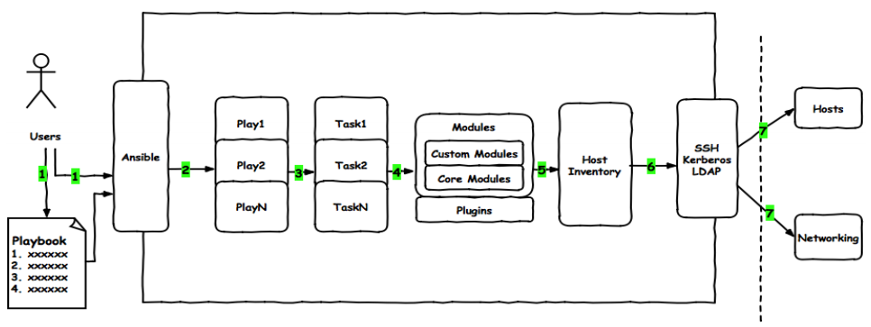

# Ansible-playbook
playbook是由一个或多个“play”组成的列表

play的主要功能在于将预定的一组主机，装扮成事先通过ansible中的task定义好的角色，task实际是调用ansible的一个module，将多个play组织在一个playbook中，即可让他们联合起来，按事先编排的机制执行预定的动作

playbook文件采用yaml语言编写

执行过程：将已有编排好的任务集写入ansible-playbook，通过ansible-pla1mingl分析拆分任务集至逐条ansible命令，按照预定的规则逐条执行



## YAML介绍
YAML是一个可读性高的用来表达资料序列的格式。YAML参考了其他多种语言，包括：XML、C语言、Python、Perl以及电子邮件格式RFC2822等。Clark Evans在2001年在首次发表了这种语言，另外Ingy döt Net与Oren Ben-Kiki也是这语言的共同设计者

YAML Ain't Markup Language，即YAML不是XML。不过，在开发的这种语言时，YAML的意思其实是："Yet Another Markup Language"（仍是一种标记语言）

特性：

1. yaml的可读性好

2. yaml和脚本语言的交互较好

3. yaml使用实现语言的数据类型

4. yaml有一个一直的信息模型

5. yaml易于实现

6. yaml可以基础流来处理

7. yaml表达性能强，扩展性好

### yaml 的语法介绍

1. 在单一档案中，可用连续三个连字号(——)区分多个档案。另外，还有选择性的连续三个点号( ... )用来表示档案结尾

2. 次行开始正常写Playbook的内容，一般建议写明该Playbook的功能

3. 使用#号注释代码

4. 缩进必须是统一的，不能空格和tab混用

5. 缩进的级别也必须是一致的，同样的缩进代表同样的级别，程序判别配置的级别是通过缩进结合换行来实现的

6. YAML文件内容是区别大小写的，k/v的值均需大小写敏感

7.  多个k/v可同行写也可换行写，同行使用，分隔

8.  v可是个字符串，也可是另一个列表

9. 一个完整的代码块功能需最少元素需包括 name 和 task

10. 一个name只能包括一个task

11. YAML文件扩展名通常为yml或yaml

#### yaml 格式的列表
List：列表，其所有元素均使用"-"打头
```bash
# 示例
- Apple
- Orange
- Strawberry
- Mango
```
#### yaml 格式的字典
Dictionary：字典，通常由多个key与value构成
```bash
# 示例
name: Example Developer
job: Developer
skill: Elite
# 也可以将key:value放置于{}中进行表示，用,分隔多个key:value
{name: Example Developer, job: Developer, skill: Elite}
```

YAML的语法和其他高阶语言类似，并且可以简单表达清单、散列表、标量等数据结构。其结构（Structure）通过空格来展示，序列（Sequence）里的项用"-"来代表，Map里的键值对用":"隔
```bash
name: John Smith
age: 41
gender: Male
spouse:
 name: Jane Smith
 age: 37
 gender: Female
children:
 - name: Jimmy Smith
   age: 17
   gender: Male
 - name: Jenny Smith
   age 13
   gender: Female
```
## Playbook核心元素

1. Host：执行任务的远程主机列表

2. Task：任务集,要执行的模块的任务集

3. Varniables：内置变量或自定义变量在playbook中调用

4. Templates：模板，可替换模板文件中的变量，并实现一些简单逻辑的文件

5. Handles和notity结合使用，由特定条件触发的操作，满足条件才执行，否则不执行

6. tags：标签，指定在某条任务执行，用于选择运行playbook中的部分代码，ansible具有幂等性，因此会自动跳过没有变化的部分，即便如此，有些代码为测试其确实没有发生变化的时间依然会非常地长。此时，如果确信其没有变化，就可以通过tags跳过此些代码片断
	ansible-playbook –t tagsname useradd.yml

### playbook组件的具体说明

1. Host
playbook中的每一个play的目的都是为了让特定主机以某个指定的用户身份执行任务。hosts用于指定要执行指定任务的主机，须事先定义在主机清单中

```bash
# 可以是如下形式：
one.example.com
one.example.com:two.example.com
192.168.1.50
192.168.1.*

Websrvs:dbsrvs 或者，两个组的并集
Websrvs:&dbsrvs 与，两个组的交集
webservers:!phoenix 在websrvs组，但不在dbsrvs组
# 示例：
- hosts: websrvs：dbsrvs (属于webservs或者dbservs)
```

2. remote_user
可用于Host和task中。也可以通过指定其通过sudo的方式在远程主机上执行任务，其可用于play全局或某任务；此外，甚至可以在sudo时使用sudo_user指定sudo时切换的用户
```bash
- hosts: websrvs   # 主机列表
  remote_user: root  # 默认执行的用户
  tasks:
    - name: test connection   # 名称
	  ping:
        remote_user: linux
        sudo: yes 默认sudo为root
        sudo_user:wang sudo为wang
```

3. task列表和action

play的主体部分是task list，task list中的各任务按次序逐个在hosts中指定的所有主机上执行，即在所有主机上完成第一个任务后，再开始第二个任务

task的目的是使用指定的参数执行模块，而在模块参数中可以使用变量。模块执行是幂等的，这意味着多次执行是安全的，因为其结果均一致

每个task都应该有其name，用于playbook的执行结果输出，建议其内容能清晰地描述任务执行步骤。如果未提供name，则action的结果将用于输出

tasks：任务列表书写的两种格式
(1) action: module arguments
(2) module: arguments 建议使用

> 注意：shell和command模块后面跟命令，而非key=value

如果命令或脚本的退出码不为零，可以使用如下方式替代
```bash
tasks:
 - name: run this command and ignore the result
 shell: /usr/bin/somecommand || /bin/true
```

或者使用ignore_errors来忽略错误信息
```bash
tasks:
 - name: run this command and ignore the result
 shell: /usr/bin/somecommand
 ignore_errors: True
```

## 运行playbook
```bash
运行playbook的方式
	ansible-playbook <filename.yml> ... [options]
常见选项
	--check -C 只检测可能会发生的改变，但不真正执行操作
	--list-hosts 列出运行任务的主机
	--list-tags 列出tag
	--list-tasks 列出task
	--limit 主机列表 只针对主机列表中的主机执行
	-v -vv -vvv 显示过程
示例
	ansible-playbook file.yml --check 只检测
	ansible-playbook file.yml
	ansible-playbook file.yml --limit websrvs
```

### playbook使用示例

####  使用ansible安装并配置httpd

1. 配置playbook文件
```
[ root@localhost ~]# vim httpd.yaml

---

- hosts: all
  tasks:
  - name: "安装apache"
    yum: name=httpd
  - name: "复制文件"
    copy: src=/tmp/httpd.conf dest=/etc/httpd/conf/ backup=yes
  - name: "启动apache，并设置开机自启动"
    service: name=httpd state=started enabled=yes
```

2. 执行yaml文件
```bash
# 检查playbook文件的语法
[ root@localhost ~]# ansible-playbook -C httpd.yaml

[ root@localhost ~]# ansible-playbook httpd.yaml

PLAY [all] *********************************************************************************

TASK [Gathering Facts] *********************************************************************
ok: [192.168.5.102]
ok: [192.168.5.101]

TASK [安装apache] ****************************************************************************
changed: [192.168.5.101]
changed: [192.168.5.102]

TASK [复制文件] ********************************************************************************
changed: [192.168.5.101]
changed: [192.168.5.102]

TASK [启动apache，并设置开机自启动] *******************************************************************
changed: [192.168.5.102]
changed: [192.168.5.101]

PLAY RECAP *********************************************************************************
192.168.5.101              : ok=4    changed=3    unreachable=0    failed=0    skipped=0    rescued=0    ignored=0   
192.168.5.102              : ok=4    changed=3    unreachable=0    failed=0    skipped=0    rescued=0    ignored=0   
```

3. 验证httpd服务是否启动
```bash
[ root@localhost ~]# ansible all -m shell -a 'ss -tnlp | grep httpd'
192.168.5.101 | CHANGED | rc=0 >>
LISTEN     0      128         :::8080                    :::*                   users:(("httpd",pid=17802,fd=4),("httpd",pid=17801,fd=4),("httpd",pid=17800,fd=4),("httpd",pid=17799,fd=4),("httpd",pid=17798,fd=4),("httpd",pid=17797,fd=4))

192.168.5.102 | CHANGED | rc=0 >>
LISTEN     0      128         :::8080                    :::*                   users:(("httpd",pid=17576,fd=4),("httpd",pid=17575,fd=4),("httpd",pid=17574,fd=4),("httpd",pid=17573,fd=4),("httpd",pid=17572,fd=4),("httpd",pid=17571,fd=4))

```

####  使用ansible 实现创建用户
1. 配置playbook文件
```bash
[ root@localhost ~]# vim user.yaml

---

- hosts: all
  remote_user: root

  tasks:
  - name: create a group
    group: name=mysql gid=3306  system=yes
  - name: crete msyql user
    user: name=mysql system=yes uid=3306 group=mysql create_home=no home=/data/mysql shell=/sbin/nologin
```

2. 执行ploybook
```bash
[ root@localhost ~]# ansible-playbook user.yaml 

PLAY [all] *********************************************************************************

TASK [Gathering Facts] *********************************************************************
ok: [192.168.5.102]
ok: [192.168.5.101]

TASK [create a group] **********************************************************************
changed: [192.168.5.101]
changed: [192.168.5.102]

TASK [crete msyql user] ********************************************************************
changed: [192.168.5.101]
changed: [192.168.5.102]

PLAY RECAP *********************************************************************************
192.168.5.101              : ok=3    changed=2    unreachable=0    failed=0    skipped=0    rescued=0    ignored=0   
192.168.5.102              : ok=3    changed=2    unreachable=0    failed=0    skipped=0 
```

3. 验证
```bash
[ root@localhost ~]# ansible all -m shell -a 'cat /etc/passwd| grep mysql'
192.168.5.101 | CHANGED | rc=0 >>
mysql:x:3306:3306::/data/mysql:/sbin/nologin

192.168.5.102 | CHANGED | rc=0 >>
mysql:x:3306:3306::/data/mysql:/sbin/nologin
```