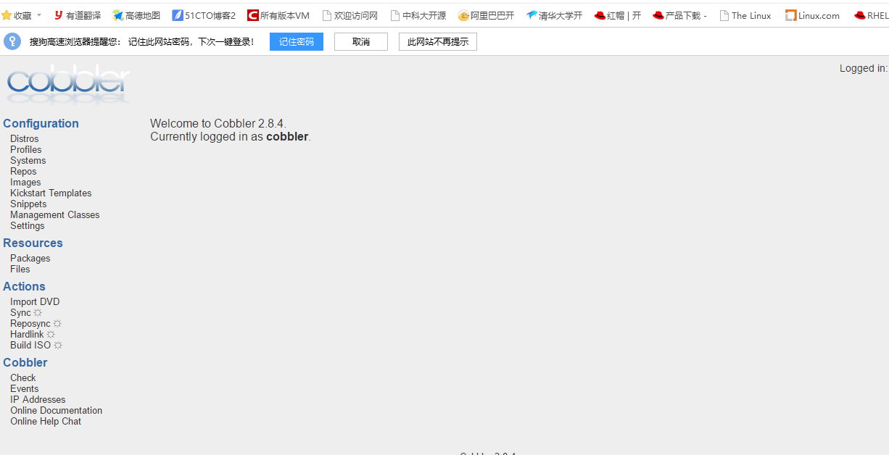

# Cobbler
快速网络安装Linux操作系统支持众多的Linux发行版：Red Hat、Fedora、CentOS、Debian、Ubuntu和SuSE，也可以支持网络安装windows
cobbler是PXE的二次封装，将多种安装参数封装到一个菜单，提供了CLI和Web的管理形式

## cobbler的核心组件

1. repository
用来提供安装树，指明安装时用到的包文件
镜像方式：指向yum源
import：导入安装镜像文件

2. distribution
同来指明安装的操作系统，通过使用pxeboot(vmlinuz+initrd.img)来指明安装的特定操作系统
会根据repository自动的导入pxeboot(vmlinuz+initrd.img)文件

3. profile
用来指明如何将repository和distribution组合起来，并结合kickstart文件完成自动化安装环境的定制

## cobbler的工作流程

1. 客户端裸机从网络启动后，开机会通过广播请求DHCP服务器(cobbler server)为其分配一个ip地址

2. 客户端拿到ip地址后，再向cobbler server请求OS引导文件

3. cobbler server通知客户端OS引导文件的名字和TFTP服务器的地址和端口

4. 客户端收到响应后，去TFTP服务器下载引导文件

5. 客户端执行引导文件，确定加载信息，选择要安装的OS，期间会再向Cobbler server 请求kickstart和OS image文件

6. 客户端加载kickstart文件，接收到OS image文件后，安装操作系统

## 安装cobbler（EPEL源）
cobbler服务集成的组件：PXE、DHCP、rsync、http、DNS、kickstart、IPMI(电源管理)

```bash
[ root@localhost ~]# yum -y install cobbler cobbler-web pykickstart httpd syslinux debmirror dhcp tftp-server

# pykickstart ： cobbler在导入kickstart文件时会用到，包括使用其提供的工具监测kickstart文件的语法 
# debmirror：用来部署deb系的系统
# syslinux： 提供pxelinux.0文集

```
## cobbler 配置目录

- 配置文件
/etc/cobbler/settings : cobbler 主配置文件
/etc/cobbler/iso/: iso模板配置文件
/etc/cobbler/pxe: pxe模板文件
/etc/cobbler/power: 电源配置文件
/etc/cobbler/user.conf: web服务授权配置文件
/etc/cobbler/users.digest: web访问的用户名密码配置文件
/etc/cobbler/dhcp.template : dhcp服务器的的配置末班
/etc/cobbler/dnsmasq.template : dns服务器的配置模板
/etc/cobbler/tftpd.template : tftp服务的配置模板
/etc/cobbler/modules.conf : 模块的配置文件

- 数据目录
/var/lib/cobbler/config/: 用于存放distros，system，profiles 等信息配置文件
/var/lib/cobbler/triggers/: 用于存放用户定义的cobbler命令
/var/lib/cobbler/kickstart/: 默认存放kickstart文件
/var/lib/cobbler/loaders/: 存放各种引导程序

- 镜像目录
/var/www/cobbler/ks_mirror/: 导入的发行版系统的所有数据
/var/www/cobbler/images/ : 导入发行版kernel和initrd镜像用于远程网络启动
/var/www/cobbler/repo_mirror/: yum 仓库存储目录

- 日志目录
/var/log/cobbler/installing: 客户端安装日志
/var/log/cobbler/cobbler.log : cobbler日志

## cobbler命令的使用
cobbler check 核对当前设置是否有问题
cobbler list 列出所有的cobbler元素
cobbler report 列出元素的详细信息
cobbler sync 同步配置到数据目录,更改配置最好都要执行下
cobbler reposync 同步yum仓库
cobbler distro 查看导入的发行版系统信息
cobbler system 查看添加的系统信息
cobbler profile 查看配置信息


## 启动cobbler
```bash
[ root@localhost ~]# systemctl start cobblerd.service httpd tftp.service
[ root@localhost ~]# systemctl enable  cobblerd.service httpd tftp.service
```
## 检查环境，根据报错更改配置文件
```bash
[ root@localhost ~]# cobbler check
The following are potential configuration items that you may want to fix:

1 : The 'server' field in /etc/cobbler/settings must be set to something other than localhost, or kickstarting features will not work.  This should be a resolvable hostname or IP for the boot server as reachable by all machines that will use it.
2 : For PXE to be functional, the 'next_server' field in /etc/cobbler/settings must be set to something other than 127.0.0.1, and should match the IP of the boot server on the PXE network.
3 : change 'disable' to 'no' in /etc/xinetd.d/tftp
4 : Some network boot-loaders are missing from /var/lib/cobbler/loaders, you may run 'cobbler get-loaders' to download them, or, if you only want to handle x86/x86_64 netbooting, you may ensure that you have installed a *recent* version of the syslinux package installed and can ignore this message entirely.  Files in this directory, should you want to support all architectures, should include pxelinux.0, menu.c32, elilo.efi, and yaboot. The 'cobbler get-loaders' command is the easiest way to resolve these requirements.
5 : enable and start rsyncd.service with systemctl
6 : comment out 'dists' on /etc/debmirror.conf for proper debian support
7 : comment out 'arches' on /etc/debmirror.conf for proper debian support
8 : The default password used by the sample templates for newly installed machines (default_password_crypted in /etc/cobbler/settings) is still set to 'cobbler' and should be changed, try: "openssl passwd -1 -salt 'random-phrase-here' 'your-password-here'" to generate new one
9 : fencing tools were not found, and are required to use the (optional) power management features. install cman or fence-agents to use them

Restart cobblerd and then run 'cobbler sync' to apply changes.
```

1. 设置server
```bash
[ root@localhost ~]# vim /etc/cobbler/settings
#cobbler 服务器的ip地址
server: 192.168.55.1

```
2. 设置next_server
```bash
[ root@localhost ~]# vim /etc/cobbler/settings
#TFTP服务器的ip地址
next_server: 192.168.55.1
```
3. 更改/etc/xinetd.d/tftp配置文件
将disable设置为no,Centos7 可忽略，设置tftp开机自启即可

4. 安装了syslinux包，可以忽略
如果当前节点可以访问互联网，执行“cobbler get-loaders”命令即可；否则，需要安装syslinux程序包，而后复制/usr/share/syslinux/{pxelinux.0,memu.c32}等文件至/var/lib/cobbler/loaders/目录中
```bash
[ root@localhost ~]# cobbler get-loaders
```


5. 启动rsyncd.service
```bash
[ root@localhost ~]# systemctl start rsyncd.service 
[ root@localhost ~]# systemctl enable rsyncd.service 
```

6.  /etc/debmirror.conf
注释'dists'行和'arches'行

7. 替换默认密码
该密码为使用cobbler安装后的系统的root密码
```bash
[ root@localhost ~]# openssl passwd -1
Password: 
Verifying - Password: 
$1$OIAuwRbn$PuScbHhsAHId4GyjlHx0A0

[ root@localhost ~]# vim /etc/cobbler/settings
#更改默认的密码
default_password_crypted: "$1$OIAuwRbn$PuScbHhsAHId4GyjlHx0A0"
```
8. 其他配置
```bash
[ root@localhost ~]# vim /etc/cobbler/settings
# dhcp不需要配置,cobbler自动配置
manage_dhcp：1
manage_tftpd：1
pxe_just_once：1
```

9. 更改cobbler管理dhcp的模板文件
```bash
[ root@localhost ~]# vim /etc/cobbler/dhcp.template
# 更改dhcp的信息
subnet 192.168.55.0 netmask 255.255.255.0 {
     option routers             192.168.55.254;
     option domain-name-servers 192.168.55.254;
     option subnet-mask         255.255.255.0;
     range dynamic-bootp        192.168.55.100 192.168.55.200;
     default-lease-time         21600;
     max-lease-time             43200;
     next-server                $next_server;
```
10. 重启服务
```bash
# 将下载的文件拷贝到tftp目录，并根据dhcp模板文件生成dhcp配置文件
[ root@localhost ~]# cobbler sync
[ root@localhost ~]# systemctl restart cobblerd.service 
```

### 导入安装源文件
会将安装源文件复制到对应的目录下/var/www/cobbler
```bash
# /var/www/html/centos/7 为光盘的挂载目录
[ root@localhost ~]# cobbler import --name=Centos-7.6.1810 --path=/var/www/html/centos/7

# 拷贝完成后会自动生成安装菜单
[ root@localhost ~]# cat /var/lib/tftpboot/pxelinux.cfg/default 
DEFAULT menu
PROMPT 0
MENU TITLE Cobbler | http://cobbler.github.io/
TIMEOUT 200
TOTALTIMEOUT 6000
ONTIMEOUT local

LABEL local
        MENU LABEL (local)
        MENU DEFAULT
        LOCALBOOT -1

LABEL Centos-7.6.1810-x86_64
        kernel /images/Centos-7.6.1810-x86_64/vmlinuz
        MENU LABEL Centos-7.6.1810-x86_64
        append initrd=/images/Centos-7.6.1810-x86_64/initrd.img ksdevice=bootif lang=  kssendmac text  ks=http://192.168.55.1/cblr/svc/op/ks/profile/Centos-7.6.1810-x86_64
        ipappend 2


MENU end
```
## cobbler 命令的使用
1. 查看安装源文件
```bash
[ root@node1 ~]# cobbler distro list
   Centos-7.6.1810-x86_64
```

2. 查看默认的安装菜单（应答文件和安装源文件的对应安装菜单）
```bash
[ root@node1 ~]# cobbler profile list
   Centos-7.6.1810-x86_64
```

3. 删除安装菜单
```
[ root@node1 ~]# cobbler profile remove +菜单名称
```

4. 删除安装源文件
```bash
[ root@node1 ~]# cobbler distro --name=安装源文件的位置
```

5. 导入安装源文件
```bash
[ root@localhost ~]# cobbler import --name=Centos-7.6.1810 --path=/var/www/html/centos/7

# --name：指定安装源文件的名称
# --path：指定从哪里导入安装源文件
```

6. 添加安装菜单
```bash

```

kickstart文件：要注意kickstart文件的权限为644
```bash
[ root@node1 ~]# cat /var/lib/cobbler/kickstarts/ks7-mini.cfg
#version=DEVEL
# System authorization information
auth --enableshadow --passalgo=sha512
# Use CDROM installation media
#url --url=http://192.168.55.1/centos/7/
url --url=$tree  #此处为tree，让cobbler自动指向安装源文件
# Use graphical install
text
# Run the Setup Agent on first boot
firstboot --enable
ignoredisk --only-use=sda
# Keyboard layouts
keyboard --vckeymap=us --xlayouts='us'
# System language
lang en_US.UTF-8

# Network information
network  --bootproto=dhcp --device=eth0 --onboot=on --ipv6=auto --activate
network  --hostname=centos7.localdomain

# Root password
rootpw --iscrypted $6$XbYv/n2NgHHmH877$tARYueHoREAo3TNDY.7MbuUd2P4ohp0ed.HXfGvIHvN9CRQFJ4LhmhJ5Ij2axdjc8jM09gSvMF4DwX9.yums61
# System services
firewall --disabled
selinux --disabled
services --disabled="chronyd"
# System timezone
timezone Asia/Shanghai --isUtc --nontp
user --name=weiying --password=$6$XbYv/n2NgHHmH877$tARYueHoREAo3TNDY.7MbuUd2P4ohp0ed.HXfGvIHvN9CRQFJ4LhmhJ5Ij2axdjc8jM09gSvMF4DwX9.yums61 --iscrypted --gecos="weiying"
# X Window System configuration information
#xconfig  --startxonboot
# System bootloader configuration
bootloader --append=" crashkernel=auto" --location=mbr --boot-drive=sda
# Partition clearing information
clearpart --all --initlabel
zerombr
reboot
# Disk partitioning information
part /boot --fstype="xfs" --ondisk=sda --size=1024
part swap --fstype="swap" --ondisk=sda --size=1024
part / --fstype="xfs" --ondisk=sda --size=15360

%packages
@core
%end
```

7. 安装测试，使用网络引导

## cobbler的web管理实现
提供cobbler的基于web管理界面，epel源：yum install cobbler-web 

- 认证方法配置文件：/etc/cobbler/modules.conf
支持多种认证方法：
authn_configfile
authn_pam

1. 使用authn_configfile模块认证cobbler_web用户
```bash
[ root@node1 ~]# vim /etc/cobbler/modules.conf
[authentication]
module = authn_configfile
```

2. 创建其认证文件/etc/cobbler/users.digest，并添加所需的用户
```bash
[ root@node1 ~]#  htdigest -c /etc/cobbler/users.digest Cobbler admin 
Adding password for admin in realm Cobbler.
New password: 
Re-type new password: 
```
> 注意:添加第一个用户时,使用“-c”选项，后续添加其他用户时不要再使用，cobbler_web的realm只能为Cobbler

3. 访问测试过https://cobblerserver/cobbler_web

4. 使用authn_pam模块认证cobbler_web用户
```bash
[ root@node1 ~]# vim /etc/cobbler/modules.conf
[authentication]
module = authn_pam
```

5. 创建cobbler用户并授权
```bash
[ root@node1 ~]# useradd cobbler

[ root@node1 ~]# vim /etc/cobbler/users.conf
[admins]
admin = "cobbler
```

6. 重启访问测试
