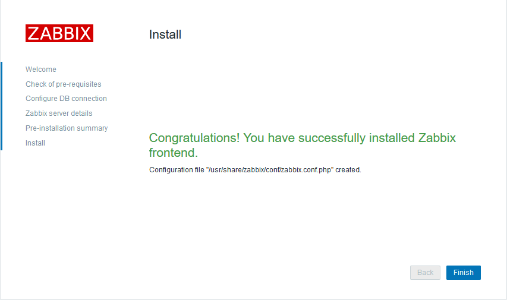

# 企业机房整体布局


# 开源的监控软件

- Cacti：基于LANP平台展现的网络流量监测分析工具，通过SNMP奇数和或自定义脚本从目标设备/主机获取监控指标信息，其次进行数据存储，调用模板将数据存到数据库，使用rrdtool存储和更新数据，通过rrdtool回执结果图形，最后进行数据展示，通过web方式将监控结果呈现出来
	https://www.cacti.net/ https://github.com/Cacti/cacti

- Nagios：用来监视系统和网络的开源的应用软件，利用其众多的插件实现对本机和远端服务的监控，当被监控对象发生异常的时候，会及时向管理员告警，提供一批设好的监控插件，用户可以之间调用，也可以自定义Shell脚本来监控服务，适合各企业的业务监控，可通过Web页面显示对象状态、日志、告警信息，分层告警机制及自定义监控相对薄弱。
	 https://www.nagios.org/

- Smokeping：是一款用于网络性能监测的开源监控软件，主要用于对IDC的网络状况，网络质量，稳定性等做检测，通过rrdtool制图方式，图形化地展示网络的时延情况，进而能够清楚的判断出网络的即时通信情况。
	https://oss.oetiker.ch/smokeping/ http://blogs.studylinux.net/?p=794

-  Open-falcon：小米公司开源出来的监控软件，监控能力和性能较强。
	https://www.open-falcon.org/ https://github.com/XiaoMi/open-falcon

- Zabbix：目前使用较多的开源监控软件，可横向扩展、自定义监控项、支持多种监控方式、可监控网络与服务等。
	https://www.zabbix.com/cn/

# 商业监控解决方案：
监控宝(https://www.jiankongbao.com/)、听云(https://www.tingyun.com/)、……

## zabbix
Zabbix是一个企业级解决方案，支持实时监控数千台服务器，虚拟机和网络设备，采集百万级监控指标。可以针对网络、存储、虚拟机、java应用程序和数据库等进行监控，适用于任何IT基础架构、服务、应用程序和资源的解决方案

- 监控指标的采集方法
多平台Zabbix代理
SNMP和IPMI代理
用户服务无代理监控
自定义方法
计算和聚合
终端用户Web监控


- 数据采集：周期性时序数据
	主机/对象：服务器、路由器、交换机、存储、防火墙、IP、PORT、URL、自定义监控对象...
	采集目标：监控项(CPU、内存等)、指标数据（具体监控的值）

- 数据存储：
	存储系统：
		SQL: MySQL/MariaDB(Zabbix)
		NoSQL：Redis(Open-falcon)
		rrd: Round Robin Database(Cacti)
	数据：
		历史数据: 每个监控项采集到的每个监控值
		趋势数据: 趋势表里主要保留某个监控项一个小时内历史数据的最大值、最小值和平均值以及该监控项一个小时内所采集到的数据个数。

- 阀值：severity，可按照等级实现层级报警

- 告警：email, 短信, 微信,语音,故障自治愈


### zabbix四大核心任务

1. 采集：zabbix-server, zabbix-proxy,zabbix-agent
Agentless：SNMP,Telnet,ssh, IPMI, JMX,  （没有agent的情况下）
Agent：zabbix agent
	通过zabbix-agent采集数据，将采集到的数据发送给zabbix-server，由zabbix将数据存储到数据库中，zabbix-proxy为代理，在多个机房的情况下，使用zabbix-proxy分别采集当前机房的数据，再将数据发送打zabbix-server端，zabbix-serber进行汇总

2. 存储：zabbix database

3. 展示：zabbix web（基于LAMP或者LNMP）
graph -> screen -> slideshow(将多个screen以幻灯片的方式进行轮流展示)

4. 告警
host (host groups) <- templates
host -> items -> triggers -> action (条件-conditions, 操作-operations)


## 基于Ubuntu deb包安装zabbix
1. 安装zabbix apt源
```bash
root@zabbix-server:~# wget https://repo.zabbix.com/zabbix/4.0/ubuntu/pool/main/z/zabbix-release/zabbix-release_4.0-2+bionic_all.deb
root@zabbix-server:~# dpkg -i zabbix-release_4.0-2+bionic_all.deb
root@zabbix-server:~# apt update 
```

2. 安装Zabbix server，Web前端，agent
```bash
root@zabbix-server:~# apt -y install zabbix-server-mysql zabbix-frontend-php zabbix-agent
```

3. 创建初始数据库
```bash
# 更改数据库的监听地址
root@zabbix-server:~# vim /etc/mysql/mariadb.conf.d/50-server.cnf 
bind-address            = 0.0.0.0

root@zabbix-server:~# systemctl restart mariadb

root@zabbix-server:~# mysql

MariaDB [(none)]> create database zabbix character set utf8 collate utf8_bin;

MariaDB [(none)]> grant all privileges on zabbix.* to zabbix@'localhost' identified by 'admin123';
MariaDB [(none)]> grant all privileges on zabbix.* to zabbix@'192.168.6.%' identified by 'admin123';
```

4. 导入初始架构和数据，系统将提示您输入新创建的密码
```bash
root@zabbix-server:~# zcat /usr/share/doc/zabbix-server-mysql*/create.sql.gz | mysql -uzabbix -padmin123 zabbix
```


5. 为Zabbix server配置数据库
编辑配置文件 /etc/zabbix/zabbix_server.conf
```bash
DBHost=192.168.6.100
DBName=zabbix
DBUser=zabbix
DBPassword=admin123
DBPort=3306 
```

6. 为Zabbix前端配置PHP
编辑配置文件 /etc/zabbix/apache.conf,配置时区,要根据PHP版本更改
```bash
php_value date.timezone Asia/Shanghai
```

7. 启动Zabbix server和agent进程
启动Zabbix server和agent进程，并为它们设置开机自启
```bash
root@zabbix-server:~# systemctl restart zabbix-server zabbix-agent apache2
root@zabbix-server:~# systemctl enable zabbix-server zabbix-agent apache2
```

8. 配置Zabbix前端
连接到新安装的Zabbix前端： http://server_ip_or_name/zabbix

您可以看到前端安装向导的第一个页面，直接下一步


请确认满足所有的软件安装前置条件，然后下一步


请输入连接到数据库的详细信息。Zabbix 数据库必须提前创建完成。


> zabbix 前端和server都需要连接数据库，同zabbix web界面操作产生的数据都是通过前端连接数据库写入的，这里配置的是前端连接的数据库，zabbix配置文件中写的是server连接的数据库

输入 Zabbix server 的详细信息。


> 端口默认是10051，确保开启

查看设置的摘要


配置完成


> 配置完成后会在/usr/share/zabbix/conf/zabbix.conf.php创建了信息文件,如果要更改数据库的地址，需要在zabbix server的配置文件和这里同时修改才生效

```bash
root@zabbix-server:~# vim /usr/share/zabbix/conf/zabbix.conf.php

<?php
// Zabbix GUI configuration file.
global $DB;

$DB['TYPE']     = 'MYSQL';
$DB['SERVER']   = '192.168.6.100';
$DB['PORT']     = '3306';
$DB['DATABASE'] = 'zabbix';
$DB['USER']     = 'zabbix';
$DB['PASSWORD'] = 'admin123';

// Schema name. Used for IBM DB2 and PostgreSQL.
$DB['SCHEMA'] = '';

$ZBX_SERVER      = '192.168.6.100';
$ZBX_SERVER_PORT = '10051';
$ZBX_SERVER_NAME = 'zabbix_server';

$IMAGE_FORMAT_DEFAULT = IMAGE_FORMAT_PNG;
```

登录


> 默认账号：Admin 密码：zabbix

### 设置zabbix界面为中文


1. Ubuntu安装中文语言包
```bash
# 安装中文语言包
root@zabbix-server:~# apt install language-pack-zh*

#配置相关的环境变量
root@zabbix-server:~# vim /etc/environment 
# 添加下面两行
LANG="zh_CN.UTF-8"
LANGUAGE="zh_CN:zh:en_US:en"

# 重新配置本地配置，选择语言为zh_CN.UTF-8
root@zabbix-server:~# dpkg-reconfigure locales
```

2. 重启服务后选择中文
```bash
root@zabbix-server:~# systemctl restart zabbix-server zabbix-agent apache2
```


3. 更改字体
设置中文后默认字体会乱码，要重新设置字体，可以将Windows的字体上传到zabbix server 端，然后更改默认字体

```bash
# 先将字体文件上传到 /var/www/html/zabbix/assets/fonts目录
root@zabbix-server:~# ls /var/www/html/zabbix/assets/fonts/simkai.ttf
/usr/share/zabbix/assets/fonts/simkai.ttf
# 更改默认字体的配置文件
root@zabbix-server:~# vim /var/www/html/zabbix/include/defines.inc.php
define('ZBX_GRAPH_FONT_NAME',           'simkai');
define('ZBX_FONT_NAME', 'simkai');
```


## 基于ubuntu编译安装zabbix

zabbix-server：192.168.6.100
zabbix-sql：192.168.6.101


1. 官网下载zabbix 4.0源码程序包，解压
```bash
root@zabbix-server:/usr/local/src# ls /usr/local/src/zabbix-4.0.10.tar.gz 
/usr/local/src/zabbix-4.0.10.tar.gz
root@zabbix-server:/usr/local/src# tar xf zabbix-4.0.10.tar.gz 
```

2. 创建用户账户
对于所有 Zabbix 守护进程，需要一个非特权用户。 如果从非特权用户帐户启动 Zabbix 守护程序，它将以该用户身份运行。

然而，如果一个守护进程以“root”启动，它会切换到“zabbix”用户，且这个用户必须存在。在 Linux 系统中，可以使用下面命令建立一个用户（该用户属于自己的用户组，“zabbix”）：
```bash
root@zabbix-server:~# groupadd zabbix
root@zabbix-server:~# useradd -g zabbix zabbix
```

3. 创建 Zabbix 数据库
对于 Zabbix server 和 proxy 守护进程以及 Zabbix 前端，必须需要一个数据库。但是 Zabbix agent 并不需要。

SQL 脚本 用于创建数据库 schema 和插入 dataset。Zabbix proxy 数据库只需要数据库 schema，而 Zabbix server 数据库在建立数据库 schema 后，还需要 dataset。
```bash
# 安装数据库
root@zabbix-server:~# apt install mariadb-server
# 更改数据库的监听地址
root@zabbix-server:~# vim /etc/mysql/mariadb.conf.d/50-server.cnf 
bind-address            = 0.0.0.0
root@zabbix-server:~# systemctl restart mariadb


# 创建zabbix数据库并授权
MariaDB [(none)]> create database zabbix character set utf8 collate utf8_bin;

MariaDB [(none)]> grant all privileges on zabbix.* to zabbix@'localhost' identified by 'admin123';

MariaDB [(none)]> grant all privileges on zabbix.* to zabbix@'192.168.6.%' identified by 'admin123';

# 导入数据库初始化文件
root@zabbix-server:~# cd /usr/local/src/zabbix-4.0.10/database/mysql
root@zabbix_sql_java_agent:/usr/local/src/zabbix-4.0.10/database/mysql# ls
data.sql  images.sql  Makefile.am  Makefile.in  schema.sql


mysql -uzabbix -padmin123 -h192.168.6.101 zabbix < schema.sql
# 下面步骤当创建Zabbix proxy数据库时不需要执行
mysql -uzabbix -padmin123 -h192.168.6.101 zabbix < images.sql
mysql -uzabbix -padmin123 -h192.168.6.101 zabbix < data.sql

```

3. 编译安装zabbix
```bash
# 安装依赖
apt-get  install   apache2 apache2-bin apache2-data apache2-utils fontconfig-config fonts-dejavu-core fping libapache2-mod-php   libapache2-mod-php7.2 libapr1 libaprutil1 libaprutil1-dbd-sqlite3 libaprutil1-ldap libfontconfig1 libgd3 libiksemel3   libjbig0 libjpeg-turbo8 libjpeg8 liblua5.2-0 libodbc1 libopenipmi0 libsensors4 libsnmp-base libsnmp30 libsodium23 libssh2-1  libtiff5 libwebp6 libxpm4 php-bcmath php-common php-gd php-ldap php-mbstring php-mysql php-xml php7.2-bcmath php7.2-cli  php7.2-common php7.2-gd php7.2-json php7.2-ldap php7.2-mbstring php7.2-mysql php7.2-opcache php7.2-readline   php7.2-xml snmpd  ssl-cert ttf-dejavu-core      libmysqlclient-dev  libxml2-dev  libxml2 snmp  libsnmp-dev   libevent-dev  openjdk-8-jdk curl libcurl4-openssl-dev 

# 编译安装

./configure --prefix=/apps/zabbix_server  --enable-server --enable-agent --with-mysql  --with-net-snmp --with-libcurl --with-libxml2  --enable-java

make && make install

# --enable-java：开启java 
# --enable-server：编译安装server端
# --enable-agent：编译安装agent
# --with-mysql：使用mysql数据库
# 从 Zabbix 3.0.0 起，STMP 认证需要需要 cURL 7.20.0 或更高版本的 --with-libcurl 配置选项。
# 从 Zabbix 2.2.0 起，虚拟机监控需要 --with-libcurl 和 --with-libxml2 配置选项。
```

4. 编辑zabbix_server的配置文件，更改数据库连接
```bash
vim /apps/zabbix_server/etc/zabbix_server.con
DBHost=192.168.6.100
DBName=zabbix
DBUser=zabbix
DBPassword=admin123
DBPort=3306 
```

5. 启动zabbix_server端
```bash
root@zabbix-server:~# chown -R zabbix:zabbix /apps
root@zabbix-server:~# /apps/zabbix_server/sbin/zabbix_server -c /apps/zabbix_server/etc/zabbix_server.conf
```

6. 安装 Zabbix web 界面
复制 PHP 文件

Zabbix 前端是 PHP 编写的，所以必须运行在支持 PHP 的 Web 服务器上。只需要简单的从 frontends/php 路径下复制 PHP 文件到 Web 服务器的 HTML 文档目录，即可完成安装。
```bash
root@zabbix-server:~# mkdir /var/www/html/zabbix
root@zabbix-server:~# cp -a /usr/local/src/zabbix-4.0.10/frontends/php/* /var/www/html/zabbix/
root@zabbix-server:/var/www/html# chown -R zabbix:zabbix /var/www/html/zabbix
```
网页访问：http://192.168.6.100/zabbix 安装web端

安装web端的依赖
```bash
apt-get   install php-gettext   php-xml php-net-socket php-gd php-mysql
# 重启apache
systemctl restart apache2
```

更改php选项，修改指定选项的限制
```bash
vim /etc/php/7.2/apache2/php.ini
post_max_size = 16M
max_execution_time = 300
max_input_time = 300
date.timezone = Asia/Shanghai

# 重启apache
systemctl restart apache2
```
web端连接数据库


下载配置文件并将其放在 /var/www/html/zabbix/conf后完成安装登录

### 修改zabbix语言为中文


1. Ubuntu安装中文语言包
```bash
# 安装中文语言包
root@zabbix-server:~# apt install language-pack-zh*

#配置相关的环境变量
root@zabbix-server:~# vim /etc/environment 
# 添加下面两行
LANG="zh_CN.UTF-8"
LANGUAGE="zh_CN:zh:en_US:en"

# 重新配置本地配置，选择语言为zh_CN.UTF-8
root@zabbix-server:~# dpkg-reconfigure locales
```

2. 重启服务后选择中文
```bash
root@zabbix-server:~# systemctl restart zabbix-server zabbix-agent apache2
```


3. 更改字体
设置中文后默认字体会乱码，要重新设置字体，可以将Windows的字体上传到zabbix server 端，然后更改默认字体

```bash
# 先将字体文件上传到 /usr/share/zabbix/assets/fonts目录
root@zabbix-server:~# ls /usr/share/zabbix/assets/fonts/simkai.ttf
/usr/share/zabbix/assets/fonts/simkai.ttf
# 更改默认字体的配置文件
root@zabbix-server:~# vim /usr/share/zabbix/include/defines.inc.php
define('ZBX_GRAPH_FONT_NAME',           'simkai');
define('ZBX_FONT_NAME', 'simkai');
```


### 配置并启动agent
因为只启动了zabbix_server，没有启动agent，导致不能监测到数据


1. 启动agent
```bash
/apps/zabbix_server/sbin/zabbix_agentd -c /apps/zabbix_server/etc/zabbix_agentd.conf
```


2. 准备zabbix_server 和 zabbix-agent的启动脚本
```bash
# 先关闭zabbix进程
root@zabbix-server:~# ps -ef | grep zabbix
vim /lib/systemd/system/zabbix-server.service
[Unit]
Description=Zabbix Server
After=syslog.target
After=network.target

[Service]
Environment="CONFFILE=/apps/zabbix_server/etc/zabbix_server.conf"
EnvironmentFile=-/etc/default/zabbix-server
Type=forking
Restart=on-failure
PIDFile=/apps/zabbix_server/run/zabbix_server.pid  # pid文件的路径必须是配置文件中定义的位置
KillMode=control-group
ExecStart=/apps/zabbix_server/sbin/zabbix_server -c $CONFFILE
ExecStop=/bin/kill -SIGTERM $MAINPID
RestartSec=10s
TimeoutSec=infinity

[Install]
WantedBy=multi-user.target


root@zabbix-server:~# vim /lib/systemd/system/zabbix-agent.service
[Unit]
Description=Zabbix Agent
After=syslog.target
After=network.target

[Service]
Environment="CONFFILE=/apps/zabbix_server/etc/zabbix_agentd.conf"
EnvironmentFile=-/etc/default/zabbix-agent
Type=forking
Restart=on-failure
PIDFile=/apps/zabbix_server/run/zabbix_agentd.pid  # pid文件的路径必须是配置文件中定义的位置
KillMode=control-group
ExecStart=/apps/zabbix_server/sbin/zabbix_agentd -c $CONFFILE
ExecStop=/bin/kill -SIGTERM $MAINPID
RestartSec=10s

[Install]
WantedBy=multi-user.target
```

3. 更改配置文件
```bash
vim /apps/zabbix_server/etc/zabbix_server.conf
PidFile=/apps/zabbix_server/run/zabbix_server.pid

vim /apps/zabbix_server/etc/zabbix_agentd.conf
PidFile=/apps/zabbix_server/run/zabbix_agentd.pid

```

4. 创建对应的目录
```bash
mkdir /apps/zabbix_server/run
chown -R zabbix:zabbix /apps/zabbix_server/run
```

5. 启动测试
```bash
systemctl daemon-reload
root@zabbix-server:~# systemctl start zabbix-server.service zabbix-agent.service
```

### zabbix的配置文件
```bash
vim /apps/zabbix_server/etc/zabbix_server.conf
ListenPort=10051  # zabbix_serve的端口
LogType=file      # 以文本的方式记录日志
LogFile=/apps/zabbix_server/logs/zabbix_server.log  # pid文件的存放位置
PidFile=/apps/zabbix_server/run/zabbix_server.pid   # 日志文件的存放位置
DBHost=192.168.6.101  # 数据库的地址
DBName=zabbix         # 数据库的名称
DBUser=zabbix		  # 数据库的用户名
DBPassword=admin123   # 连接数据库的密码
DBPort= 3306          # 连接数据库的端口
Timeout=4
LogSlowQueries=3000
AllowRoot=0           # 是否允许root用户启动。0表示不允许
User=zabbix           # 允许启动zabbix的用户
```