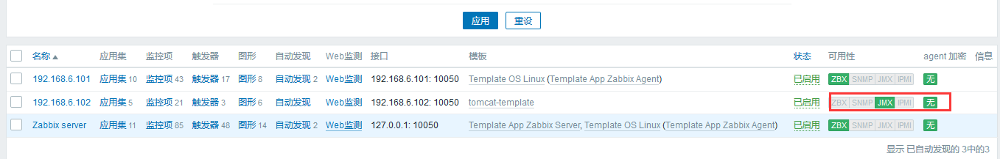
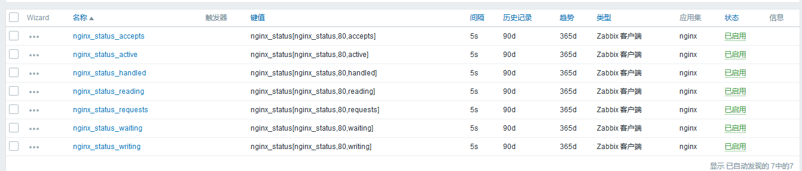

# 配置zabbix监控其他服务器
需要监控的服务器ip：192.168.6.101

1. 在192.168.6.101 安装zabbix_agent 并添加启动用户 （也可以apt安装zabbix-agent）
```bash
./configure --prefix=/apps/zabbix_agent --enable-agent

make && make install

useradd zabbix -s /sbin/nologin
```

2. 编辑agent的配置文件
```bash
PidFile=/apps/zabbix_agent/run/zabbix_agentd.pid
LogFile=/apps/zabbix_agent/logs/zabbix_agentd.log

Server=192.168.6.100  # 指定zabbix_server的ip地址
Hostname=192.168.6.101 # 加入到zabbix_server后的名称


mkdir /apps/zabbix_agent/logs
mkdir /apps/zabbix_agent/run
chown -R zabbix:zabbix /apps/zabbix_agent/run /apps/zabbix_agent/logs
```

3. 启动agent
```bash
vim /lib/systemd/system/zabbix-agent.service
[Unit]
Description=Zabbix Agent
After=syslog.target
After=network.target

[Service]
Environment="CONFFILE=/apps/zabbix_agent/etc/zabbix_agentd.conf"
EnvironmentFile=-/etc/default/zabbix-agent
Type=forking
Restart=on-failure
PIDFile=/apps/zabbix_agent/run/zabbix_agentd.pid
KillMode=control-group
ExecStart=/apps/zabbix_agent/sbin/zabbix_agentd -c $CONFFILE
ExecStop=/bin/kill -SIGTERM $MAINPID
RestartSec=10s

[Install]
WantedBy=multi-user.target

root@zabbix_sql_java_agent:~# systemctl daemon-reload 
root@zabbix_sql_java_agent:~# systemctl start zabbix-agent.service
```
4. 在web端添加这个主机
添加主机

关联模板


添加成功


使用zabbix_get命令获取指定监控项
```bash
# zabbix_get命令的使用
# 获取指定主机的指定监控项的值
/apps/zabbix_server/bin/zabbix_get -s 192.168.6.101 -p 10050 -k "system.cpu.load[all,avg1]"
0.080000

#-s 指定主机
# -p 指定端口
# -k：指定监控项
```

## 配置zabbix监控后端的tomcat服务
zabbix_server:192.168.6.100
java gateway：192.168.6.101
tomcat服务器：192.168.6.102

### zabbix监控tomcat的流程
zabbix_server要想监控tomcat的话，需要一个中转服务器java gateway，zabbix_server上的监控项的请求会发送给java gateway，通过java gateway通过JMX协议(12345端口)转发给java服务器,java处理完毕后通过java gateway发送给zabbix_server，zabbix_server将数据写入到数据库中，最后由zabbix_web读取数据库中的数据画图

1. 192.168.6.102 部署后端tomcat服务器，并启动tomcat
```bash
apt install openjdk-8-jdk  # 或者通过oracle的jdk程序包安装
tar xf apache-tomcat-8.5.42.tar.gz 
mkdir /apps
ln -sv /usr/local/src/apache-tomcat-8.5.42 /apps/tomcat
root@zabbix_nginx_tomcat:~# mkdir /apps/tomcat/webapps/zabbix
root@zabbix_nginx_tomcat:~# vim /apps/tomcat/webapps/zabbix/index.html
zabbix

/apps/tomcat/bin/catalina.sh start
# 访问http://192.168.6.102:8080/zabbix/ 测试
```

2. 配置tomcat监控参数
```bash
vim /apps/tomcat/bin/catalina.sh

CATALINA_OPTS="$CATALINA_OPTS
-Dcom.sun.management.jmxremote
-Dcom.sun.management.jmxremote.port=12345
-Dcom.sun.management.jmxremote.authenticate=false
-Dcom.sun.management.jmxremote.ssl=false
-Djava.rmi.server.hostname=192.168.6.102"

#CATALINA_OPTS="$CATALINA_OPTS
#-Dcom.sun.management.jmxremote #启用远程监控JMX
#-Dcom.sun.management.jmxremote.port=12345 #默认启动的JMX端口号，要和zabbix添加主机时候的端口一致即可
#-Dcom.sun.management.jmxremote.authenticate=false #不使用用户名密码
#-Dcom.sun.management.jmxremote.ssl=false #不使用ssl认证
#-Djava.rmi.server.hostname=192.168.6.102" #tomcat主机自己的IP地址，不要写zabbix服务器的地址

# 重启tomcat
/apps/tomcat/bin/catalina.sh stop
/apps/tomcat/bin/catalina.sh start
# 验证监听了12345端口
```
Windows安装jdk环境，启动jconsole

连接远程的JMX

确认能采集到数据


3. 在zabbix_server服务器配置java gateway启动参数 (java gateway可以与zabbix_server不在相同的服务器)
```bash
vim /apps/zabbix_server/sbin/zabbix_java/settings.sh
LISTEN_IP="0.0.0.0" # 监听的地址
LISTEN_PORT=10052   # 监听的端口
PID_FILE="/apps/zabbix_server/run/zabbix_java.pid"  # pid文件的存放位置
START_POLLERS=20   # java gateway主进程启动后，会启动几个收集后端服务信息的工作进程，要和java 应用保持一定关系
TIMEOUT=30   # 采集数据的时候，等待多长时间后端返回数据，最大值为30秒


# 启动java gateway
/apps/zabbix_server/sbin/zabbix_java/startup.sh
# 会监听10052端口
```
在192.168.6.101安装配置java gateway
```bash
apt install zabbix-java-gateway

# 配置java-gateway，与上面的配置类似
vim /etc/zabbix/zabbix_java_gateway.conf
LISTEN_IP="0.0.0.0" # 监听的地址
LISTEN_PORT=10052   # 监听的端口
START_POLLERS=20  # java gateway主进程启动后，会启动几个收集后端服务信息的工作进程，要和java 应用保持一定关系
TIMEOUT=30   # 采集数据的时候，等待多长时间后端返回数据，最大值为30秒

# 启动java-gateway
systemctl restart zabbix-java-gateway.service
systemctl enable zabbix-java-gateway.service
```

4. 配置zabbix server调用192.168.6.101 的java gateway
```bash
vim /apps/zabbix_server/etc/zabbix_server.conf
JavaGateway=192.168.6.101  #指定java gateway的地址
JavaGatewayPort=10052 #指定java gateway的服务器监听端口，如果是默认端口可以不写
StartJavaPollers=20 #启动多少个进程去轮训 java gateway，要和java gateway的配置一致

systemctl restart zabbix-server.service
```

5. web添加监控的主机，监控java gateway


添加模板


验证结果


使用cmdline-jmxclient-0.10.3.jar 包检测tomcat数据
```bash
java -jar cmdline-jmxclient-0.10.3.jar - 192.168.6.102:12345  'Catalina:name="http-nio-8080",type=ThreadPool' maxThreads
07/15/2019 00:42:12 +0000 org.archive.jmx.Client maxThreads: 200

java -jar cmdline-jmxclient-0.10.3.jar - 192.168.6.102:12345  'Catalina:name="http-nio-8080",type=ThreadPool' currentThreadCount
07/15/2019 00:42:40 +0000 org.archive.jmx.Client currentThreadCount: 10

# 测试得到最大的线程数为200，当前为10
```

### zabbix监控nginx

1. 在192.168.6.102部署安装nginx
```bash
# --with-http_stub_status_module 状态页参数必须打开
./configure --prefix=/apps/nginx \
--user=nginx \
--group=nginx \
--with-http_ssl_module \
--with-http_v2_module \
--with-http_realip_module \
--with-http_stub_status_module \
--with-http_gzip_static_module \
--with-pcre \
--with-stream \
--with-stream_ssl_module \
--with-stream_realip_module
```

2. 打开nginx的状态页,并启动nginx
```bash
 location /nginx_status {
    stub_status;
    allow 192.168.0.0/21;
    allow 127.0.0.1;
    deny all;
}


/apps/nginx/sbin/nginx
```

status状态页各个值的说明
```bash
1. Active connections: 291：当前处于活动状态的客户端连接数，包括连接等待空闲的连接数

2. accepts：Nginx自从启动后已经接受客户端请求的总数，reload后会重新计算

3. handled：Nginx自从启动后已经处理完成的客户端请求总数，通常等于accepts，除非有应为worker_connections限制等被拒绝的连接

4. requests：Nginx自从启动后客户端发来的总的请求总数

5. Reading：当前状态，正在读取客户端请求报文首部连接的连接数

6. writing：正在向客户端发送响应报文过程中的连接数

7. waiting：正在等待客户端发出连接请求的空闲连接数，开启keep-ailve的情况下，这个值登录active-(reading+writing)
```

3. 创建脚本，获取状态页的各个值
```bash
vim nginx_status.sh

#!/bin/bash 

nginx_status_fun(){ #函数内容
	NGINX_PORT=$1 #端口，函数的第一个参数是脚本的第二个参数，即脚本的第二个参数是段端口号
	NGINX_COMMAND=$2 #命令，函数的第二个参数是脚本的第三个参数，即脚本的第三个参数是命令
	nginx_active(){ #获取nginx_active数量，以下相同，这是开启了nginx状态但是只能从本机看到
        /usr/bin/curl "http://127.0.0.1:"$NGINX_PORT"/nginx_status/" 2>/dev/null| grep 'Active' | awk '{print $NF}'
        }
	nginx_reading(){ #获取nginx_reading状态的数量
        /usr/bin/curl "http://127.0.0.1:"$NGINX_PORT"/nginx_status/" 2>/dev/null| grep 'Reading' | awk '{print $2}'
       }
	nginx_writing(){
        /usr/bin/curl "http://127.0.0.1:"$NGINX_PORT"/nginx_status/" 2>/dev/null| grep 'Writing' | awk '{print $4}'
       }
	nginx_waiting(){
        /usr/bin/curl "http://127.0.0.1:"$NGINX_PORT"/nginx_status/" 2>/dev/null| grep 'Waiting' | awk '{print $6}'
       }
	nginx_accepts(){
        /usr/bin/curl "http://127.0.0.1:"$NGINX_PORT"/nginx_status/" 2>/dev/null| awk NR==3 | awk '{print $1}'
       }
	nginx_handled(){
        /usr/bin/curl "http://127.0.0.1:"$NGINX_PORT"/nginx_status/" 2>/dev/null| awk NR==3 | awk '{print $2}'
       }
	nginx_requests(){
        /usr/bin/curl "http://127.0.0.1:"$NGINX_PORT"/nginx_status/" 2>/dev/null| awk NR==3 | awk '{print $3}'
       }
  	case $NGINX_COMMAND in
		active)
			nginx_active;
			;;
		reading)
			nginx_reading;
			;;
		writing)
			nginx_writing;
			;;
		waiting)
			nginx_waiting;
			;;
		accepts)
			nginx_accepts;
			;;
		handled)
			nginx_handled;
			;;
		requests)
			nginx_requests;
		esac 
}

main(){ #主函数内容
	case $1 in #分支结构，用于判断用户的输入而进行响应的操作
		nginx_status) #当输入nginx_status就调用nginx_status_fun，并传递第二和第三个参数
			nginx_status_fun $2 $3;
			;;
		*) #其他的输入打印帮助信息
			echo $"Usage: $0 {nginx_status key}"
	esac #分支结束符
}

main $1 $2 $3

chmod +x nginx_status.sh 
# 传递参数测试脚本
./nginx_status.sh nginx_status 80 active

# 第一个参数为状态页的名称
# 第二个值为端口
# 第三个值为查询状态页的具体参数
```

3. 让zabbix_agent能够调用该脚本
```bash
cp nginx_status.sh /etc/zabbix/zabbix_agentd.conf.d/

# 创建配置文件调用这个脚本，或者将自定义的监控项写到agent的配置文件中
vim /etc/zabbix/zabbix_agentd.conf.d/agent_nginx_status.conf
UserParameter=nginx_status[*], /etc/zabbix/zabbix_agentd.conf.d/nginx_status.sh $1 $2 $3
# UserParameter=监控项的名称[传递给脚本的参数，*表示所有],脚本的绝对路径 接收监控项传递的参数
# 另一种写法
#UserParameter=监控项的名称,脚本的绝对路径 指定参数 
# 要避免监控项的名称相同

systemctl restart zabbix-agent.service 
```

4. 到zabbix_server测试能否获取nginx状态页的值
```bash
 /apps/zabbix_server/bin/zabbix_get -s 192.168.6.102 -p 10050 -k "nginx_status[nginx_status,80,requests]"

12

# 测试成功
```

5. 到web界面添加模板，并关联到主机

添加模板，创建监控项


为创建的监控项添加图形


关联到主机并查看


检查完毕创建其他的监控项



最后验证
