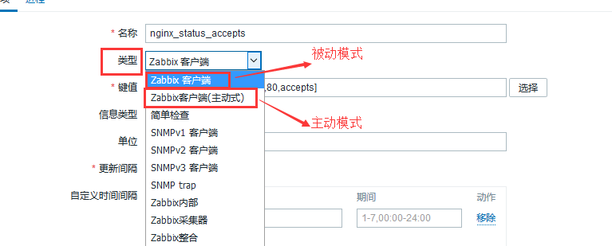
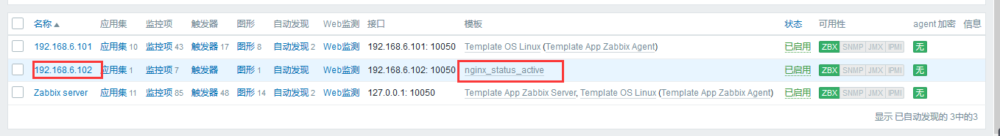
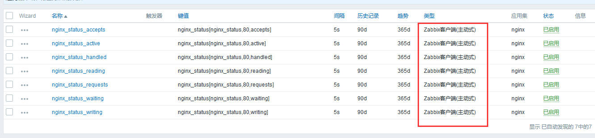
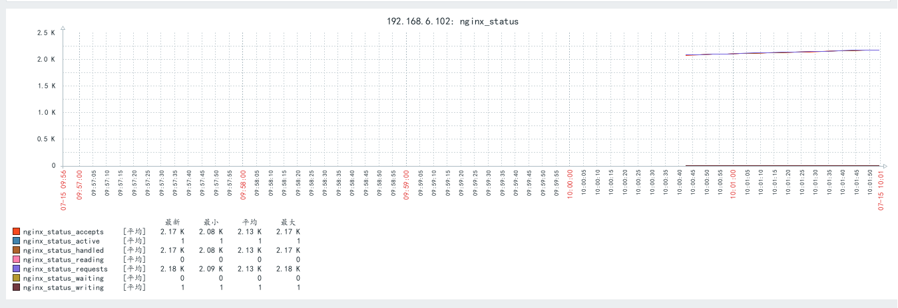
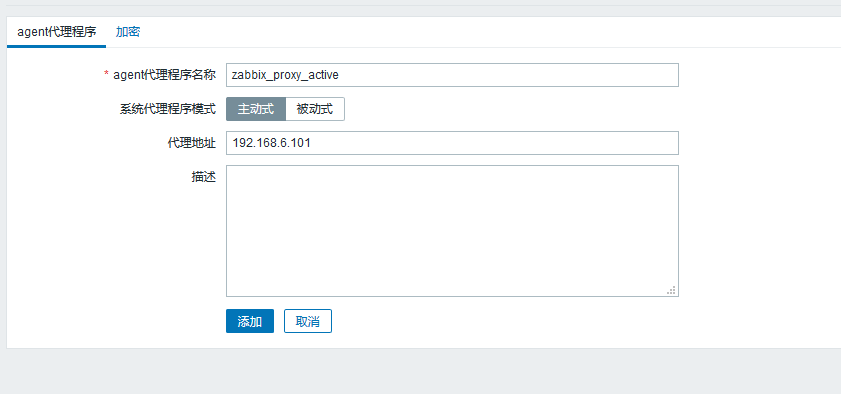
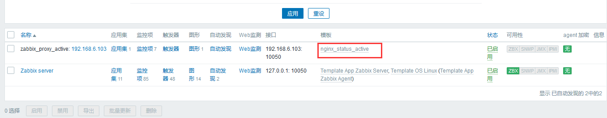
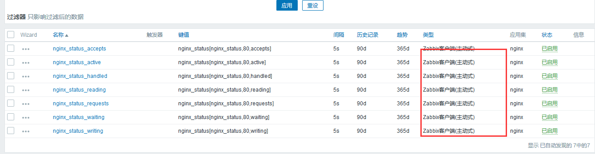

# zabbix的监控模式
监控模式由监控模板定义，在模板中的监控项中的类型中定义，zabbix客户端为被动模式，zabbix客户端(主动) 为主动模式，支持批量更改监控类型、时间间隔更其他选项


## 被动模式
是由zabbix server向zabbix agent发出指令获取数据，即zabbix agent被动的去获取数据并返回给zabbix server，zabbix server周期性的向agent 索取数据，这种模式的最大问题就是会加大zabbix server的工作量，在数百台服务器的环境下zabbix server不能及时获取到最新数据，但这也是默认的工作方式。

zabbix_server由10050端口向zabbix_agent获取数据


## 主动模式
zabbix_agent启动后会向zabbix_server发送获取监控项的请求，拿到监控项后，在本地采集，根据监控项定义的间隔时间，主动将采集到的数据发送给zabbix_server，不再需要zabbix serve进行干预，因此主动模式在一定程度上可减轻zabbix server的压力。

zabbix_agent通过10051端口向zabbix_server发送数据


### 设置zabbix主动模式监控nginx
默认为被动模式

1. 修改zabbix_agnet为被动模式
```bash
vim /etc/zabbix/zabbix_agentd.conf
# 为被动模式下的zabbix_server 的ip地址,主动模式下可忽略
Server=192.168.6.100

# 主动模式下的zabbix_server的IP地址
ServerActive=192.168.6.100
# 在zabbix_web端显示的名称，主动模式下，当zabbix_agent向zabbix_server请求监控项的时候，zabbix_server通过hostname确zabbix_agent对应那些监控项(zabbix_web中主机名称必须和zabbix_agnet设置的hostname相同)
Hostname=192.168.6.102

systemctl restart zabbix-agent.service
```

2. 将主机与nginx模板关联，并修改监控模式为主动模式



3. 检查主动模式下是否能够采集到数据



# zabbix_proxy
zabbix 是一个分布式的监控系统，支持通过代理服务器zabbix proxy收集zabbix agent的
数据，然后把收集保存在本地数据库并发送给zabbix server进行统一存储和展示

由zabbix_proxy代理zabbix_server接收zabbix_agent的数据，无论是主动模式还是被动模式，都由zabbix_proxy与zabbix_agent通信，zabbix_server只需要与zabbix_proxy建议一个tcp/ip通道，减轻zabbix_server的压力

主动模式下：zabbix_agent向zabbix_proxy获取监控项，再由zabbix_proxy向zabbix_server请求后返回给zabbix_agent，能够自动的更新agent监控项，防止监控项的增加或修改

被动模式下：由zabbix_proxy向zabbig_agent获取数据后再发送给zabbix_server


zabbix_proxy可以部署多个，同时监控不同的机房，一个zabbix_server可以有多个处于不同模式的zabbix_proyx


## zabbix_proxy的搭建部署主动模式
192.168.6.100：zabbix_server
192.168.6.101：zabbix_proxy
192.168.6.102/103：node节点，部署tomcat和JMX

1. 部署zabbix_proxy
```bash
# 安装zabbix源
wget https://repo.zabbix.com/zabbix/4.0/ubuntu/pool/main/z/zabbix-release/zabbix-release_4.0-2+bionic_all.deb
dpkg -i zabbix-release_4.0-2+bionic_all.deb
apt update
# 安装zabbix_proyx
apt install zabbix-proxy-mysql 
```

2. 创建数据库并初始化
```bash
create database zabbix_proxy_active character set utf8 collate utf8_bin;

grant all privileges on zabbix_proxy_active.* to zabbix_proxy_active@'192.168.6.%' identified by 'admin123';

grant all privileges on zabbix_proxy_active.* to zabbix_proxy_active@localhost identified by 'admin123';

# 初始化数据库，只需要导入/usr/share/doc/zabbix-proxy-mysql/schema.sql.gz
zcat /usr/share/doc/zabbix-proxy-mysql/schema.sql.gz | mysql -uzabbix_proxy_active -padmin123 zabbix_proxy_active
```

3. 修改zabbix_proxy配置文件
```bash
vim /etc/zabbix/zabbix_proxy.conf
# 修改工作模式，0 主动模式  1被动模式
ProxyMode=0
# 指向zabbix_server 的ip地址
Server=192.168.6.100
# zabbix_server的端口
ServerPort=10051
# 配置zabbix_proxy的代理名称，和web端agent代理的名称必须相同
Hostname=zabbix_proxy_active
# proxy的监听端口
ListenPort=10051
# 配置proxy往server发送数据使用的地址
SourceIP=192.168.6.101
#是否开启远程命令，server通过proxy到agent执行远程命令 0 关闭 1开启
EnableRemoteCommands=1
# zabbix_proxy的数据库配置
DBHost=192.168.6.101
DBName=zabbix_proxy_active
DBUser=zabbix_proxy_active
DBPassword=admin123
DBPort=3306
#proxy将在本地保存多长时间的数据，小时为单位，最多720小时
ProxyLocalBuffer=720
#proxy数据没有连接到server端，导致没有发送给server端数据，本地保存多长时间的数据
ProxyOfflineBuffer=720
# 配置心跳检测，用proxy检测与master是否连接
HeartbeatFrequency=120
#间隔多长时间proxy会到server重新获取监控项发送给agent，单位秒
ConfigFrequency=300
#proxy间隔多长时间给server发送一次数据，秒
DataSenderFrequency=60
#proxy启动多少个数据收集器
StartPollers=50

# javagateway配置
JavaGateway=192.168.6.100
JavaGatewayPort=10052
StartJavaPollers=20

# 保存配置的缓存区大小，用来保存监控项，监控项多的话要配置足够大
CacheSize=512M
#预先启动多少个连接数据库的进程
StartDBSyncers=4
#保存监控历史数据占用的最大内存
HistoryCacheSize=512M
# 保存历史数据的索引信息
HistoryIndexCacheSize=128M
#每个监控项的最长获取等待时间
Timeout=30
# 外部网络设备的探测工具
FpingLocation=/usr/bin/fping
#多久的数据库查询会被记录到日志 毫秒
LogSlowQueries=3000

# 启动服务
systemctl start zabbix-proxy.service
systemctl enable zabbix-proxy.service
```

4. web端添加proxy主动代理


5. 102配置agent指向proxy
```bash
vim /etc/zabbix/zabbix_agentd.conf 
Server=192.168.6.101
ServerActive=192.168.6.101
Hostname=192.168.6.103

systemctl start zabbix-agent.service 
```
6. web端创建并配置主机,并关联主动模式的监控nginx模板




7. 验证


> zabbix_proxy被动模式数据传输特别慢，不使用

### 配置proxy监控linux的tcp连接数
tcp端口状态装换


tcp的三次握手

ack=0：表示是请求报文


tpc的四次断开


1. 创建监测tcp连接数脚本
```bash
root@zabbix_nginx_tomcat:~# vim /etc/zabbix/zabbix_agentd.conf.d/tcp_conn.sh

#/bin/bash
tcp_conn_status(){
        TCP_STAT=$1
        ss -ant | awk 'NR>1 {++s[$1]} END {for(k in s) print k,s[k]}' > /tmp/tcp_conn.txt
        TCP_STAT_VALUE=$(grep "$TCP_STAT" /tmp/tcp_conn.txt | cut -d ' ' -f2)
        if [ -z $TCP_STAT_VALUE ];then
                TCP_STAT_VALUE=0
        fi
        echo $TCP_STAT_VALUE
}

main(){
        case $1 in
            tcp_status)
                tcp_conn_status $2;     
                ;;
                *)
                echo "$0 + tcp_status + STATUS"
        esac
}

main $1 $2

chmod +x /etc/zabbix/zabbix_agentd.conf.d/tcp_conn.sh
```

2. 配置agent调用该脚本
```bash
vim /etc/zabbix/zabbix_agentd.conf.d/agent_tcp_conn.conf
UserParameter=linux_status[*],/etc/zabbix/zabbix_agentd.conf.d/tcp_conn.sh $1 $2 $3

systemctl restart zabbix-agent.service
```
3. 在被监控服务器为zabbix 用户授权
```bash
# 授权zabbix用户可以不输入密码执行任何命令，防止zabbix在执行top等命令的时候没有权限
vim /etc/sudoers
zabbix  ALL=(ALL) NOPASSWD:ALL
```

4. server端测试
```bash
 /apps/zabbix_server/bin/zabbix_get -s 192.168.6.102 -p 10050 -k "linux_status[tcp_status,LISTEN]"
27
/apps/zabbix_server/bin/zabbix_get -s 192.168.6.102 -p 10050 -k "linux_status[tcp_status,TIME-WAIT]"
31
# 测试成功
```

5. web端创建模板、监控项、图表并关联主机


6. 验证
