# 使用zabbix监控memcached

1. 安装memcached
```bash
yum install  memcached
systemctl ensable  memcached.service 
systemctl enable  memcached.service
```

2. 编写脚本，获取memcached的状态
使用ncat(ubuntu为nc)命令
echo -e "stats\nquit"| ncat 127.0.0.1 "11211"
```bash
vim /etc/zabbix/zabbix_agentd.d/memcached.sh
 #!/bin/bash
[ root@node1 zabbix_agentd.d]# bash -x memcached.sh 
[ root@node1 zabbix_agentd.d]# vim memcached.sh 

#!/bin/bash
memcached_status(){
    M_PORT=$1
    M_COMMAND=$2
    echo -e "stats\nquit" | nc 127.0.0.1 "$M_PORT" | grep "STAT $M_COMMAND " | awk '{print $3}'
}

main(){
    case $1 in
        memcached_status)
            memcached_status $2 $3
        ;;
    esac
}

main $1 $2 $3

chmod +x  /etc/zabbix/zabbix_agentd.d/memcached.sh
```

3. 配置agent调用该脚本
```bash
vim /etc/zabbix/zabbix_agentd.d/agent_memcached_status.conf
UserParameter=memcached_status[*],/etc/zabbix/zabbix_agentd.d/memcached.sh $1 $2 $3

systemctl restart zabbix-agent.service 
```

4. server端验证
```bash
/apps/zabbix_server/bin/zabbix_get -s 192.168.6.103 -p 10050 -k "memcached_status["memcached_status","11211","curr_connections"]"
10
```

5. 创建模板、监控项和图像
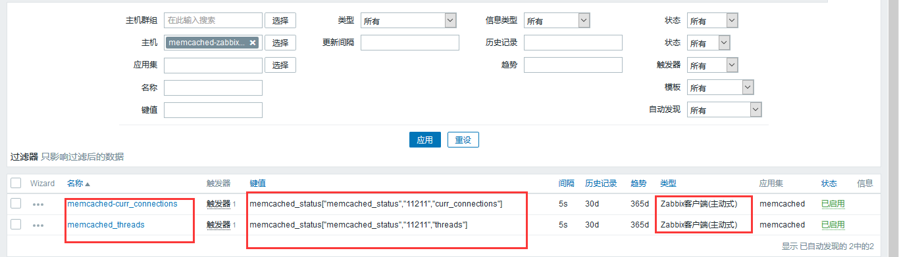

6. 关联主机并验证
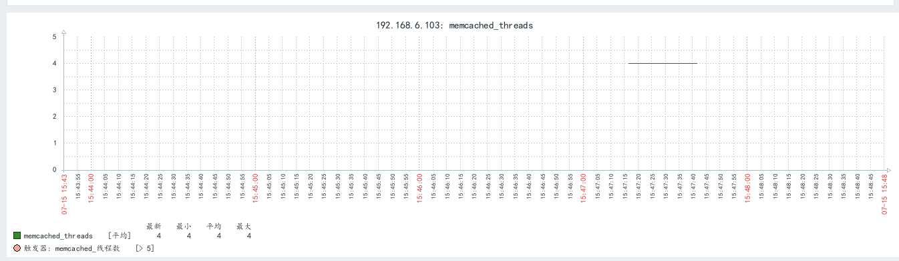


# zabbix监控redis
监控连接数和内存使用


1. 安装并启动redis
```bash
yum -y install redis

systemctl restart redis
```

2. 编写脚本，获取redis的状态
通过非交互的方式取值 (echo -en "INFO \r\n";sleep 1;) | nc 127.0.0.1 "6379"
```bash
[ root@node1 zabbix_agentd.d]# vim /etc/zabbix/zabbix_agentd.d/redis.sh

#!/bin/bash
redis_status(){
    R_PORT=$1
    R_COMMAND=$2
    (echo -en "INFO \r\n";sleep 1;) | nc 127.0.0.1 "$R_PORT" > /tmp/redis_"$R_PORT".tmp
    REDIS_STAT_VALUE=$(grep ""$R_COMMAND":" /tmp/redis_"$R_PORT".tmp | cut -d ':' -f2)
    echo $REDIS_STAT_VALUE
}

help(){
    echo "${0} + redis_status + PORT + COMMAND"
}
main(){
    case $1 in
        redis_status)
            redis_status $2 $3
            ;;
        *)
            help
            ;;
    esac
}

main $1 $2 $3

chmod +x /etc/zabbix/zabbix_agentd.d/redis.sh
```

3. 让agent调用该脚本
```bash
vim /etc/zabbix/zabbix_agentd.d/agent_redis_status.conf
UserParameter=redis_status[*],/etc/zabbix/zabbix_agentd.d/redis.sh $1 $2 $3

systemctl restart zabbix-agent.service 
```

4. server端测试
```bash
/apps/zabbix_server/bin/zabbix_get -s 192.168.6.103 -p 10050 -k "redis_status[redis_status,6379,rdb_last_save_time]"
1563177139
```

5. 添加监控模板、监控项和图形
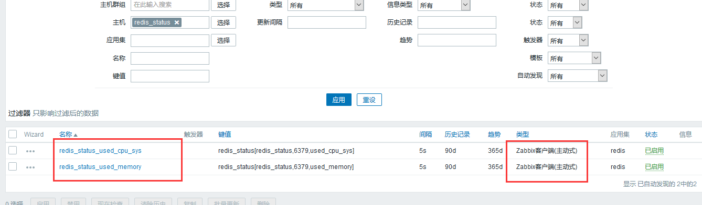

6. 关联到主机并验证
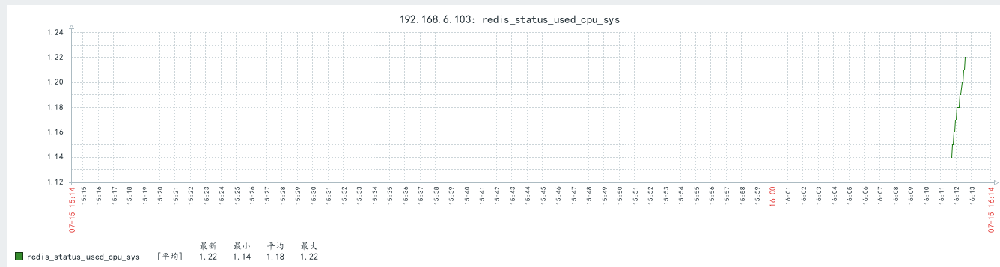

# 邮件报警通知配置

1. 配置中创建报警媒介类型
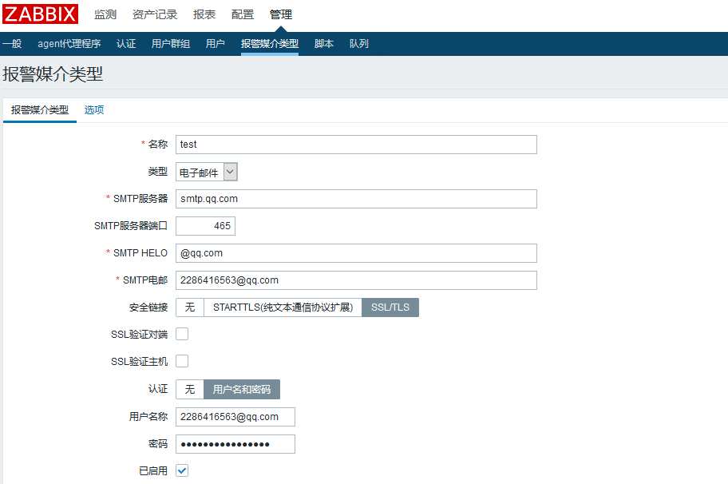

2. 在用户设置中给用户添加报警媒介
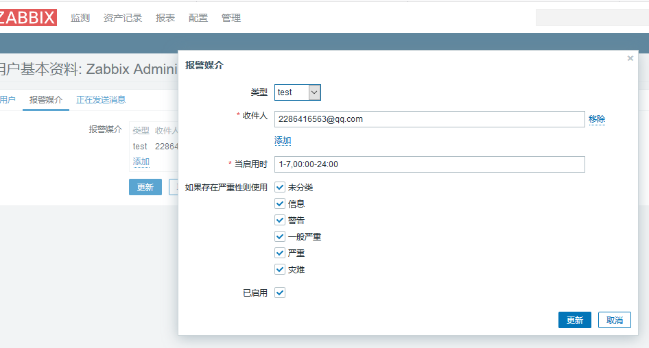

3. 配置报警动作
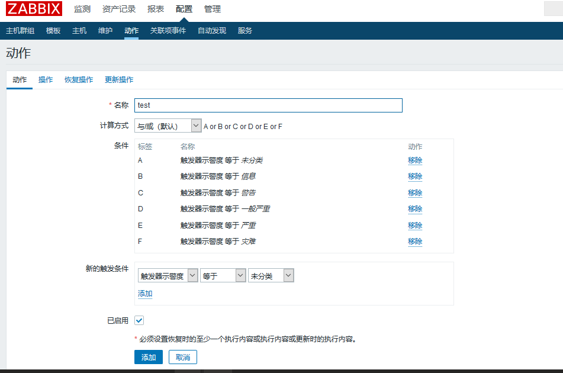
定义操作
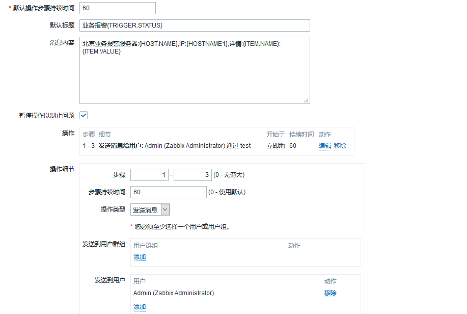
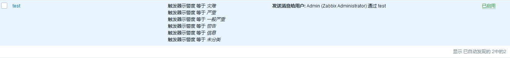
每60s为一次操作，前三次操作每次发送一封邮件

4. 测试能否发送邮件
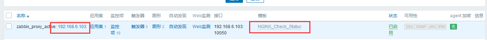
主机中关联了nginx检查模板，当关闭80端口的时候会报警，关闭80端口测试
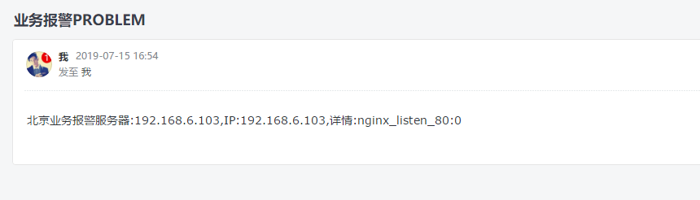

5. 配置业务恢复通知
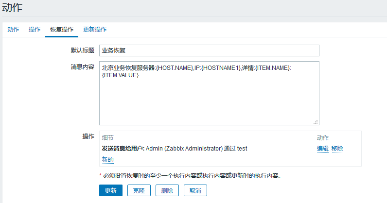
再次关闭nginx测试报警信息
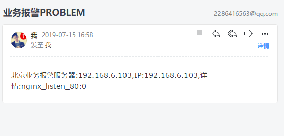

启动nginx测试恢复通知
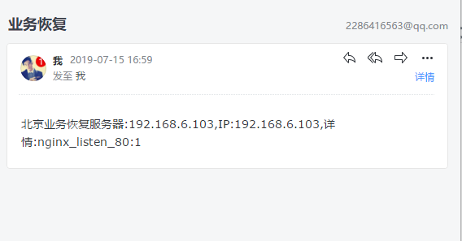
恢复时只会发送一次邮件

6. 配置nginx等服务的故障自治愈
前提：agent运行远程执行命令，特殊命令zabbix要在sudo配置文件中运行无密码执行

新建触发器动作
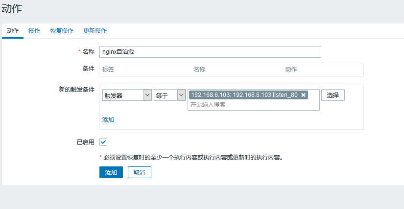

配置操作
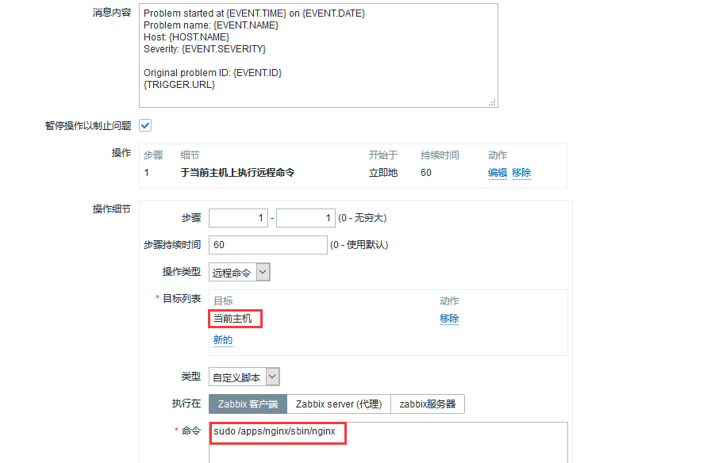

配置agent
```bash
vim /etc/zabbix/zabbix_agentd.conf
EnableRemoteCommands=1   # 运行执行远程命令
UnsafeUserParameters=1   # 执行远程命令的时候允许特殊字符

systemctl restart zabbix-agent.service
```

给zabbix用户授权
```bash
vim /etc/sudoers
zabbix  ALL=(ALL)   NOPASSWD:ALL
```

关闭nginx测试能否收到邮件并重启nginx
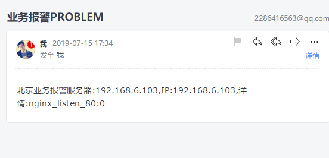

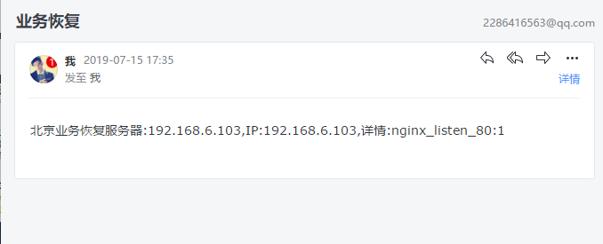

测试成功