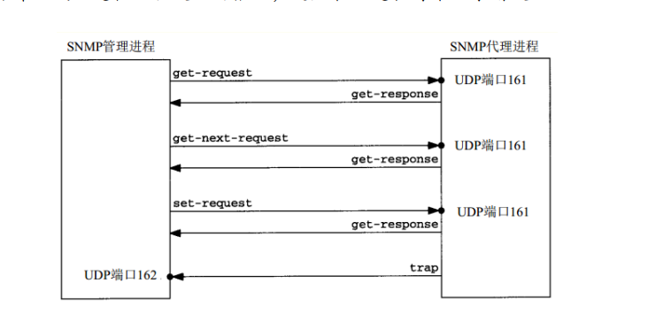
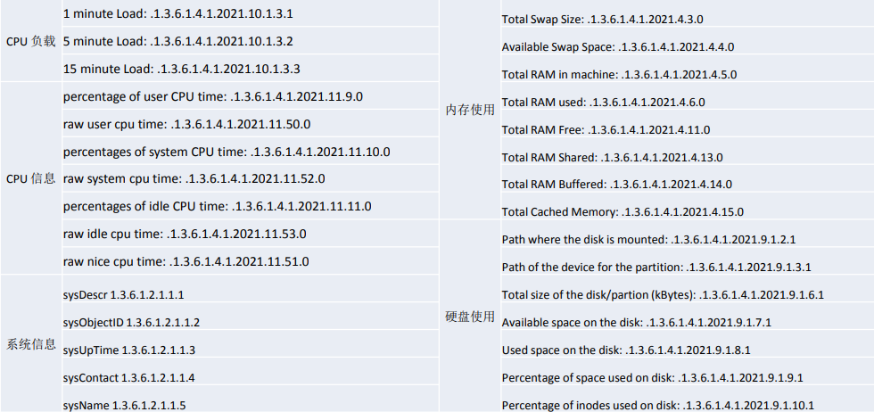
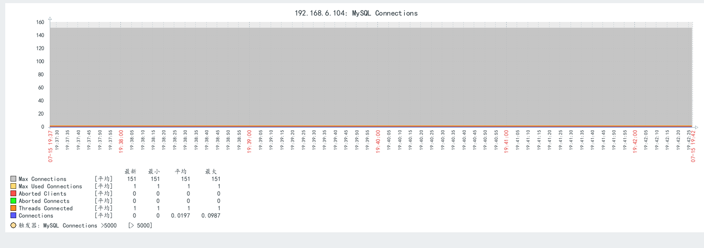
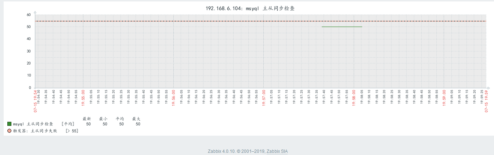

# SNMP
SNMP是英文“Simple Network Management Protocol”的缩写，中文意思是“简单网络管理协议，SNMP是一种简单网络管理协议，它属于TCP/IP五层协议中的应用层协议，用于网络管理的协议，SNMP主要用于网络设备的管理。

SNMP的基本思想：为不同种类的设备、不同厂家生产的设备、不同型号的设备，定义为一个统一的接口和协议，使得管理员可以是使用统一的外观面对这些需要管理的网络设备进行管理。通过网络，管理员可以管理位于不同物理空间的设备，从而大大提高网络管理的效率，简化网络管理员的工作。

SNMP协议是TCP/IP协议簇的一个应用层协议，在1988年被制定，并被Internet体系结构委员会（IAB）采纳作为一个短期的网络管理解决方案，由于SNMP的简单性，在Internet时代得到了蓬勃的发展，1992年发布了SNMPv2版本，以增强SNMPv1的安全性和功能，SNMP的协议版本目前有SNMP v1、SNMP v2c和SNMP v3三种版本，其具体差别如下：

1. SNMP v1采用团体名（Community Name）认证，团体名用来定义SNMP NMS和SNMP Agent的关系，如果SNMP报文携带的团体名没有得到设备的认可，该报文将被丢弃，团体名起到了类似于密码的作用，用来限制SNMP NMS对SNMP Agent的访问。

2. SNMP v2c也采用团体名认证，它在兼容SNMP v1的同时又扩充了SNMP v1的功能，它提供了更多的操作类型（GetBulk和InformRequest）、支持更多的数据类型（Counter64等）、提供了更丰富的错误代码且能够更细致地区分错误。

3. SNMP v3提供了基于用户的安全模型（USM，User-Based Security Model）的认证机制，用户可以设置认证和加密功能，认证用于验证报文发送方的合法性，避免非法用户的访问，加密则是对NMS和Agent之间的传输报文进行加密，以免被窃听。通过有无认证和有无加密等功能组合，可以为SNMP NMS和SNMP Agent之间的通信提供更高的安全性。

## SNMP的工作机制
SNMP的工作机制SNMP网络元素分为NMS和Agent两种

1. NMS（Network Management Station，网络管理站）是运行SNMP客户端程序的工作站，能够提供非常友好的人机交互界面，方便网络管理员完成绝大多数的网络管理工作。

2. Agent是驻留在设备上的一个进程，负责接收、处理来自NMS的请求报文。在一些紧急情况下，如接口状态发生改变等，Agent也会主动通知NMS。

NMS是SNMP网络的管理者，Agent是SNMP网络的被管理者。NMS和Agent之间通过SNMP协议来交互管理信息。

## SNMP 数据交互
get-request操作：从代理进程处提取一个或多个参数值
get-next-request操作：从代理进程处提取一个或多个参数的下一个参数值。
set-request操作：设置代理进程的一个或多个参数值。
get-response操作：返回的一个或多个参数值。这个操作是由代理进程发出的。
trap 操作：代理进程主动发出的报文，通知管理进程有某些事情发生。



## SNMP 组织结构
一套完整的SNMP系统主要包括以下几个方面

1. SNMP报文协议。

2. 管理信息结构（SMI， Structure ofManagement Information），一套公用的结构和表示符号

3. 管理信息库（MIB，Management Information Base），管理信息库包含所有代理进程的所有可被查询和修改的参数。
	所谓(MIB)管理信息库，就是所有代理进程包含的、并且能够被管理进程进行查询和设置的信息的集合。MIB是基于对象标识树的，对象标识是一个整数序列，中间以"."分割，这些整数构成一个树型结构，类似于DNS或Unix的文件系统,MIB被划分为若干个组，如system、interfaces、 at（地址转换）和ip组等。iso.org.dod.internet.private.enterprises（ 1.3.6.1.4.1）这个标识，是给厂家自定义而预留的，比如华为的为1.3.6.1.4.1.2011，华三的为1.3.6.1.4.1.25506。

4. OID（Object Identifiers），一个OID是一个唯一的键值对，用于标识具体某一个设备的某个具体信息(对象标识)，如端口信息、设备名称等。Centos 部分常用的OID


## zabbix监控SNMP设备
暂时省略，以后用到的话再补充

# 使用procona 模板监控mysql
使用第三方的监控，procona 监控数据库的主从配置
mysql主节点：192.168.6.103
mysql从节点：192.168.6.104

1. 配置mysql主节点，开启二进制日志，设置serverid
```bash
vim /etc/my.cnf
server-id=103
log-bin=/data/mysql/master-log

# 启动mysql主节点
/etc/init.d/mysqld restart
```

2. 配置mysql数据库从节点
```bash
vim /etc/my.cnf
server-id=104
log-bin=/data/mysql/master-log

# 启动mysql主节点
/etc/init.d/mysqld restart
```

3. 配置mysql主从
```bash
# 主节点创建测试数据
# 主节点收取从节点复制的账号
grant replication slave on *.* to 'repluser'@'192.168.6.%' identified by 'admin123';

# 导出master的数据库
/usr/local/mysql/bin/mysqldump --all-databases --single_transaction --flush-logs --master-data=2 --lock-tables > backup.sql
scp backup.sql 192.168.6.104:~/
```

4. 从节点导入数据库，并配置主从复制
```bash
mysql < backup.sql

CHANGE MASTER TO MASTER_HOST='192.168.6.103',MASTER_USER='repluser',MASTER_PASSWORD='admin123',MASTER_LOG_FILE='master-log.000002', MASTER_LOG_POS=120;

# 启动主从复制线程
start slave;
show slave status\G;
# 确保Slave_IO_Running: Yes
#Slave_SQL_Running: Yes
```

5. 在slave节点安装 procona ,slave节点也要安装agent
```bash
wget https://www.percona.com/downloads/percona-monitoring-plugins/percona-monitoring-plugins-1.1.8/binary/redhat/7/x86_64/percona-zabbix-templates-1.1.8-1.noarch.rpm

rpm -ivh percona-zabbix-templates-1.1.8-1.noarch.rpm

# procona 依赖php，安装php环境
yum install php php-mysql
```

6. 配置 procona 
```bash
# 拷贝配置文件
cp /var/lib/zabbix/percona/templates/userparameter_percona_mysql.conf /etc/zabbix/zabbix_agentd.d/
systemctl restart zabbix-agent.service

# 创建 procona连接数据库的文件
vim /var/lib/zabbix/percona/scripts/ss_get_mysql_stats.php.cnf
<?php
$mysql_user = 'root';
$mysql_pass = '';
```

7. 本机测试
```bash
/var/lib/zabbix/percona/scripts/get_mysql_stats_wrapper.sh gg5620
```

8. server端测试
```bash
root@zabbix-server:~# /apps/zabbix_server/bin/zabbix_get -s 192.168.6.104 -p 10050 -k "MySQL.innodb-lock-structs"
0
```

9. web端导入模板，关联到主机，然后更改默认为主动模式


# 自定义配置监控数据库主从同步

1. 编写获取mysql数据的脚本
vim /etc/zabbix/zabbix_agentd.d/mysql.sh
```bash
#!/bin/bash
Seconds_Behind_Master(){
        NUM=`mysql -uroot -hlocalhost   -e "show slave status\G;"  | grep "Seconds_Behind_Master:" | awk -F: '{print $2}'`
        echo $NUM
}

master_slave_check(){
NUM1=`mysql -uroot -hlocalhost   -e "show slave status\G;"  | grep "Slave_IO_Running" | awk -F:  '{print $2}' | sed 's/^[ \t]*//g'`
#echo $NUM1
NUM2=`mysql -uroot -hlocalhost   -e "show slave status\G;"  | grep "Slave_SQL_Running:" | awk -F:  '{print $2}' | sed 's/^[ \t]*//g'`
#echo $NUM2
if test $NUM1 == "Yes" &&  test $NUM2 == "Yes";then
    echo 50
else
    echo 100
fi
}

main(){
    case $1 in
        Seconds_Behind_Master)
           Seconds_Behind_Master;
           ;;
        master_slave_check)
           master_slave_check
           ;;
    esac
}
main $1

chmod +x /etc/zabbix/zabbix_agentd.d/mysql.sh
```

2. 配置agent调用该脚本
```bash
vim /etc/zabbix/zabbix_agentd.d/agent_mysql_slave.conf
UserParameter=master_slave_check,/etc/zabbix/zabbix_agentd.d/mysql.sh master_slave_check
UserParameter=Seconds_Behind_Master,/etc/zabbix/zabbix_agentd.d/mysql.sh Seconds_Behind_Master

systemctl restart zabbix-agent.service
```

3. server端测试
```bash
/apps/zabbix_server/bin/zabbix_get -s 192.168.6.104 -p 10050 -k "master_slave_check"
50
/apps/zabbix_server/bin/zabbix_get -s 192.168.6.104 -p 10050 -k "Seconds_Behind_Master"
0
```
4. web端添加模板、监控项，图形并关联到主机
