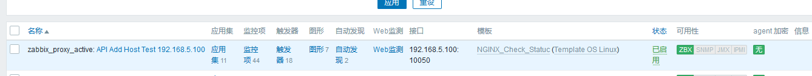

# zabbix API
主要用户执行常规任务，对主机的测增删改查

get create update delete

完全依赖web界面，基于http请求

通过json的格式传送数据

在访问数据之前，需要或者身份验证令牌，使用user.login方法完成


通过api获取tocken认证
```bash
vim tocken.sh

#!/bin/bash

 curl -s -X POST -H 'Content-Type:application/json' -d '
{
    "jsonrpc": "2.0",
    "method": "user.login",
    "params": {
        "user": "Admin",   # 用户名
        "password": "zabbix"  # 密码
    },
    "id": 1   # 用户id
}' http://192.168.6.100/zabbix/api_jsonrpc.php | python -m json.tool

chmod +x tocken.sh

# 返回的数据
./tocken.sh
{
    "jsonrpc": "2.0",
    "result": "1cce9caf4e329dedc0bcee2dc1d80979",
    "id": 1
}
```

通过返回的tocken值获取指定主机的信息
```bash
curl -s -X POST -H 'Content-Type:application/json' -d '
{
    "jsonrpc": "2.0",
    "method": "host.get",
    "params": {
        "filter": {
            "host": [
                "192.168.5.100",  # 指定的主机
                "Zabbix server"
			]
        }
    },
    "auth": "01f405367c3540c654c9e579de310c20",    # 获取的tocken
    "id": 1
}' http://192.168.6.100/zabbix/api_jsonrpc.php | python3 -m json.tool
```
获取所有的主机信息
```bash
curl -s -X POST -H 'Content-Type:application/json' -d '
{
    "jsonrpc": "2.0",
    "method": "host.get",
    "params": {
        "output": ["host"]
    },
    "auth": "b0341825c64dac50765bcffa9e3c1fbf",
    "id": 1
}' http://192.168.6.100/zabbix/api_jsonrpc.php | python3 -m json.tool

# 返回的数据
{
    "jsonrpc": "2.0",
    "result": [
        {
            "hostid": "10084",
            "host": "Zabbix server"
        },
        {
            "hostid": "10287",
            "host": "192.168.5.100"
        }
    ],
    "id": 1
}
```

获取所有用户的信息
```bash
curl -s -X POST -H 'Content-Type:application/json' -d '
{
    "jsonrpc": "2.0",
    "method": "user.get",
    "params": {
        "output": "extend"
    },
    "auth": "b0341825c64dac50765bcffa9e3c1fbf",
    "id": 1
}'  http://192.168.6.100/zabbix/api_jsonrpc.php | python3 -m json.tool
```

获取所有模板的信息
```bash
curl -s -X POST -H 'Content-Type:application/json' -d '
{
    "jsonrpc": "2.0",
    "method": "template.get",
    "params": {
        "output": "extend"
    },
    "auth": "b0341825c64dac50765bcffa9e3c1fbf",
    "id": 1
}'  http://192.168.6.100/zabbix/api_jsonrpc.php | python3 -m json.tool
```

获取指定模板的信息
```bash
curl -s -X POST -H 'Content-Type:application/json' -d '
{
    "jsonrpc": "2.0",
    "method": "template.get",
    "params": {
        "output": "extend",
        "filter": {
            "host": [
                "NGINX_Check_Statuc"
            ]
        }
    },                                         
    "auth": "b0341825c64dac50765bcffa9e3c1fbf",
    "id": 1                                                           
}'   http://192.168.6.100/zabbix/api_jsonrpc.php | python3 -m json.tool
```

# 通过脚本快速添加zabbix_agent
以监控nginx状态页为例

1. 创建自动编译安装agent脚本
```bash
#!/bin/bash

yum install  vim iotop bc gcc gcc-c++ glibc glibc-devel pcre pcre-devel openssl  openssl-devel zip unzip zlib-devel  net-tools lrzsz tree ntpdate telnet lsof tcpdump wget libevent libevent-devel bc  systemd-devel bash-completion traceroute  bridge-utils -y


tar -xf zabbix-4.0.10.tar.gz && cd zabbix-4.0.10 && ./configure --prefix=/apps/zabbix_agent --enable-agent && make && make install && cd ..

cp zabbix-agent.service /lib/systemd/system/
systemctl daemon-reload

cp  zabbix_agentd.conf /apps/zabbix_agent/etc/
host_ip=`ifconfig eth0 | awk '$1~"^inet$"{print $2}'`
sed -i -r "s/^(Hostname=).*/\1$host_ip/g" /apps/zabbix_agent/etc/zabbix_agentd.conf
useradd zabbix -s /usr/sbin/nologin
mkdir /apps/zabbix_agent/{logs,run}
chown -R zabbix:zabbix /apps/zabbix_agent
systemctl restart zabbix-agent
systemctl enable zabbix-agent
# 编译安装nginx并创建状态页
yum install -y vim lrzsz tree screen psmisc lsof tcpdump wget ntpdate gcc gcc-c++ glibc glibc-devel pcre pcre-devel openssl openssl-devel systemd-devel net-tools iotop bc zip unzip zlib-devel bash-completion nfs-utils automake libxml2 libxml2-devel libxslt libxslt-devel perl perl-ExtUtils-Embed

tar xf nginx-1.14.2.tar.gz && cd nginx-1.14.2 && ./configure --prefix=/apps/nginx --user=nginx --group=nginx --with-http_ssl_module --with-http_v2_module --with-http_realip_module --with-http_stub_status_module --with-http_gzip_static_module --with-pcre --with-stream --with-stream_ssl_module --with-stream_realip_module && make && make install && cd ..

\cp nginx.conf /apps/nginx/conf/nginx.conf
useradd nginx

/apps/nginx/sbin/nginx

# 配置nginx状态页监控
cp nginx_status.sh  /apps/zabbix_agent/etc/zabbix_agentd.conf.d/
cp agent_nginx_status.conf /apps/zabbix_agent/etc/zabbix_agentd.conf.d/
systemctl restart zabbix-agent
```

2. 将目录下的所有配置文件、脚本准备好打包
```bash
root@zabbix-server:/usr/local/src# ll
总用量 17772
drwxr-xr-x  2 root root     4096 7月  17 07:43 ./
drwxr-xr-x 10 root root     4096 7月  10 11:56 ../
-rw-r--r--  1 root root      100 7月  17 07:42 agent_nginx_status.conf
-rw-r--r--  1 root root  1015384 7月  17 06:56 nginx-1.14.2.tar.gz
-rw-r--r--  1 root root     2764 7月  17 06:57 nginx.conf
-rwxr-xr-x  1 root root     2043 7月  17 06:58 nginx_status.sh*
-rw-r--r--  1 root root 17140053 7月  13 03:06 zabbix-4.0.10.tar.gz
-rwxr-xr-x  1 root root     1746 7月  17 07:37 zabbix_agent_4.0.10-install.sh*
-rw-r--r--  1 root root    10950 7月  17 07:20 zabbix_agentd.conf
-rw-r--r--  1 root root      447 7月  17 07:21 zabbix-agent.service


tar -czvf install-zabbix-agent.tar.gz ./*
```

# 通过zabbix api添加主机，并将模板关联到主机

> 前提

获取创建主机时关联模板的模板组id和模板id


1. 通过脚本获取tocken
```bash
vim tocken.py

#!/usr/bin/env python
# -*- coding:utf-8 -*-

import requests
import json

url = 'http://192.168.6.100/zabbix/api_jsonrpc.php'
post_data = {
    "jsonrpc": "2.0",
    "method": "user.login",
    "params": {
        "user": "Admin",
        "password": "zabbix"
    },
    "id": 1
}
post_header = {'Content-Type': 'application/json'}

ret = requests.post(url, data=json.dumps(post_data), headers=post_header)

zabbix_ret = json.loads(ret.text)
if not zabbix_ret.has_key('result'):
    print 'login error'
else:
    print zabbix_ret.get('result')

# 安装依赖模块
yum install python-pip
pip install requests
# 执行脚本
python tocken.py
d2872f37a0afaa2dea9044a87ee967c0
```

2. 通过API添加主机-使用proxy
API添加主机为预先知道要添加的主机IP、预先安装并配置好zabbix agent、预先知道要关联的模板ID/组ID等信息，然后同API提交请求添加
```bash
#!/bin/bash

# 要添加的主机列表
IP="
192.168.5.100
"	
for node_ip in ${IP};do
 curl -s -X POST -H 'Content-Type:application/json' -d '
 {
     "jsonrpc": "2.0",
     "method": "host.create",
     "params": {
         "host": "'${node_ip}'",  # 主机名称
         "proxy_hostid": "10272",  # proxy的id
         "interfaces": [
             {
                 "type": 1, # type： 1 agent 2 SNMP 3 IMPI 4 JMX
                 "main": 1, # more接口
                 "useip": 1, # #0是使用DNS，1是使用IP地址
                 "ip": "'${node_ip}'", #添加的zabbix agent的IP地址
                 "dns": "",
                 "port": "10050" #agent端口
             }
         ],
         "groups": [
             {
                 "groupid": "15" #添加到的组的ID
             }
         ],
         "templates": [
             {
                 "templateid": "10280"#关联的模板的ID
             }
         ]
     },
     "auth": "1c6dc1fa4f3c87de715f9f779cefbc7e", 
     "id": 1
 }' http://192.168.6.100/zabbix/api_jsonrpc.php | python -m json.tool
done
```

执行脚本，web端验证
```bash
[ root@localhost ~]# bash add_host.sh 
{
    "id": 1,
    "jsonrpc": "2.0",
    "result": {
        "hostids": [
            "10289"
        ]
    }
}
```



3. 通过API添加主机-不使用proxy
```bash
#!/bin/bash

# 要添加的主机列表
IP="
192.168.5.100
"	
for node_ip in ${IP};do
 curl -s -X POST -H 'Content-Type:application/json' -d '
 {
     "jsonrpc": "2.0",
     "method": "host.create",
     "params": {
         "host": "'${node_ip}'",
		 "name": "test active", #可见名称
         "interfaces": [
             {
                 "type": 1, # type： 1 agent 2 SNMP 3 IMPI 4 JMX
                 "main": 1, # more接口
                 "useip": 1, # #0是使用DNS，1是使用IP地址
                 "ip": "'${node_ip}'", #添加的zabbix agent的IP地址
                 "dns": "",
                 "port": "10050" #agent端口
             }
         ],
         "groups": [
             {
                 "groupid": "15" #添加到的组的ID
             }
         ],
         "templates": [
             {
                 "templateid": "10280"#关联的模板的ID
             }
         ]
     },
     "auth": "1c6dc1fa4f3c87de715f9f779cefbc7e", 
     "id": 1
 }' http://192.168.6.100/zabbix/api_jsonrpc.php | python -m json.tool
done
```

执行脚本，web端验证
```bash
[ root@localhost ~]# bash add_host.sh 
{
    "id": 1,
    "jsonrpc": "2.0",
    "result": {
        "hostids": [
            "10288"
        ]
    }
}
```

