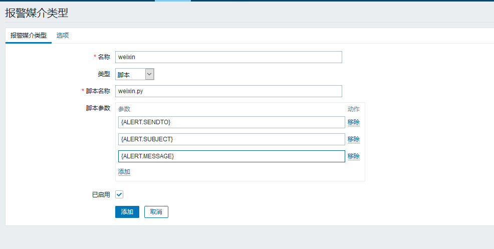
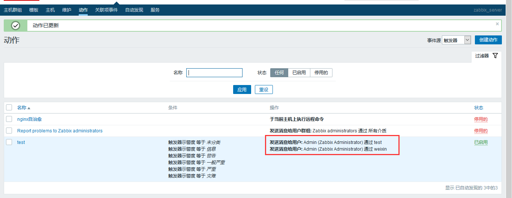
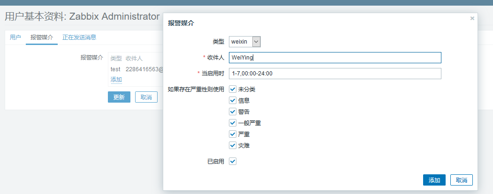
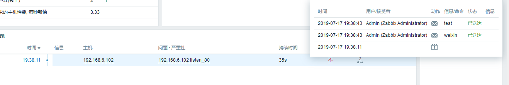

# 配置zabbix企业微信报警

> 前提：需要提前申请企业微信

1. 在企业微信中创建应用，该应用用于报警使用
通过调用企业微信的id和应用的密钥

2. 将报警是通知的用户加入到企业微信中

3. 在zabbix_server端创建微信报警调用的脚本
```bash
 vim /apps/zabbix_server/share/zabbix/alertscripts/weixin.py
#!/usr/bin/env python
#coding:utf-8
#Author:Zhang ShiJie
import requests
import sys
import os
import json
import logging


logging.basicConfig(level = logging.DEBUG, format = '%(asctime)s, %(filename)s, %(levelname)s, %(message)s',
datefmt = '%a, %d %b %Y %H:%M:%S',
filename = os.path.join('/tmp','weixin.log'),
filemode = 'a')

# corpid='企业ID'
corpid='wwd65244cffb12affc'
#appsecret="SCRET"
appsecret="V2jKhAIz5v9qucXQwhvLKwtg3hw2OdBr17mT4aClMMw"
#agentid="Agent ID"
agentid="1000002"
token_url='https://qyapi.weixin.qq.com/cgi-bin/gettoken?corpid=' + corpid + '&corpsecret=' + appsecret
req=requests.get(token_url)
accesstoken=req.json()['access_token']


msgsend_url='https://qyapi.weixin.qq.com/cgi-bin/message/send?access_token=' + accesstoken
touser=sys.argv[1]
subject=sys.argv[2]
message=sys.argv[2] + "\n\n" +sys.argv[3]


params={
"touser": touser,
"msgtype": "text",
"agentid": agentid,
"text": {
"content": message
},
"safe":0
}


req=requests.post(msgsend_url, data=json.dumps(params))
logging.info('sendto:' + touser + ';;subject:' + subject + ';;message:' + message)

chmod +x /apps/zabbix_server/share/zabbix/alertscripts/weixin.py
#如果是Ubuntu的系统，要安装python2.7
apt install python2.7

```

4. 导入脚本需要的模块
```bash
apt install python-pip
pip install requests
```

5. 创建微信报警媒介


添加报警动作


6. 为用户添加微信报警媒介


7. 手动测试
```bash
python weixin.py WeiYing "主题" "这是内容"
# 测试成功，微信收到报警
```

8. 当前配置了监听nginx 80端口的报警，停止服务试试


# 短信报警配置
短信报警需要企业注册，而且需要营业执照，暂时做不了